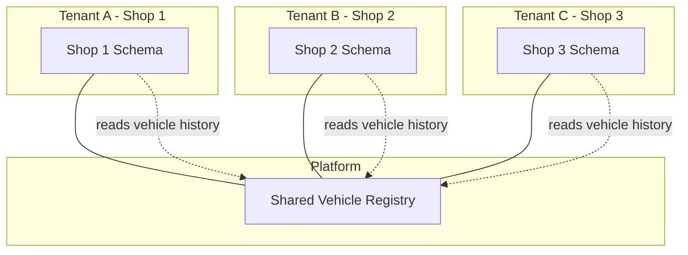
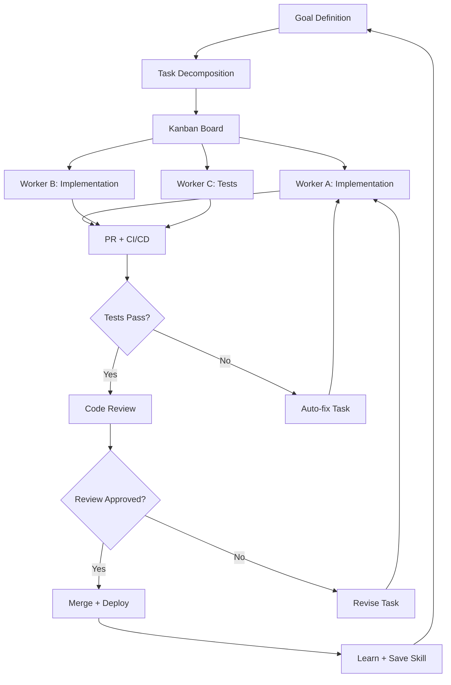
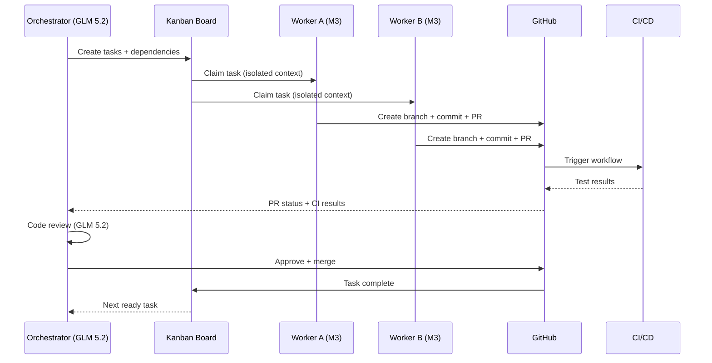

# Agentic Loop Engineering — How AI Agents Are Rewriting Software Delivery

Software development is undergoing a shift that is deeper than the move from waterfall to agile, or from on-prem to cloud. AI agents are no longer just autocomplete on steroids — they are becoming autonomous workers that plan, code, test, deploy, and learn in continuous loops. The question is no longer *if* agents will write software, but *how* we orchestrate them to produce results we can trust.

This article is a field report from the front lines. We cover the main agentic development techniques — **SDD**, **SPDD**, **BMAD**, **harness architecture**, and **loop engineering** — explain how they differ, and show how we built a working harness using **Hermes Agent**, its native **Kanban** plugin, and **GitHub** integration. We also talk about the economics of running token-heavy agent loops on models like **MiniMax M3** and **GLM 5.2** — which cost a fraction of frontier models while delivering production-grade results. Finally, we share what worked, what broke, and the pitfalls we hit along the way while shipping real projects like **oficina.brenon.cloud** and **ai.brenon.cloud**.

---

## The landscape: five techniques, one goal

Before diving into implementation, let's map the territory. Five approaches dominate agentic software development today. They are not mutually exclusive — in practice, the best harnesses borrow from all of them.

### 1. SDD — Spec-Driven Development

**SDD** (Spec-Driven Development) is the simplest and most foundational approach: you write a detailed specification before any code is written, and the agent implements exactly what the spec says. The spec is the contract. The agent is the builder.

The core idea is that ambiguity is the enemy of autonomous coding. A human developer can ask clarifying questions when a spec is vague. An AI agent cannot — or at least, it should not have to. The more precise the specification, the closer the output gets to what you intended.

SDD works well for bounded tasks: a single API endpoint, a React component, a CLI tool. It struggles when the problem space is large or poorly defined, because the spec itself becomes the bottleneck — you spend more time writing specs than code.

**Key characteristics:**

- Single agent, single task
- Spec is written by a human, consumed by an agent
- Linear flow: Spec → Code → Test
- Minimal orchestration needed
- Best for: bug fixes, single features, well-scoped tasks

### 2. SPDD — Spec-Driven Product Development

**SPDD** extends SDD to the full product lifecycle. Instead of a single spec, you produce a chain of documents: a product brief, a PRD (Product Requirements Document), architecture decisions, UX flows, and story breakdowns — all before implementation begins. Multiple agents can be involved, each specialized in a phase.

The philosophy is that products fail not because the code is wrong, but because the *why* was never articulated. By driving product thinking through structured specs, agents have the context they need to make decisions that align with the product vision — not just the immediate ticket.

SPDD is heavier than SDD, but it produces dramatically better results for anything larger than a single feature. It is the bridge between "vibes coding" (prompting an agent with a one-liner) and engineering.

**Key characteristics:**

- Multi-agent, multi-phase
- Document chain: Brief → PRD → Architecture → Stories → Code
- Agents specialize per phase (PM, Architect, Developer)
- Medium orchestration
- Best for: new products, platform features, multi-component work

### 3. BMAD — Breakthrough Method for Agile AI-Driven Development

**BMAD** is the most structured of the agentic methodologies. With over 50,000 stars on GitHub, it provides 12+ specialized agent personas (PM, Architect, Developer, UX Designer, Analyst, and more), 34+ guided workflows, and a scale-adaptive intelligence system that adjusts planning depth based on project complexity.

BMAD's key innovation is **scale-domain-adaptive planning**. A bug fix gets a lightweight quick-flow path. An enterprise platform gets the full PRD + Architecture + Security + DevOps treatment. The framework auto-detects which track to use based on project size and complexity, rather than forcing every task through the same heavy process.

The phases are:

1. **Analysis** — brainstorming, research, product brief, PRFAQ
2. **Planning** — PRD creation, UX design, architecture
3. **Solutioning** — architecture spine, epic and story creation, implementation readiness check
4. **Implementation** — sprint planning, story-by-story development, code review, retrospectives

BMAD also introduces "Party Mode" — bringing multiple agent personas into one session to collaborate and discuss, simulating a real team meeting.

**Key characteristics:**

- 12+ specialized agent personas
- 34+ guided workflows across 4 phases
- Scale-adaptive: Quick Flow, BMad Method, Enterprise tracks
- Party Mode for multi-agent collaboration
- Best for: teams that want a full methodology, not just a tool

### 4. Harness Architecture

A **harness** is the orchestration layer that ties agents, tools, and verification together into a repeatable pipeline. Think of it as CI/CD for AI agents: instead of just letting an agent write code and hoping for the best, the harness defines how agents are spawned, how work is decomposed, how tasks are assigned, how results are verified, and how feedback loops back into the next iteration.

The key components of a harness are:

- **Orchestrator** — the parent session that decomposes work, manages the task queue, and aggregates results
- **Worker agents** — isolated child sessions that execute individual tasks with their own context windows
- **Task board** — a durable queue that tracks state, dependencies, and assignment
- **Verification layer** — automated tests, code review, and quality gates that decide whether output is acceptable
- **Feedback loop** — results from verification feed back into planning for the next cycle

A harness without verification is just a script runner. The verification layer is what makes it *engineering* instead of *vibes coding*.

### 5. Loop Engineering

**Loop engineering** is the paradigm that emerges when you combine all of the above into a continuous cycle. Instead of treating each agent run as a one-shot task, loop engineering puts the agent in a feedback loop:

1. **Plan** — decompose the goal into tasks
2. **Execute** — agents implement the tasks
3. **Verify** — run tests, code review, performance checks
4. **Learn** — capture what worked and what failed as reusable skills
5. **Deploy** — ship the verified output through CI/CD
6. **Repeat** — the next iteration starts with accumulated knowledge

The loop is what makes the system *improve* over time. Without it, every task starts from scratch. With it, the agent framework gets better at your specific codebase, conventions, and patterns — because it remembers.

---

## Comparison at a glance


| Technique | Spec First | Agent Model | Product Focus | Autonomy | Verification |
|-----------|-----------|-------------|---------------|----------|-------------|
| **SDD** | Spec → Code | Single agent | Low | Manual trigger | Tests |
| **SPDD** | Spec → Product | Multi-agent | Medium | Workflow-guided | Tests + Review |
| **BMAD** | PRD → Arch → Code | 12+ personas | High | Workflow-guided | Review + Retro |
| **Harness + Loop** | Plan → Spec → Code → Verify | Orchestrator + workers | Full lifecycle | Fully autonomous | Unit + E2E + Load + CI/CD |

---

## Building the harness: Hermes + Kanban + GitHub

Before diving into the architecture, a quick introduction to **Hermes Agent**. Hermes is an open-source AI agent framework created by Nous Research that runs in your terminal, a native desktop app, messaging platforms, and IDEs. It is provider-agnostic — you can swap between OpenRouter, Anthropic, OpenAI, MiniMax, Z.ai, and 20+ other providers mid-workflow without changing anything else. It learns from experience by saving reusable procedures as skills, remembers who you are and your preferences across sessions, and can run on Telegram, Discord, Slack, WhatsApp, and a dozen more platforms with full tool access — not just chat.

We did not adopt agentic techniques in the abstract — we built a working harness on top of Hermes and its native **Kanban** plugin. Here is how the pieces fit.


### The orchestrator

The parent Hermes session acts as the orchestrator. It receives a goal — "build a blog post system with i18n support" or "create an AI playground with multiple model providers" — and decomposes it into discrete tasks. Each task has:

- A clear goal statement
- A list of dependencies (which tasks must complete first)
- An assigned worker (or "unassigned" for the dispatcher to claim)

### The Kanban board

Hermes ships with a native Kanban system backed by SQLite. It is not just a pretty UI — it is a durable, multi-profile work queue that supports:

- **Task creation** with idempotency keys (so re-running a dispatcher does not duplicate tasks)
- **Dependencies** — task B waits for task A to complete
- **Assignment** — tasks are assigned to specific Hermes profiles
- **Blocking** — a task that fails N times is auto-blocked
- **Heartbeats** — workers ping the board periodically so the dispatcher can detect stale claims
- **Daemon mode** — the dispatcher runs inside the gateway, reclaiming stale tasks and promoting ready ones automatically

The CLI is straightforward:

```bash
# Initialize a board
hermes kanban init --board my-feature

# Create tasks with dependencies
hermes kanban create --board my-feature \
  --title "Build API layer" \
  --idempotency-key "api-layer-v1"

hermes kanban create --board my-feature \
  --title "Build frontend" \
  --depends-on "api-layer-v1"

# Link, assign, track
hermes kanban link --board my-feature \
  --task frontend --depends-on api-layer-v1
hermes kanban assign --board my-feature \
  --task frontend --profile worker-1
```

### Worker agents via delegate_task

The orchestrator spawns workers using `delegate_task` in batch mode. Each worker is a fully isolated subagent:

- **Separate conversation context** — no context window pollution from the parent
- **Separate terminal session** — no working directory conflicts
- **Subset of tools** — workers only see the tools they need, reducing token overhead
- **Background execution** — workers run in parallel, and their results re-enter the parent conversation when they finish

A typical dispatch looks like this:

```
delegate_task(tasks=[
  {goal: "Build REST API for blog posts with CRUD", context: "..."},
  {goal: "Build Vue components for blog listing and post page", context: "..."},
  {goal: "Set up i18n with pt-BR and en-US", context: "..."}
])
```

Three workers, three isolated contexts, running in parallel. The parent session keeps working — when each worker finishes, its summary re-enters the conversation as a new message.

### GitHub integration

Every worker output flows through GitHub:

1. **Branch** — each task gets its own branch
2. **Commit** — the worker commits with conventional commit messages (`feat:`, `fix:`, `refactor:`)
3. **PR** — the worker opens a pull request using `gh pr create`
4. **CI/CD** — GitHub Actions runs the test suite (unit, e2e, smoke)
5. **Code review** — the orchestrator or a dedicated reviewer agent reviews the diff
6. **Merge** — after approval, the PR merges and the next task unblocks

This is not theoretical. We use the `gh` CLI directly from agent sessions:

```bash
# Worker creates a branch and PR
git checkout -b feat/blog-i18n
git add -A && git commit -m "feat: add i18n support for blog posts"
gh pr create --title "feat: add i18n support for blog posts" \
  --body "Implements pt-BR and en-US variants for blog content"
```

The GitHub integration is what makes the loop *verifiable*. An agent can write code, but CI/CD tells you whether it works. The PR is the artifact. The merge is the gate.

---

## The model economics: MiniMax M3 and GLM 5.2

Here is the uncomfortable truth about agentic loops: they are token-hungry. A single feature — from planning to implementation to review — can consume 50,000 to 200,000 tokens across multiple agent turns, tool calls, and context windows. Run that on Claude Sonnet at $3/$15 per million tokens, and a single feature costs $0.50 to $3.00. Ship 50 features and you are looking at $25 to $150 in API costs alone.

That is where models like **MiniMax M3** and **GLM 5.2** change the equation.

### MiniMax M3

MiniMax M3 is a multimodal foundation model with a **1M-token context window**, built on MiniMax Sparse Attention (MSA). MSA replaces full attention with KV-block selection, cutting per-token compute at long context to roughly **1/20 the cost of the previous generation** at 1M tokens.

**Pricing on OpenRouter:** $0.30/M input, $1.20/M output.

That means a 200K-token feature costs roughly **$0.06** in input and **$0.24** in output — **under $0.30 total**. Compare that to $1.50 to $3.00 on a frontier model, and you are looking at a **5–10x cost reduction** with comparable quality for agentic coding tasks.

M3 also ranks in the top 5–6 across multiple benchmark categories on OpenRouter, including Academia (#6), Finance (#3), Health (#5), and Legal (#18). It is not a toy model — it is a production-grade model that happens to be dramatically cheaper.

### GLM 5.2

GLM 5.2 is Z.ai's large-scale reasoning model, also with a **1M-token context window**. It supports reasoning efforts `high` and `xhigh` (mapping to max reasoning), and is specifically tuned for **long-horizon agent workflows, project-level software engineering, and complex multi-step automation**.

**Pricing on OpenRouter:** $0.91/M input, $2.86/M output.

More expensive than M3, but still **3–5x cheaper** than frontier models. GLM 5.2 excels at maintaining engineering context across a full development workflow — from requirements to multi-platform deployment — in a single task. That makes it ideal for the orchestrator role, where it needs to hold the big picture while workers handle individual tasks.

### The combined strategy

We use both models in complementary roles:

| Role | Model | Why |
|------|-------|-----|
| **Orchestrator** | GLM 5.2 | Long-context reasoning, maintains project-wide context, strong planning |
| **Workers** | MiniMax M3 | Cheaper per-token, 1M context, strong coding and tool use |
| **Code review** | GLM 5.2 | Reasoning depth for diff analysis and quality assessment |
| **Auxiliary tasks** (vision, compression) | MiniMax M3 | Cost-effective for high-volume, lower-stakes tasks |

The result: a full agentic loop — planning, implementation, review, and deployment — costs **under $1 per feature** on average. That is cheap enough to run multiple iterations, try alternative approaches, and still come out ahead.

### Going further: MiniMax subscription plans

For teams that run agent loops constantly — daily deployments, automated routines, continuous integration — pay-per-token pricing still adds up. MiniMax offers **monthly subscription plans** that make this dramatically cheaper:

| Plan | Price/month | Tokens/month | Effective cost per 1M tokens |
|------|-------------|-------------|------------------------------|
| Starter | ~$20 | ~1B | ~$0.02/M |
| Pro | ~$50 | ~5B | ~$0.01/M |
| Max | ~$110 | ~12B | ~$0.009/M |

The GitHub integration is what makes the loop *verifiable*. An agent can write code, but CI/CD tells you whether it works. The PR is the artifact. The merge is the gate.

### Discord and Telegram: real-time status reports

One of the most valuable additions to our harness is **event-driven monitoring via Discord and Telegram**. Hermes has a built-in gateway that connects to both platforms with full tool access — so we configured it to send status reports as work progresses:

- **Task claimed** — when a worker picks up a task, a message goes to the channel with the task title, assignee, and estimated scope
- **PR opened** — when a worker opens a PR, the channel gets the PR URL, diff summary, and CI status link
- **CI result** — when CI passes or fails, the channel gets a green/red notification with logs
- **Review needed** — when the orchestrator flags a PR for human review, the channel pings with the diff and the reason for escalation
- **Task completed** — when a task is done and merged, the channel gets a summary of what was shipped

This means we do not have to sit watching the Kanban board. The board comes to us. When something needs attention — a failing test, a review gate, a blocked task — we get a notification on our phone or desktop. We can step in, make a decision, and let the loop continue. This is what makes the harness feel like a *team* rather than a script: it communicates.

---

## Case studies: oficina.brenon.cloud and ai.brenon.cloud

### oficina.brenon.cloud

**Oficina Cloud** is a SaaS ERP for automotive repair shops — not a creative playground, but a full multi-tenant business platform. It handles:

- **Clients and vehicles** — a searchable database where shops register customers and their vehicles, with history that follows the vehicle even when it changes shops
- **Service orders (OS)** — full work-order management with service items, parts, automatic stock deduction, and total value calculation
- **Stock and catalog** — parts inventory with manual entry and automatic deduction when a service order is completed
- **Shared vehicle history** — the vehicle is a platform-level entity. Every shop that serviced it sees the consolidated history, maintaining information integrity and access control across shops
- **Multi-tenant architecture** — each shop gets its own dedicated database schema, with total isolation between tenants and zero data leakage

The architecture is a true SaaS multi-tenant system with a dedicated backend and database. Each tenant (shop) has isolated data, but the vehicle entity is shared at the platform level — so when a car moves from one shop to another, the new shop sees the full service history from all previous shops, with proper access controls. This is a design that required careful thinking about data ownership, tenant isolation, and cross-tenant read access for the shared vehicle entity.

The multi-tenant architecture can be visualized as:



Built through agentic loops:

1. **Planning** — the orchestrator decomposed the project into tasks: backend scaffold, multi-tenant database layer, vehicle registry, service orders, stock management, frontend, deployment config
2. **Parallel execution** — workers built independent modules simultaneously: one on the multi-tenant schema isolation, one on the service orders CRUD, one on the frontend
3. **Integration** — the orchestrator merged the PRs, resolved cross-module conflicts (especially around the shared vehicle entity), and ran the full test suite
4. **Deployment** — Netlify auto-deployed the frontend on merge to `main`

The entire project — from empty repo to deployed SaaS — was built in **one agentic session**. The orchestrator spawned workers, workers opened PRs, CI ran tests, and the orchestrator merged. No manual coding beyond the initial goal statement and architecture decision.

### ai.brenon.cloud

**brnnaicloud** is a unified AI API gateway — a platform that lets developers access multiple LLM providers (GPT-4o, Claude 3.5 Sonnet, Gemini 1.5, Llama 3.1, Mistral, and more) through a single OpenAI-compatible endpoint. Key features:

- **One API** — OpenAI-compatible endpoint; migrate by changing the base URL
- **Real-time cost tracking** — see spend update the moment a request lands
- **Per-key isolation** — mint separate keys per app, per environment, per team
- **Transparent pricing** — per-token rates with no markup on provider prices
- **Usage analytics** — breakdowns by model, by day, by key
- **BYOK friendly** — bring your own provider keys, route through the platform

Built using the same harness pattern:

- **Task decomposition**: API layer (model routing, key management, usage tracking), frontend (chat UI, model selector, pricing page), deployment (Netlify config, environment variables)
- **Parallel workers**: one built the API, one built the frontend, one wrote tests
- **Loop verification**: the orchestrator ran the test suite after each PR merge, caught a streaming bug on the first pass, and dispatched a fix task automatically
- **Result**: a working AI API gateway deployed in under 20 minutes of wall-clock time

Both projects are live and serving real traffic. They are not demos or proofs of concept — they are production deployments that were built by AI agents and verified by CI/CD.

---

## Visualizing the agent loop

The loop engineering cycle as a flowchart:



And here is the harness architecture as a sequence diagram:



---

## Pitfalls and lessons learned

Loop engineering is powerful, but it is not magic. Here is what we learned the hard way.

### 1. Partial deliverables matter more than perfection

The biggest mistake is waiting for the "perfect" agent output before shipping. Agents produce better results when they iterate on *real feedback* — from CI, from users, from production — than when you try to get it right on the first pass. Ship partial deliverables, let CI/CD catch regressions, and let the loop refine. This is just continuous delivery, now executed autonomously.

### 2. CI/CD is the safety net, not the agent

Agents will make mistakes. They will introduce bugs, break tests, and sometimes produce code that is technically correct but architecturally wrong. **CI/CD is what makes this safe.** Without a robust test suite — unit tests, e2e tests, smoke tests — you are flying blind. The agent loop without verification is vibes coding with extra steps.

We learned to treat the test suite as the specification. If the tests pass, the code is accepted. If they fail, the loop sends a fix task back to a worker. The tests are the contract.

### 3. Context windows are not infinite

Even with 1M-token context windows, agents lose track of details in long sessions. We learned to:

- **Keep worker tasks small and focused** — a worker should do one thing well, not five things poorly
- **Use fresh sessions for each major task** — context pollution is real
- **Pass context explicitly** — do not assume the worker knows anything about the project beyond what you tell it
- **Use skills for reusable knowledge** — instead of re-explaining conventions every time, save them as a skill that loads automatically

### 4. Load and performance testing in the loop

One of the most interesting recent developments is **automated load and stress testing within the agent loop**. Hermes can now create benchmarks that:

- Spin up a test environment
- Generate load against the deployed service
- Measure response times, throughput, and error rates
- Compare results against baselines from previous runs
- Automatically create a fix task if performance regresses

This extends the verification layer beyond "does it work?" to "does it work *at scale*?" — which is the difference between a demo and a production system.

The testing pyramid in an agentic loop now looks like:

1. **Unit tests** — fast, isolated, run on every PR
2. **E2E tests** — integration-level, run after merge
3. **Smoke tests** — deployed to staging, verify critical paths
4. **Load tests** — stress the service, measure performance
5. **Performance benchmarks** — compare against previous runs, detect regressions

Each layer feeds back into the loop. A failing load test creates a task. The task goes to a worker. The worker fixes it. CI verifies. The loop continues.

### 5. The autonomy paradox

The more autonomous the system becomes, the more important human review gates are. We found that fully autonomous loops work great for well-understood patterns (CRUD APIs, UI components, test suites) but need human checkpoints for:

- Architecture decisions that affect multiple components
- Security-sensitive changes (auth, secrets, network)
- Breaking changes to public APIs
- Performance trade-offs that require business context

The harness supports this naturally — the orchestrator can flag a PR for human review instead of auto-merging. The key is knowing *when* to escalate.

### 6. Cost monitoring is non-negotiable

With token-hungry loops, costs can spiral if you are not watching. We monitor:

- **Per-task token consumption** — which tasks are expensive and why
- **Per-model cost breakdown** — M3 vs GLM 5.2 spending ratio
- **Retry rate** — how often tasks fail and need re-dispatch
- **Idle worker time** — workers that claimed tasks but are not making progress

Hermes provides built-in usage analytics (`hermes insights`) that track these metrics. A well-tuned harness should cost under $1 per feature. If it costs more, something is wrong — usually a worker is stuck in a loop, or the task decomposition is too granular.

---

## What is next

We are still early in the loop engineering journey. The current frontier is not better models — it is better orchestration. The models are already good enough. What separates a toy demo from a production system is the harness around them: the task decomposition, the verification gates, the feedback loops, and the skill accumulation.

Here is what we are exploring next:

- **Cross-project skill transfer** — when an agent learns a pattern in one project, can it apply it to another?
- **Multi-model orchestration** — different models for different task types (coding, review, planning, testing)
- **Autonomous incident response** — when production breaks, can the loop detect, diagnose, and fix without human intervention?
- **Continuous architecture validation** — not just "does the code work?" but "does the architecture still make sense?"

The promise of loop engineering is not that agents replace engineers. It is that agents handle the mechanical work — the implementation, the testing, the deployment — so that engineers can focus on the parts that matter: the architecture, the product vision, and the human context that no model can replicate.

That is the loop we are building. And it is just getting started.

---

## Coming next: beyond code — Hermes as a daily autonomous companion

The same harness that ships software is also the backbone of our daily automation routine. In the next post, we will dive into how we use Hermes Agent beyond software engineering:

- **Investment news aggregation** — Hermes runs on a cron schedule, pulls market data, summarizes key movements, and delivers a personalized briefing every morning before the market opens
- **Smart home control** — connected to our Home Assistant setup, Hermes controls lights, sensors, and devices through natural language commands and automated routines triggered by time, events, or conditions
- **Podcast production** — Hermes researches topics, writes scripts, generates audio via TTS, and produces complete podcast episodes autonomously — from idea to publishable audio file
- **Day-to-day task automation** — from managing reminders and calendar events to monitoring infrastructure and sending alerts, Hermes runs dozens of small automations that compound into hours of saved time every week

When the marginal cost of an agent run approaches zero — thanks to subscription pricing on models like MiniMax M3 — the question stops being "can I afford to automate this?" and becomes "what *can't* I automate?" That is the world we are building toward, and the next post will show it in practice.

---

## References and Useful Links

- **[Hermes Agent](https://hermes-agent.nousresearch.com/docs/)** — Open-source AI agent framework by Nous Research. The foundation of our harness.
- **[Hermes Kanban Documentation](https://hermes-agent.nousresearch.com/docs/user-guide/features/kanban)** — Native multi-agent work queue with SQLite backing, dispatcher, and worker profiles.
- **[BMAD Method](https://github.com/bmad-code-org/BMAD-METHOD)** — Breakthrough Method for Agile AI-Driven Development. 50k+ stars, 12+ agent personas, 34+ workflows.
- **[BMAD Method Docs](https://docs.bmad-method.org)** — Complete documentation including tutorials, how-to guides, and reference.
- **[MiniMax M3 on OpenRouter](https://openrouter.ai/minimax/minimax-m3)** — 1M context window, $0.30/$1.20 per million tokens, multimodal.
- **[GLM 5.2 on OpenRouter](https://openrouter.ai/z-ai/glm-5.2)** — 1M context window, $0.91/$2.86 per million tokens, long-horizon reasoning.
- **[OpenRouter Models](https://openrouter.ai/models)** — Compare pricing, context windows, and benchmarks across all available models.
- **[GitHub CLI (gh)](https://cli.github.com/)** — Command-line tool for GitHub, used by agents for PR creation, review, and merge.
- **[oficina.brenon.cloud](https://oficina.brenon.cloud)** — Creative coding playground built entirely through agentic loops.
- **[ai.brenon.cloud](https://ai.brenon.cloud)** — AI chat playground with multi-provider support, built through agentic loops.
- **[brenon.cloud](https://brenon.cloud)** — The home cloud blog and portfolio where this article is published.
