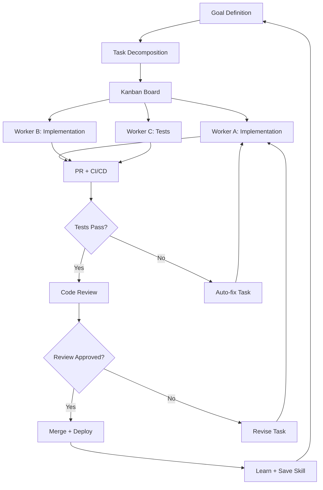
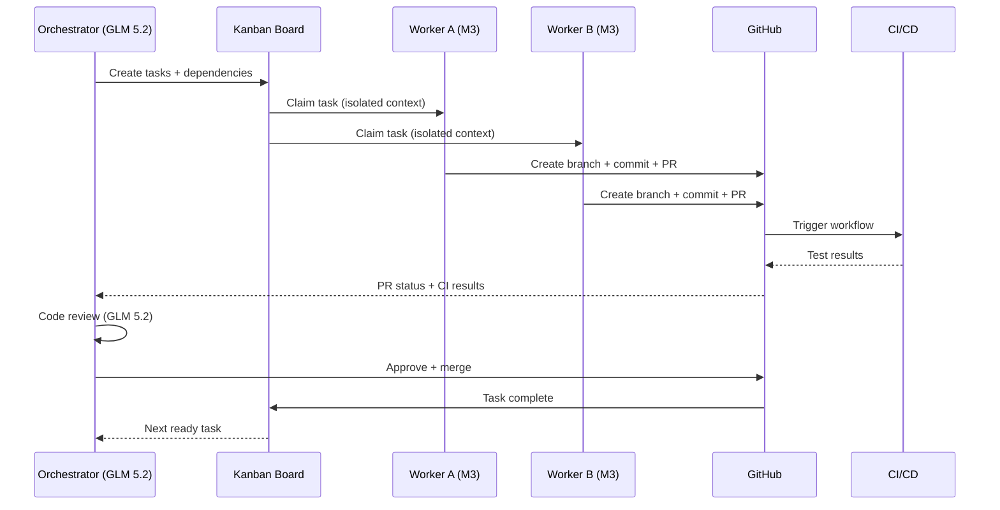

# Loop Engineering Agentico — Como Agentes de IA Estão Reescrevendo a Entrega de Software

O desenvolvimento de software está passando por uma mudança mais profunda do que a transição de waterfall para ágil, ou de on-premise para nuvem. Agentes de IA não são mais apenas autocompletar com esteroides — estão se tornando trabalhadores autônomos que planejam, codificam, testam, deployam e aprendem em loops contínuos. A questão não é mais *se* agentes vão escrever software, mas *como* os orquestramos para produzir resultados nos quais podemos confiar.

Este artigo é um relato de campo da linha de frente. Cobrimos as principais técnicas de desenvolvimento agentic — **SDD**, **SPDD**, **BMAD**, **arquitetura de harness** e **loop engineering** — explicamos como elas se diferenciam, e mostramos como construímos um harness funcional usando **Hermes Agent**, seu plugin nativo de **Kanban** e integração com **GitHub**. Também falamos sobre a economia de rodar loops de agentes que consomem muitos tokens em modelos como **MiniMax M3** e **GLM 5.2** — que custam uma fração dos modelos frontier enquanto entregam resultados de nível produção. Por fim, compartilhamos o que funcionou, o que quebrou, e os pitfalls que encontramos no caminho enquanto entregávamos projetos reais como **oficina.brenon.cloud** e **ai.brenon.cloud**.

---

## O panorama: cinco técnicas, um objetivo

Antes de mergulhar na implementação, vamos mapear o território. Cinco abordagens dominam o desenvolvimento de software agentic hoje. Elas não são mutuamente excludentes — na prática, os melhores harnesses pegam emprestado de todas elas.

### 1. SDD — Spec-Driven Development

**SDD** (Spec-Driven Development) é a abordagem mais simples e fundamental: você escreve uma especificação detalhada antes de qualquer código ser escrito, e o agente implementa exatamente o que a spec diz. A spec é o contrato. O agente é o construtor.

A ideia central é que ambiguidade é a inimiga da codificação autônoma. Um desenvolvedor humano pode fazer perguntas esclarecedoras quando uma spec é vaga. Um agente de IA não pode — ou pelo menos, não deveria precisar. Quanto mais precisa a especificação, mais próxima a output fica do que você pretendia.

SDD funciona bem para tarefas delimitadas: um endpoint de API, um componente React, uma CLI. Enfrenta dificuldades quando o espaço do problema é grande ou mal definido, porque a própria spec se torna o gargalo — você gasta mais tempo escrevendo specs do que código.

**Características principais:**

- Agente único, tarefa única
- Spec escrita por humano, consumida por agente
- Fluxo linear: Spec → Código → Teste
- Orquestração mínima necessária
- Melhor para: bug fixes, features isoladas, tarefas bem delimitadas

### 2. SPDD — Spec-Driven Product Development

**SPDD** estende SDD para o ciclo de vida completo do produto. Em vez de uma única spec, você produz uma cadeia de documentos: um product brief, um PRD (Product Requirements Document), decisões de arquitetura, fluxos de UX, e breakdown de stories — tudo antes da implementação começar. Múltiplos agentes podem estar envolvidos, cada um especializado em uma fase.

A filosofia é que produtos falham não porque o código está errado, mas porque o *porquê* nunca foi articulado. Ao dirigir o pensamento de produto através de specs estruturadas, os agentes têm o contexto que precisam para tomar decisões alinhadas com a visão do produto — não apenas com o ticket imediato.

SPDD é mais pesado que SDD, mas produz resultados dramaticamente melhores para qualquer coisa maior que uma feature isolada. É a ponte entre "vibes coding" (promptar um agente com uma frase) e engenharia.

**Características principais:**

- Multi-agente, multi-fase
- Cadeia de documentos: Brief → PRD → Arquitetura → Stories → Código
- Agentes especializam-se por fase (PM, Arquiteto, Desenvolvedor)
- Orquestração média
- Melhor para: produtos novos, features de plataforma, trabalho multi-componente

### 3. BMAD — Breakthrough Method for Agile AI-Driven Development

**BMAD** é a mais estruturada das metodologias agentic. Com mais de 50.000 stars no GitHub, oferece 12+ personas de agentes especializados (PM, Arquiteto, Desenvolvedor, UX Designer, Analista, e mais), 34+ workflows guiados, e um sistema de inteligência adaptativa por escala que ajusta a profundidade do planejamento com base na complexidade do projeto.

A principal inovação do BMAD é o **planejamento adaptativo por escala e domínio**. Um bug fix segue um caminho leve de quick-flow. Uma plataforma enterprise recebe o tratamento completo de PRD + Arquitetura + Segurança + DevOps. O framework auto-detecta qual track usar com base no tamanho e complexidade do projeto, em vez de forçar toda tarefa pelo mesmo processo pesado.

As fases são:

1. **Análise** — brainstorming, pesquisa, product brief, PRFAQ
2. **Planejamento** — criação de PRD, design de UX, arquitetura
3. **Solutioning** — arquitetura, criação de epics e stories, check de prontidão para implementação
4. **Implementação** — sprint planning, desenvolvimento story by story, code review, retros

O BMAD também introduz o "Party Mode" — trazer múltiplas personas de agentes em uma mesma sessão para colaborar e discutir, simulando uma reunião de equipe real.

**Características principais:**

- 12+ personas de agentes especializados
- 34+ workflows guiados across 4 fases
- Adaptativo por escala: tracks Quick Flow, BMad Method, Enterprise
- Party Mode para colaboração multi-agente
- Melhor para: times que querem uma metodologia completa, não só uma ferramenta

### 4. Arquitetura de Harness

Um **harness** é a camada de orquestração que conecta agentes, ferramentas e verificação em um pipeline repetível. Pense nisso como CI/CD para agentes de IA: em vez de apenas deixar um agente escrever código e torcer para o melhor, o harness define como agentes são spawnados, como o trabalho é decomposto, como tarefas são atribuídas, como resultados são verificados, e como o feedback volta para a próxima iteração.

Os componentes principais de um harness são:

- **Orquestrador** — a sessão pai que decompose o trabalho, gerencia a fila de tarefas, e agrega resultados
- **Agentes trabalhadores (workers)** — sessões filhas isoladas que executam tarefas individuais com suas próprias janelas de contexto
- **Task board** — uma fila durável que rastreia estado, dependências e atribuição
- **Camada de verificação** — testes automatizados, code review, e quality gates que decidem se a output é aceitável
- **Feedback loop** — resultados da verificação voltam para o planejamento do próximo ciclo

Um harness sem verificação é só um script runner. A camada de verificação é o que transforma *vibes coding* em *engenharia*.

### 5. Loop Engineering

**Loop engineering** é o paradigma que emerge quando você combina tudo acima em um ciclo contínuo. Em vez de tratar cada execução de agente como uma tarefa one-shot, loop engineering coloca o agente em um loop de feedback:

1. **Planejar** — decompor o objetivo em tarefas
2. **Executar** — agentes implementam as tarefas
3. **Verificar** — rodar testes, code review, checks de performance
4. **Aprender** — capturar o que funcionou e o que falhou como skills reutilizáveis
5. **Deployar** — publicar a output verificada através de CI/CD
6. **Repetir** — a próxima iteração começa com o conhecimento acumulado

O loop é o que faz o sistema *melhorar* com o tempo. Sem ele, toda tarefa começa do zero. Com ele, o framework de agentes fica melhor no seu codebase específico, convenções e padrões — porque ele lembra.

---

## Comparação em um relance


| Técnica | Spec First | Modelo de Agentes | Foco em Produto | Autonomia | Verificação |
|---------|-----------|-------------------|-----------------|-----------|-------------|
| **SDD** | Spec → Código | Agente único | Baixo | Trigger manual | Testes |
| **SPDD** | Spec → Produto | Multi-agente | Médio | Workflow guiado | Testes + Review |
| **BMAD** | PRD → Arquitetura → Código | 12+ personas | Alto | Workflow guiado | Review + Retro |
| **Harness + Loop** | Plano → Spec → Código → Verificação | Orquestrador + workers | Ciclo de vida completo | Totalmente autônomo | Unit + E2E + Load + CI/CD |

---

## Construindo o harness: Hermes + Kanban + GitHub

Não adotamos essas técnicas no abstrato — construímos um harness funcional em cima do **Hermes Agent** e seu plugin nativo de **Kanban**. Veja como as peças se encaixam.


### O orquestrador

A sessão pai do Hermes atua como orquestrador. Ela recebe um objetivo — "construir um sistema de blog com suporte a i18n" ou "criar um playground de IA com múltiplos providers de modelo" — e o decompõe em tarefas discretas. Cada tarefa tem:

- Uma declaração clara de objetivo
- Uma lista de dependências (quais tarefas precisam completar antes)
- Um worker atribuído (ou "não atribuído" para o dispatcher reivindicar)

### O Kanban board

O Hermes já vem com um sistema nativo de Kanban com backend em SQLite. Não é só uma UI bonita — é uma fila de trabalho durável, multi-profile, que suporta:

- **Criação de tarefas** com chaves de idempotência (então re-rodar um dispatcher não duplica tarefas)
- **Dependências** — tarefa B espera a tarefa A completar
- **Atribuição** — tarefas são atribuídas a profiles específicos do Hermes
- **Bloqueio** — uma tarefa que falha N vezes é auto-bloqueada
- **Heartbeats** — workers mandam pings periódicos ao board para o dispatcher detectar claims obsoletas
- **Modo daemon** — o dispatcher roda dentro do gateway, reclamando tarefas obsoletas e promovendo as prontas automaticamente

O CLI é direto:

```bash
# Inicializar um board
hermes kanban init --board my-feature

# Criar tarefas com dependências
hermes kanban create --board my-feature \
  --title "Build API layer" \
  --idempotency-key "api-layer-v1"

hermes kanban create --board my-feature \
  --title "Build frontend" \
  --depends-on "api-layer-v1"

# Linkar, atribuir, rastrear
hermes kanban link --board my-feature \
  --task frontend --depends-on api-layer-v1
hermes kanban assign --board my-feature \
  --task frontend --profile worker-1
```

### Worker agents via delegate_task

O orquestrador spawn workers usando `delegate_task` em modo batch. Cada worker é um subagente totalmente isolado:

- **Contexto de conversa separado** — sem poluição da janela de contexto do pai
- **Sessão de terminal separada** — sem conflito de diretório de trabalho
- **Subset de ferramentas** — workers só veem as ferramentas que precisam, reduzindo overhead de tokens
- **Execução em background** — workers rodam em paralelo, e seus resultados re-entram na conversa do pai quando terminam

Um dispatch típico se parece com isso:

```
delegate_task(tasks=[
  {goal: "Build REST API for blog posts with CRUD", context: "..."},
  {goal: "Build Vue components for blog listing and post page", context: "..."},
  {goal: "Set up i18n with pt-BR and en-US", context: "..."}
])
```

Três workers, três contextos isolados, rodando em paralelo. A sessão pai continua trabalhando — quando cada worker termina, seu sumário re-entra na conversa como uma nova mensagem.

### Integração com GitHub

Toda output de worker flui pelo GitHub:

1. **Branch** — cada tarefa ganha sua própria branch
2. **Commit** — o worker committa com mensagens convencionais (`feat:`, `fix:`, `refactor:`)
3. **PR** — o worker abre um pull request usando `gh pr create`
4. **CI/CD** — GitHub Actions roda a suíte de testes (unit, e2e, smoke)
5. **Code review** — o orquestrador ou um agente reviewer dedicado revisa o diff
6. **Merge** — depois da aprovação, o PR mergeia e a próxima tarefa desbloqueia

Isso não é teórico. Usamos o `gh` CLI diretamente das sessões de agente:

```bash
# Worker cria branch e PR
git checkout -b feat/blog-i18n
git add -A && git commit -m "feat: add i18n support for blog posts"
gh pr create --title "feat: add i18n support for blog posts" \
  --body "Implements pt-BR and en-US variants for blog content"
```

A integração com GitHub é o que torna o loop *verificável*. Um agente pode escrever código, mas CI/CD diz se funciona. O PR é o artefato. O merge é o portão.

---

## A economia dos modelos: MiniMax M3 e GLM 5.2

Aqui está a verdade desconfortável sobre loops agentic: eles consomem muitos tokens. Uma única feature — do planejamento à implementação ao review — pode consumir 50.000 a 200.000 tokens across múltiplas turnos de agente, tool calls, e janelas de contexto. Rode isso no Claude Sonnet a $3/$15 por milhão de tokens, e uma feature custa $0.50 a $3.00. Entregue 50 features e você está olhando para $25 a $150 só em API.

É aqui que modelos como **MiniMax M3** e **GLM 5.2** mudam a equação.

### MiniMax M3

MiniMax M3 é um modelo fundacional multimodal com **janela de contexto de 1M de tokens**, construído sobre MiniMax Sparse Attention (MSA). MSA substitui full attention por seleção de KV-blocks, cortando o compute por token em contextos longos para aproximadamente **1/20 do custo da geração anterior** em 1M de tokens.

**Preço no OpenRouter:** $0.30/M input, $1.20/M output.

Isso significa que uma feature de 200K tokens custa aproximadamente **$0.06** de input e **$0.24** de output — **menos de $0.30 no total**. Compare com $1.50 a $3.00 num modelo frontier, e você está olhando para uma **redução de 5–10x no custo** com qualidade comparável para tarefas de codificação agentic.

M3 também ranqueia no top 5–6 across múltiplas categorias de benchmark no OpenRouter, incluindo Academia (#6), Finance (#3), Health (#5), e Legal (#18). Não é um modelo de brinquedo — é um modelo de nível produção que acontece de ser dramaticamente mais barato.

### GLM 5.2

GLM 5.2 é o modelo de raciocínio de larga escala da Z.ai, também com **janela de contexto de 1M de tokens**. Suporta reasoning efforts `high` e `xhigh` (mapeando para max reasoning), e é especificamente tuned para **workflows de agentes de longa duração, engenharia de software em nível de projeto, e automação complexa multi-step**.

**Preço no OpenRouter:** $0.91/M input, $2.86/M output.

Mais caro que M3, mas ainda **3–5x mais barato** que modelos frontier. GLM 5.2 se destaca em manter contexto de engenharia across um workflow de desenvolvimento completo — de requisitos a deployment multi-plataforma — em uma única tarefa. Isso o torna ideal para o papel de orquestrador, onde precisa manter o quadro geral enquanto workers lidam com tarefas individuais.

### A estratégia combinada

Usamos ambos os modelos em papéis complementares:

| Papel | Modelo | Por quê |
|-------|--------|---------|
| **Orquestrador** | GLM 5.2 | Raciocínio de contexto longo, mantém contexto do projeto, forte planejamento |
| **Workers** | MiniMax M3 | Mais barato por token, contexto de 1M, forte codificação e tool use |
| **Code review** | GLM 5.2 | Profundidade de raciocínio para análise de diff e avaliação de qualidade |
| **Tarefas auxiliares** (visão, compressão) | MiniMax M3 | Custo-efetivo para alto volume, tarefas de menor risco |

O resultado: um loop agentic completo — planejamento, implementação, review e deployment — custa **menos de $1 por feature** em média. Isso é barato o suficiente para rodar múltiplas iterações, tentar abordagens alternativas, e ainda sair na frente.

---

## Casos de estudo: oficina.brenon.cloud e ai.brenon.cloud

### oficina.brenon.cloud

**Oficina** é um playground de codificação criativa — uma coleção de mini-apps, experimentos e ferramentas construída com Vue 3 + Vite + Tailwind, deployada no Netlify. Foi construído quase inteiramente através de loops agentic:

1. **Planejamento** — o orquestrador decompôs o projeto em tarefas: scaffold do projeto, roteamento, biblioteca de componentes, mini-apps individuais, config de deployment
2. **Execução paralela** — 3 workers construíram mini-apps independentes simultaneamente, cada um num contexto isolado com sua própria branch
3. **Integração** — o orquestrador mergeou os PRs, resolveu conflitos, e rodou a suíte de testes completa
4. **Deployment** — Netlify auto-deployou no merge para `main`

O projeto inteiro — de repo vazio a site deployado — levou **uma sessão**. O orquestrador spawn workers, workers abriram PRs, CI rodou testes, e o orquestrador mergeou. Zero codificação manual além do goal statement inicial.

### ai.brenon.cloud

**AI** é um playground de IA que permite visitantes conversarem com múltiplos providers de LLM (OpenRouter, MiniMax, Z.ai) a partir de uma interface única. Foi construído usando o mesmo padrão de harness:

- **Decomposição de tarefas**: camada de API (roteamento de modelo, gerenciamento de chaves), frontend (UI de chat, seletor de modelo, respostas streaming), deployment (config do Netlify, variáveis de ambiente)
- **Workers paralelos**: um construiu a API, um construiu o frontend, um escreveu testes
- **Verificação em loop**: o orquestrador rodou a suíte de testes depois de cada merge de PR, pegou um bug de streaming na primeira passada, e dispatchou uma tarefa de fix automaticamente
- **Resultado**: um playground de chat de IA funcionando e deployado em menos de 20 minutos de wall-clock time

Ambos os projetos estão no ar e servindo tráfego real. Não são demos ou provas de conceito — são deployments de produção que foram construídos por agentes de IA e verificados por CI/CD.

---

## Mermaid: visualizando o loop do agente

O ecossistema Hermes Kanban suporta diagramas Mermaid nativamente. Aqui está o ciclo de loop engineering como um flowchart:



E aqui está a arquitetura do harness como um sequence diagram:



---

## Pitfalls e lições aprendidas

Loop engineering é poderoso, mas não é mágica. Aqui está o que aprendemos da maneira difícil.

### 1. Entregas parciais importam mais que perfeição

O maior erro é esperar pela output "perfeita" do agente antes de publicar. Agentes produzem resultados melhores quando iteram sobre *feedback real* — de CI, de usuários, de produção — do que quando você tenta acertar na primeira passada. Publique entregas parciais, deixe CI/CD pegar regressões, e deixe o loop refinar. Isso é entrega contínua, agora executada de forma autônoma.

### 2. CI/CD é a rede de segurança, não o agente

Agentes vão cometer erros. Vão introduzir bugs, quebrar testes, e às vezes produzir código que é tecnicamente correto mas arquiteturalmente errado. **CI/CD é o que torna isso seguro.** Sem uma suíte de testes robusta — testes unitários, e2e, smoke — você está voando cego. O loop do agente sem verificação é vibes coding com passos extras.

Aprendemos a tratar a suíte de testes como a especificação. Se os testes passam, o código é aceito. Se falham, o loop envia uma tarefa de fix de volta para um worker. Os testes são o contrato.

### 3. Janelas de contexto não são infinitas

Mesmo com janelas de contexto de 1M de tokens, agentes perdem detalhes em sessões longas. Aprendemos a:

- **Manter tarefas de worker pequenas e focadas** — um worker deve fazer uma coisa bem, não cinco coisas mal
- **Usar sessões frescas para cada tarefa maior** — poluição de contexto é real
- **Passar contexto explicitamente** — não assumir que o worker sabe qualquer coisa sobre o projeto além do que você diz
- **Usar skills para conhecimento reutilizável** — em vez de re-explicar convenções toda vez, salve-as como uma skill que carrega automaticamente

### 4. Load e performance testing no loop

Um dos desenvolvimentos mais interessantes recentes é o **load e stress testing automatizado dentro do loop do agente**. O Hermes agora consegue criar benchmarks que:

- Sobe um ambiente de teste
- Gera carga contra o serviço deployado
- Mede tempos de resposta, throughput, e taxas de erro
- Compara resultados contra baselines de execuções anteriores
- Cria automaticamente uma tarefa de fix se a performance regrediu

Isso estende a camada de verificação além de "funciona?" para "funciona *em escala?" — que é a diferença entre uma demo e um sistema de produção.

A pirâmide de testes num loop agentic agora se parece com:

1. **Testes unitários** — rápidos, isolados, rodam em todo PR
2. **Testes E2E** — nível de integração, rodam depois do merge
3. **Smoke tests** — deployados em staging, verificam caminhos críticos
4. **Load tests** — estressam o serviço, medem performance
5. **Performance benchmarks** — comparam contra runs anteriores, detectam regressões

Cada camada alimenta o loop de volta. Um load test que falha cria uma tarefa. A tarefa vai para um worker. O worker conserta. CI verifica. O loop continua.

### 5. O paradoxo da autonomia

Quanto mais autônomo o sistema se torna, mais importantes são os portões de revisão humana. Descobrimos que loops totalmente autônomos funcionam ótimo para padrões bem entendidos (CRUD APIs, componentes de UI, suítes de teste) mas precisam de checkpoints humanos para:

- Decisões de arquitetura que afetam múltiplos componentes
- Mudanças sensíveis à segurança (auth, secrets, rede)
- Breaking changes em APIs públicas
- Trade-offs de performance que exigem contexto de negócio

O harness suporta isso naturalmente — o orquestrador pode flaggear um PR para revisão humana em vez de auto-mergear. A chave é saber *quando* escalar.

### 6. Monitoramento de custo é não-negociável

Com loops que consomem muitos tokens, custos podem espiralar se você não estiver de olho. Monitoramos:

- **Consumo de tokens por tarefa** — quais tarefas são caras e por quê
- **Breakdown de custo por modelo** — razão de gasto M3 vs GLM 5.2
- **Taxa de retry** — com que frequência tarefas falham e precisam de re-dispatch
- **Tempo ocioso do worker** — workers que claimed tarefas mas não estão fazendo progresso

O Hermes tem analytics de uso embutidos (`hermes insights`) que rastreiam essas métricas. Um harness bem tunado deveria custar menos de $1 por feature. Se custa mais, algo está errado — geralmente um worker está preso num loop, ou a decomposição de tarefas está granular demais.

---

## O que vem a seguir

Ainda estamos no começo da jornada de loop engineering. A fronteira atual não são modelos melhores — é melhor orquestração. Os modelos já são bons o suficiente. O que separa uma demo de brinquedo de um sistema de produção é o harness ao redor deles: a decomposição de tarefas, os portões de verificação, os loops de feedback, e o acúmulo de skills.

Aqui está o que estamos explorando a seguir:

- **Transferência de skill cross-projeto** — quando um agente aprende um padrão num projeto, consegue aplicá-lo em outro?
- **Orquestração multi-modelo** — modelos diferentes para tipos diferentes de tarefa (codificação, review, planejamento, testes)
- **Resposta a incidentes autônoma** — quando produção quebra, o loop consegue detectar, diagnosticar, e consertar sem intervenção humana?
- **Validação contínua de arquitetura** — não apenas "o código funciona?" mas "a arquitetura ainda faz sentido?"

A promessa do loop engineering não é que agentes substituam engenheiros. É que agentes lidem com o trabalho mecânico — a implementação, os testes, o deployment — para que engenheiros possam focar nas partes que importam: a arquitetura, a visão de produto, e o contexto humano que nenhum modelo consegue replicar.

Esse é o loop que estamos construindo. E está só começando.

---

## Referências e Links Úteis

- **[Hermes Agent](https://hermes-agent.nousresearch.com/docs/)** — Framework de agente de IA open-source pela Nous Research. A fundação do nosso harness.
- **[Documentação do Kanban do Hermes](https://hermes-agent.nousresearch.com/docs/user-guide/features/kanban)** — Fila de trabalho multi-agente nativa com backend SQLite, dispatcher, e profiles de worker.
- **[BMAD Method](https://github.com/bmad-code-org/BMAD-METHOD)** — Breakthrough Method for Agile AI-Driven Development. 50k+ stars, 12+ personas de agentes, 34+ workflows.
- **[Docs do BMAD Method](https://docs.bmad-method.org)** — Documentação completa incluindo tutoriais, how-to guides, e referência.
- **[MiniMax M3 no OpenRouter](https://openrouter.ai/minimax/minimax-m3)** — Contexto de 1M, $0.30/$1.20 por milhão de tokens, multimodal.
- **[GLM 5.2 no OpenRouter](https://openrouter.ai/z-ai/glm-5.2)** — Contexto de 1M, $0.91/$2.86 por milhão de tokens, raciocínio de longa duração.
- **[Modelos OpenRouter](https://openrouter.ai/models)** — Compare preços, janelas de contexto, e benchmarks across todos os modelos disponíveis.
- **[GitHub CLI (gh)](https://cli.github.com/)** — Ferramenta de linha de comando para GitHub, usada por agentes para PR creation, review, e merge.
- **[oficina.brenon.cloud](https://oficina.brenon.cloud)** — Playground de codificação criativa construído inteiramente através de loops agentic.
- **[ai.brenon.cloud](https://ai.brenon.cloud)** — Playground de chat de IA com suporte multi-provider, construído através de loops agentic.
- **[brenon.cloud](https://brenon.cloud)** — O blog e portfolio da home cloud onde este artigo é publicado.
