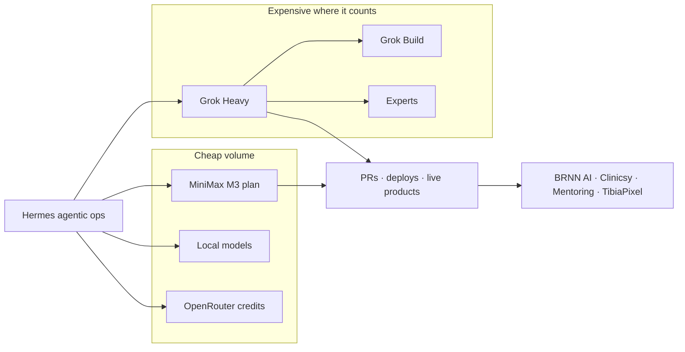

# 20B tokens at ~US$150/month — ~300× cheaper than Claude or ChatGPT

Over the last two months we pushed Hermes, subagents, PRs, deploys, and a pile of experiments across several providers at once. MiniMax’s Coding Plan heatmap is blunt: **16.89 billion tokens** on that plan alone, with a **1.74B peak** across **76 active days** from June through August 2026.

Grok does not publish the same total-token counter. Add its weekly Heavy pool, OpenRouter credits, Gemini, and local models, and the whole operation lands around **~20B tokens**. On our mix that volume sits at **~US$149/month** in cruise (MiniMax 5B + Grok Heavy promo). The same 20B on metered Claude Sonnet 5 is **~US$46,000**. On GPT-5.6 Sol, **~US$92,000**. On Claude Opus 5, **~US$115,000**. Call it **~300×** versus Sonnet, **~600–770×** versus the flagships — not a rounding error.

Those tokens did not stay on a dashboard. They fund the catalog we operate on Brenon.Cloud: greenfield products we created in the loop, and two in-flight projects — **Clinicsy** and **Profitt** — that we did not start there. We picked them up already in motion and now run them with Hermes + MiniMax + Grok.

The thesis is simple: mix cheap high-volume Chinese plans with expensive, competent American models where it matters, and you can run a fully agentic business operation without paying Claude or ChatGPT rates for 100% of the belt.

---

## What MiniMax showed in two months

MiniMax M3 Coding Plan usage (Jun–Aug 2026):

| Metric | Value |
| --- | --- |
| Total tokens | **16.89B** |
| Peak tokens | **1.74B** |
| Active days | **76** |
| Window | June → August 2026 |

The heatmap is not a one-off spike. It is sustained load, with hard peaks from late July through August — exactly when agentic automations and product loops were heaviest. A **1.74B peak** on a single window is why we started on the 12B Ultra plan: a 5B ceiling would have clipped the experiment mid-sprint.

Two details matter if you run agents:

1. **Prompt >> completion.** On this plan, agent loops are overwhelmingly input: long context, tools, session history, repo re-reads. Pricing that only imagines “pretty answers” underestimates real agent cost. We price the comparison below at the mix we measured on this workload (~96% prompt / ~4% completion).
2. **Cache is the silent majority.** A huge share of prompt is repetition. A plan with good cache plus a cheap volume model changes the bill. The same 20B on a premium API *without* treating cache as first-class is even worse.

---

## The plan ladder we climbed (and stepped down)

### MiniMax M3

- **Start:** **US$120/month** plan with **12B tokens/month**, capped on 4h / week / month windows. That was the raw engine for the first two months of high-volume experiments.
- **Now:** we stepped down to a **5B-token plan at US$50/month**. It is still the volume backbone — coding, long loops, subagents, bulk refactors.

The expensive plan was not a mistake. **Volume is cheap in China**; once usage shape is known, you right-size the ceiling. Ultra absorbed the 16.89B discovery window. Max is cruise.

### Grok (SuperGrok Heavy)

Grok does **not** publish the same total-token counter MiniMax does. What we bought is subscription capacity:

- List: **US$300/month**.
- **Current promo:** **US$99/month**, with a very strong allowance.
- Unlike MiniMax, Grok’s limit is **pooled per week** — a good fit for agentic sprints with mid-week peaks.

Before Grok, MiniMax carried almost everything. With Heavy online, the split is clear: MiniMax for daily volume, Grok when reasoning, dense research, and coding-agent quality matter more.

### The rest of the mix

- **Gemini** — batches and tasks where quota / quality fit.
- **OpenRouter** — spot credits for models we did not want as fixed subscriptions.
- **Local models** — when network latency or zero marginal cost beat frontier quality.

None of that replaces MiniMax + Grok. It completes them.

---

## Real stack cost vs. the same volume on premium APIs

Here is the comparison that matters. Take **20B tokens** at the **input-heavy mix we measured on MiniMax** (~96% prompt / ~4% completion) and ask: what if that entire volume were metered Claude or OpenAI API?

| Scenario | Estimated cost |
| --- | --- |
| **Our current stack (MiniMax 5B US$50 + Grok Heavy promo US$99)** | **~US$149 / month** (recurring capacity, not “20B on one invoice”) |
| MiniMax Ultra US$120 × 2 months (the 16.89B window) | ~US$240 for the bi-month |
| MiniMax 5B + Grok Heavy list US$300 | ~US$350 / month |
| **20B on Claude Sonnet 5** (US$2 / US$10 per 1M in/out) | **~US$46,000** |
| **20B on GPT-5.6 Terra** (US$2 / US$12) | **~US$47,000** |
| **20B on GPT-5.6 Sol** (US$4 / US$20) | **~US$92,000** |
| **20B on Claude Opus 5** (US$5 / US$25) | **~US$115,000** |
| 20B on Claude Haiku 4.5 (US$1 / US$5) — cheap US baseline | ~US$23,000 |

The **16.89B MiniMax-only** slice alone is ~**US$39k** on Sonnet 5 and ~**US$97k** on Opus 5 at the same mix. We paid **hundreds of dollars** in plans, not tens of thousands in API invoices.

API figures use public cards as of 27 August 2026 ([Anthropic](https://platform.claude.com/docs/en/about-claude/pricing), [OpenAI](https://developers.openai.com/api/docs/pricing) standard short-context rows), no prompt-cache discount and no batch. Aggressive cache lowers a metered bill — it does not collapse it to Coding Plan + SuperGrok Heavy territory. Even Haiku, the cheap US floor, is still two orders of magnitude above the subscription mix. A chat-like 80/20 split would make the API column *worse*, not better.

---

## Why the mix beats a single “best model”

### 1. Volume and intelligence do not need the same SKU

Real agents burn tokens on:

- re-reading the repo
- tool calls
- fail-and-retry
- long sessions
- spawning subagents

That is **volume**. A generous Chinese coding plan (MiniMax) absorbs it. An American frontier model (Grok) steps in when failure is expensive: architecture, dense review, PoCs that cannot hallucinate the path.

### 2. Subscription vs. metered changes team behavior

On metered API, everyone hesitates to “let the agent run overnight.” On a volume plan plus weekly Heavy capacity, we optimize **the work**, not invoice fear. That often matters more than a 2% leaderboard gap.

### 3. Weekly pool (Grok) vs. 4h / week / month slices (MiniMax)

Both ceilings annoy you in different ways — and that is useful. MiniMax forces you to spread volume. Grok gives a high weekly pool for a sprint. Together, the whole operation rarely stalls at the same instant.

### 4. Grok Heavy: Build and Experts are not brochure fluff

On Heavy we actually use:

- **Build** — speeds PoCs and terminal coding agents without standing up another harness from scratch.
- **Experts** — multi-agent passes for dense research, trade-offs, and problems a single pass gets wrong.

That is why the US$99 promo (US$300 list) is worth it next to a US$50 MiniMax plan: not because Grok is cheaper per token — it is not — but because those two surfaces accelerate the work MiniMax should not be trusted to finish alone.

That matches what we described in [Agentic Loop Engineering](/blog/agentic-loop-engineering): the method needs a cheap model in the loop and a strong model at the checkpoint.

---

## What the tokens actually shipped

The heatmap is not a lab score. It is the bill for software we **publish and operate** through agentic delivery loops on Hermes — MiniMax on volume, Grok on the hard checkpoint. A human still sits on the merge gate; the loop does the rest.

Two shapes. **Greenfield** we created in the loop. **In-flight** we did not: Clinicsy and Profitt were already moving. We took them over and now operate them with the same Hermes + MiniMax + Grok loop engineering.

### Created in the loop (greenfield)

| Product | Live host | What it is |
| --- | --- | --- |
| **BRNN AI** | [ai.brenon.cloud](https://ai.brenon.cloud) | First-party APIs on our Swarm. **Whisper STT** and **Chatterbox TTS** are live (15 min/mo STT, 5 min/mo TTS, pt-BR + en). No first-party LLM listed yet. |
| **DevDojo Mentoring** | [mentoria.devdojo.academy](https://mentoria.devdojo.academy) | Gamified technical mentoring, wired to GitHub and the DevDojo Discord. |
| **TibiaPixel** | [tibiapixel.brenon.cloud](https://tibiapixel.brenon.cloud) | Open-source Tibia-style survival/craft sim. AI agents and humans share the same shard and rules. Alpha, three servers. |
| **OficinaCloud** | [oficina.brenon.cloud](https://oficina.brenon.cloud) | Multi-tenant SaaS for small and mid-size auto repair shops: customers, vehicles, service orders, stock. |
| **VServer** | [vserver.brenon.cloud](https://vserver.brenon.cloud) | Dashboard we built to operate GPU-oriented machines (local AI or mining) with live monitoring. |

### Taken over in-flight (not born in the loop)

| Product | Live host | What it is |
| --- | --- | --- |
| **Clinicsy** | [clinicsy.app](https://clinicsy.app) | Multi-tenant SaaS to get home care, consultórios, and clinics off spreadsheets. Already in progress when we put it under Hermes + MiniMax + Grok. |
| **Profitt** | [profitt.app](https://profitt.app) | Portfolio tracker — DeFi + traditional markets, AI insights, WhatsApp/Telegram alerts. Same story: in motion, then operated by the loop, not created by it. |

These are not slides. They are public hosts: trials, alphas, paying tenants. The loops that burned 16.89B tokens are the loops that open PRs, run CI, and deploy into this catalog — including the two we did not start.

### Greenfield needed a factory. So did the two we inherited.

Empty repo, spec, Swarm, no legacy team: a good way to **test models**. A bad way to replay the *same* workflow on the next repo — and a worse way to drop agents onto a product that already has customers, which is exactly Clinicsy and Profitt.

So besides the model mix, we built **[git-meta-harness](https://github.com/brenonaraujo/git-meta-harness)** (`gmh`): a framework that materializes the delivery team — personas, GitHub issues/PRs, sensors — so Hermes and other code agents run the same loop instead of reinventing it in chat. Greenfield gets `gmh install`. An in-flight SaaS gets `gmh adopt` (Clinicsy is the case we wrote up). We wrote that factory in [git-meta-harness — From Loop Engineering to a Team That Ships](/blog/git-meta-harness). This post is the token bill. That post is how the work repeats.

With MiniMax 5B + Grok Heavy (promo) we keep:

- those products evolving on **Hermes** (desktop, gateway, cron, subagents)
- the git-meta-harness loop reusable across Hermes and other coding agents
- Gemini / OpenRouter / local experiments without swapping the backbone
- deploy, review, and iteration **without daily token-blowout anxiety**

It is not unlimited. It is **sized**. Ultra was for discovering pace (16.89B, 1.74B peaks) while the catalog came up. Max + Heavy is cruise: the ceiling sits above real work pace, and the monthly cost fits a small-team card, not an enterprise cloud forecast.

---

## Practical lessons (no romance)

1. **Measure your input/output mix.** Agents are not chat. If your dashboard is 96% prompt, any price table that ignores that is fiction.
2. **Buy volume where the dollar stretches.** Chinese coding plans for the body of the loop.
3. **Buy reasoning where failure hurts.** Grok Heavy / Build / Experts for review, research, and critical PoCs.
4. **Right-size after the spike.** We paid US$120 while discovering pace; US$50 + Heavy is cruise.
5. **Do not swear loyalty to one lab.** The mix (MiniMax + Grok + Gemini + OpenRouter + local) *is* the operation. “Model of the month” is one part.
6. **Cache and sessions matter.** Repeated prompts without cache on premium API is expensive luxury. The heatmap above is only survivable because so much of the 16.89B is repetition the plan already paid for.

---

## Closing

16.89B on MiniMax in two months. Grok Heavy on reasoning, Build, and Experts. Hermes in the middle, git-meta-harness as the factory that replays the loop. Result: greenfield products **and** two in-flight takeovers (Clinicsy, Profitt) running as agentic ops for **~US$150/month**, while the **same ~20B on Claude or ChatGPT APIs** is **~US$46k–US$115k** — on the order of **300×**.

Not a trick. Price arbitrage plus workload design. Cheap Chinese models on volume. Expensive, competent American models where it counts. Together they fund a fully agentic business operation — products in production, not a demo reel — without the daily drama of blowing the token cap.

If you still pay frontier rates for 100% of the loop, the table above is an invitation to rethink the mix — not model quality, but the **place** of each model on the belt.

---

## References and Useful Links

- **[MiniMax Token Plan](https://platform.minimax.io/subscribe/token-plan)**: Plus / Max / Ultra coding-plan quotas (the volume backbone).
- **[OpenAI API Pricing](https://developers.openai.com/api/docs/pricing)**: official card used in the table (GPT-5.6 Sol / Terra, August 2026).
- **[Anthropic Claude Pricing](https://platform.claude.com/docs/en/about-claude/pricing)**: Sonnet 5, Opus 5, Haiku 4.5.
- **[xAI Pricing](https://x.ai/pricing)**: SuperGrok / Heavy plans, Build and Experts.
- **[Agentic Loop Engineering](/blog/agentic-loop-engineering)**: the method behind the loops that burned these tokens.
- **[git-meta-harness — From Loop Engineering to a Team That Ships](/blog/git-meta-harness)**: the factory that replays the loop on Hermes and other coding agents.
- **[git-meta-harness](https://github.com/brenonaraujo/git-meta-harness)**: public framework, MIT, `gmh` CLI.
- **[Hermes Agent](https://hermes-agent.nousresearch.com/docs)**: the agentic runtime that consumes the mix day to day.
- **[BRNN AI](https://ai.brenon.cloud)**, **[Clinicsy](https://clinicsy.app)**, **[DevDojo Mentoring](https://mentoria.devdojo.academy)**, **[TibiaPixel](https://tibiapixel.brenon.cloud)**, **[OficinaCloud](https://oficina.brenon.cloud)**, **[VServer](https://vserver.brenon.cloud)**, **[Profitt](https://profitt.app)**: catalog we operate — greenfield plus Clinicsy and Profitt taken over in-flight.
