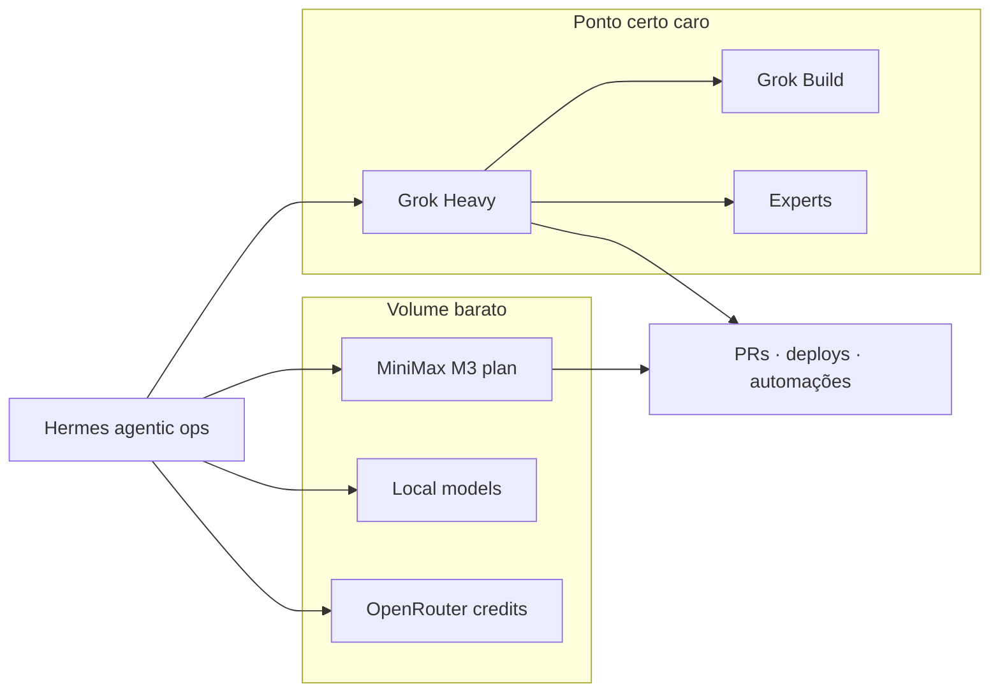

# 20 bilhões de tokens — MiniMax, Grok e o mix que sustenta operação agentica

Nos últimos dois meses a gente empurrou Hermes, subagentes, PRs, deploys e uma fila de experimentos em cima de vários provedores ao mesmo tempo. O painel do MiniMax Coding Plan não mente: **16,09 bilhões de tokens** só nesse plano, de 28 de junho a 26 de agosto de 2026.

Somando o uso do Grok (assinatura, não API metered por token na conta), créditos de OpenRouter, Gemini e modelos locais, o volume total da operação fica na casa dos **~20B de tokens**. A tese deste post é simples: dá para montar uma operação empresarial totalmente agentica misturando modelos chineses baratos em volume com modelos americanos caros e competentes no ponto certo — e o recibo fica em outra ordem de grandeza do que “tudo no Claude / tudo no ChatGPT”.

---

## O que o MiniMax mostrou em 2 meses

O Coding Plan Usage (Last 2 Months) do MiniMax M3:

| Métrica | Valor |
| --- | --- |
| Total tokens | **16,09B** |
| Prompt | 15,50B |
| Completion | 585,89M |
| Cache read | 11,87B |
| Cache write | 2,36B |
| Sessions | 28,11k |
| Janela | 2026-06-28 → 2026-08-26 |

O heatmap diário deixa claro o padrão: não foi um spike isolado. Foi uso contínuo, com picos fortes no fim de julho e ao longo de agosto — exatamente quando as automações agenticas e os loops de produto estavam rodando mais pesado.

Dois detalhes importam para quem opera agent:

1. **Prompt >> completion.** ~96% do volume é input. Contexto longo, tools, histórico de sessão, re-leituras de repo. Quem precifica só “resposta bonita” subestima o custo real de um agente.
2. **Cache read em 11,87B.** Boa parte do prompt é repetição. Plano com cache bom e modelo barato no volume muda a conta.

---

## A escada de planos que a gente subiu (e desceu)

### MiniMax M3

- **Começo:** plano de **US$ 120/mês** com **12B tokens/mês**, com tetos a cada 4h, semana e mês. Foi o motor bruto dos primeiros dois meses de experimento em volume.
- **Agora:** reduzimos para o plano de **5B tokens por US$ 50/mês**. Ainda é o backbone de volume — coding, loops longos, subagentes, refactors em massa.

O ponto não é “o plano caro era ruim”. O ponto é que **volume se compra barato na China**, e depois você calibra o teto quando o padrão de uso já está claro.

### Grok (SuperGrok Heavy)

O Grok **não expõe o total de tokens** no mesmo formato do MiniMax. O que a gente comprou foi capacidade por assinatura:

- Lista: plano na casa dos **US$ 300/mês**.
- **Agora em promo:** cerca de **US$ 99/mês**, com limite generoso.
- Diferente do MiniMax, o rate limit do Grok é **dividido por semana** — o que encaixa bem em sprints agenticas com picos no meio da semana e folga no fim.

Antes do Grok, o MiniMax sozinho carregava quase tudo. Com o Heavy no ar, o desenho mudou: MiniMax no volume diário, Grok onde raciocínio, pesquisa densa e coding agent importam mais.

### O resto do mix

- **Gemini** — lotes e tarefas onde a cota / qualidade encaixava.
- **OpenRouter** — créditos pontuais para modelos que a gente não queria assinar fixo.
- **Modelos locais** — quando latência de rede ou custo zero importavam mais que frontier.

Nada disso substitui o par MiniMax + Grok. Completa.

---

## Custo real da nossa stack vs. o mesmo volume em API “premium”

Aqui a comparação que importa. Pegamos **20B de tokens** no **mesmo mix de input/output que o MiniMax mediu** (~96,4% prompt / ~3,6% completion) e perguntamos: quanto custaria se esse volume inteiro fosse API metered de Claude ou OpenAI?

| Cenário | Custo estimado |
| --- | --- |
| **Nosso stack atual (MiniMax 5B US$50 + Grok Heavy promo ~US$99)** | **~US$ 149 / mês** (capacidade recorrente, não “20B numa fatura”) |
| MiniMax só nos 2 meses pesados @ US$120 | ~US$ 240 no bimestre do volume 16B+ |
| MiniMax 5B + Grok Heavy lista US$300 | ~US$ 350 / mês |
| **20B no Claude Sonnet 5** (US$2 / US$10 por 1M in/out) | **~US$ 45.800** |
| **20B no GPT-5** (US$1,25 / US$10) | **~US$ 31.400** |
| **20B no GPT-4o** (US$2,50 / US$10) | **~US$ 55.400** |
| **20B no Claude Opus 5** (US$5 / US$25) | **~US$ 114.500** |
| **20B no GPT-5.6 Sol** (US$5 / US$30) | **~US$ 118.200** |
| 20B no Claude Haiku 4.5 (US$1 / US$5) — baseline barato US | ~US$ 22.900 |

Só os **16,09B medidos no MiniMax**, na mesma proporção, já dariam ~**US$ 37k** no Sonnet 5 e ~**US$ 92k** no Opus 5. A gente pagou **centenas de dólares** de plano, não dezenas de milhares de API.

Números de API usam o card público de agosto/2026 (Anthropic / OpenAI), sem prompt cache e sem batch. Com cache agressivo a fatura API cai — mas não cai para o patamar de assinatura Coding Plan + SuperGrok Heavy. A ordem de grandeza continua outra.

---

## Por que o mix funciona melhor que um único “melhor modelo”

### 1. Volume e inteligência não precisam ser o mesmo SKU

Agente de verdade queima token em:

- reler repo
- rodar tool
- falhar e tentar de novo
- manter sessão longa
- spawnar subagente

Isso é **volume**. Modelo chinês em plano generoso (MiniMax) absorve. Modelo frontier americano (Grok) entra quando a falha custa caro: arquitetura, review denso, PoC que não pode alucinar o caminho.

### 2. Assinatura vs. metered muda o comportamento da equipe

Com API metered, todo mundo hesita em “deixar o agente rodar a noite toda”. Com plano de volume + Heavy semanal, a gente **otimiza o trabalho**, não o medo da fatura. Isso importa mais do que a diferença de 2% de quality bench num leaderboard.

### 3. Rate limit por semana (Grok) vs. fatias de 4h / semana / mês (MiniMax)

Os dois tetos são chatos de formas diferentes — e isso é bom. MiniMax te força a espalhar o volume. Grok te dá um pool semanal alto para sprint. Juntos, raramente a operação inteira para no mesmo instante.

### 4. Grok Heavy: Build e Experts não são “extra de marketing”

No Heavy a gente usa de verdade:

- **Build** — acelera PoC e coding agent no terminal sem montar outro harness do zero.
- **Experts** — multi-agente para pesquisa densa, trade-offs e problemas que um único pass erra.

Isso encaixa no que já descrevemos em [Loop Engineering Agentico](/blog/agentic-loop-engineering): o método precisa de modelo barato no loop e modelo forte no checkpoint.

---

## O que está rodando com esse orçamento

Com MiniMax 5B + Grok Heavy (promo) a gente mantém:

- automações agenticas no **Hermes** (desktop, gateway, cron, subagentes)
- evolução contínua dos produtos em **brenon.cloud** e satélites
- experimentos com Gemini, OpenRouter e local sem trocar o backbone
- deploy, review e iteração **sem a ansiedade de estouro de token** como evento diário

Não é “ilimitado”. É **dimensionado**. A diferença é que o teto fica acima do ritmo real de trabalho — e o custo mensal cabe em cartão de time pequeno, não em forecast de cloud enterprise.

---

## Lições práticas (sem romance)

1. **Meça o mix input/output.** Agente não é chat. Se o seu painel parece o nosso (15B prompt / 0,6B completion), qualquer tabela de preço que ignore isso é ficção.
2. **Compre volume onde o dólar rende.** Coding plan chinês para o miolo do loop.
3. **Compre raciocínio onde a falha dói.** Grok Heavy / frontier no review, na pesquisa e no PoC crítico.
4. **Recalibre o plano depois do spike.** A gente pagou US$120 enquanto descobria o ritmo; US$50 + Heavy é o regime de cruzeiro.
5. **Não jure fidelidade a um lab.** O mix (MiniMax + Grok + Gemini + OpenRouter + local) é a operação. O “melhor modelo do mês” é só uma peça.
6. **Cache e sessão importam.** 11,87B de cache read no MiniMax é o que torna 16B sobrevivível. Prompt repetido sem cache em API premium é luxo caro.

---

## Conclusão

16B+ no MiniMax em dois meses. Grok Heavy no raciocínio e no Build. Gemini, OpenRouter e local no resto. Hermes no meio orquestrando. Resultado: operação agentica de verdade por **~US$150/mês no regime atual**, enquanto o **mesmo volume em Sonnet/Opus/GPT metered** se mede em **dezenas a centenas de milhares de dólares**.

Não é truque. É arbitragem de preço + desenho de workload. Modelos chineses baratos no volume. Modelos americanos caros e competentes no ponto certo. Juntos, sustentam uma operação empresarial agentica sem o drama do estouro de token.

Se você ainda está pagando frontier em 100% do loop, a planilha acima é o convite para repensar o mix — não a qualidade do modelo, o **lugar** dele na esteira.

---

## Referências e Links Úteis

- **[OpenAI API Pricing](https://developers.openai.com/api/docs/pricing)**: card oficial usado na tabela (GPT-4o, GPT-5, GPT-5.6).
- **[Anthropic Claude Pricing](https://platform.claude.com/docs/en/about-claude/pricing)**: Sonnet 5, Opus 5, Haiku 4.5.
- **[xAI Pricing](https://x.ai/pricing)**: planos SuperGrok / Heavy, Build e Experts.
- **[Loop Engineering Agentico](/blog/agentic-loop-engineering)**: o método por trás dos loops que queimaram esses tokens.
- **[Hermes Agent](https://hermes-agent.nousresearch.com/docs)**: o runtime agentico que consome o mix no dia a dia.
