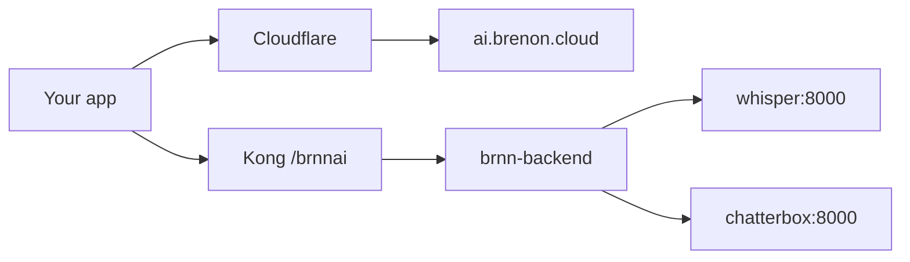

# STT and TTS on our cluster

We already ran a Swarm at home. Kong in front, a tunnel at the edge, the same path that serves oficina, draw, and the rest. One obvious piece was missing: audio.

Audio isn't special. People just assume transcribing and synthesizing speech means paying a vendor. It doesn't. Whisper and Chatterbox are open models. You can run both as services on the cluster, put a key in front, and let a developer call them.

That is what we did. The result is at [ai.brenon.cloud](https://ai.brenon.cloud).

---

## Why we did it

There was no fancy reason. We had the cluster, the models were ready, and we were tired of outsourcing something we can serve ourselves.

Paying per minute of transcription makes sense when you don't have machines. We do. Whisper small is good enough for a product. Chatterbox speaks Brazilian Portuguese and can clone a voice. Both fit on the Swarm.

The rest we already knew how to build: account, API key, quota, sandbox. Same shape as any other service here.

---

## What's live

Two of our own APIs, both live:

- **Whisper STT** (`brnn/whisper-stt`) — 15 free minutes a month, clips up to 1 minute. Ready for pt-BR.
- **Chatterbox TTS** (`brnn/chatterbox-tts`) — 5 free minutes, 30-second clips, one free voice clone. pt-BR and English.

We do not have our own text model yet. When we do, it goes in the catalog. Until then we don't pretend.

Create an account, mint a `sk-brn-…` key, and try the sandbox. No card on the free plan.

Public calls go through Kong:

```
https://api.brenon.cloud/brnnai/v1/audio/transcriptions
https://api.brenon.cloud/brnnai/v1/audio/speech
```

---

## How it sits on the cluster

No new stack. One more Swarm service.



The portal is Next.js behind the tunnel. The API is Express with SQLite. Whisper and Chatterbox are sibling stacks on the Kong overlay. Rate limit and CORS live in Kong. The key is checked in the backend.

If the cluster already serves everything else, serving audio is two more containers and a route.

---

## How we built it

The whole project (portal, API, quota, sandbox, Swarm deploy, Kong route) came out of the same loop I wrote about in [Agentic Loop Engineering](/blog/agentic-loop-engineering): plan, implement, test, publish, then go back to what broke.

It was not one prompt and a miracle. It was a spec, tasks, PRs, CI, and the cluster at the end. The loop post is the method. This one is the product that came out the other side.

---

## References and Useful Links

- **[ai.brenon.cloud](https://ai.brenon.cloud)**: portal, sandbox, and keys.
- **[Agentic Loop Engineering](/blog/agentic-loop-engineering)**: how we build software in a loop.
- **[Status](https://ai.brenon.cloud/status)**: backend, Whisper, and Chatterbox health.
