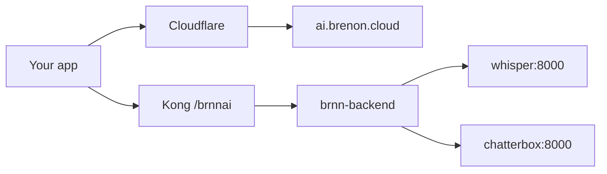

# STT e TTS no nosso cluster

A gente já rodava um Swarm em casa. Kong na frente, túnel na borda, o mesmo caminho que serve oficina, draw e o resto. Faltava um pedaço óbvio: áudio.

Áudio não é especial. Só que a maior parte das pessoas assume que transcrever e sintetizar voz é coisa de API cara. Não é. Whisper e Chatterbox são modelos abertos. Dá pra subir os dois como serviço no cluster, colocar uma chave na frente e deixar o dev chamar.

Foi isso que fizemos. O resultado está em [ai.brenon.cloud](https://ai.brenon.cloud).

---

## Por que fizemos

Não tinha um motivo sofisticado. Tinha o cluster, os modelos prontos, e a vontade de parar de terceirizar uma coisa que a gente consegue servir.

Pagar por minuto de transcrição faz sentido quando você não tem máquina. A gente tem. O Whisper small transcreve bem o suficiente pra produto. O Chatterbox fala pt-BR e ainda clona voz. Os dois cabem no Swarm.

O resto a gente já conhece: conta, API key, cota, sandbox. Mesmo desenho de qualquer outro serviço nosso.

---

## O que está no ar

Duas APIs nossas, as duas live:

- **Whisper STT** (`brnn/whisper-stt`) — 15 minutos grátis por mês, clipe de até 1 minuto. Pronto pra pt-BR.
- **Chatterbox TTS** (`brnn/chatterbox-tts`) — 5 minutos grátis, clipe de 30 segundos, um clone de voz grátis. pt-BR e inglês.

Modelo de texto próprio ainda não. Quando tiver, entra no catálogo. Até lá a gente não finge que tem.

Você cria conta, gera uma key `sk-brn-…` e testa no sandbox. Sem cartão no plano grátis.

A chamada pública passa pelo Kong:

```
https://api.brenon.cloud/brnnai/v1/audio/transcriptions
https://api.brenon.cloud/brnnai/v1/audio/speech
```

---

## Como isso senta no cluster

Nada de stack nova. É mais um serviço no Swarm.



O portal é Next.js atrás do túnel. A API é Express com SQLite. Whisper e Chatterbox são stacks irmãs no overlay do Kong. Rate limit e CORS ficam no Kong. A key é validada no backend.

Se o cluster já serve o resto, servir áudio é mais dois containers e uma rota.

---

## Como a gente construiu

O projeto inteiro (portal, API, cota, sandbox, deploy no Swarm, rota no Kong) saiu pelo mesmo loop que descrevi em [Loop Engineering Agentico](/blog/agentic-loop-engineering): planejar, implementar, testar, publicar, e voltar no que quebrou.

Não foi um prompt e um milagre. Foi spec, tarefa, PR, CI, e o cluster no fim. O post do loop é o método. Este texto é o produto que saiu do outro lado.

---

## Referências e Links Úteis

- **[ai.brenon.cloud](https://ai.brenon.cloud)**: portal, sandbox e keys.
- **[Loop Engineering Agentico](/blog/agentic-loop-engineering)**: como a gente constrói software em loop.
- **[Status](https://ai.brenon.cloud/status)**: saúde do backend, Whisper e Chatterbox.
