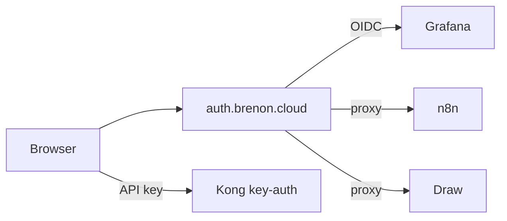

# One login for the lab

We already had Authentik running at [auth.brenon.cloud](https://auth.brenon.cloud). It was an IdP with almost nothing plugged in. Each console had its own password. That is fine for a weekend lab. It is a mess once you treat `*.brenon.cloud` like a small cloud.

The goal was simple: log in once, then open the apps you are allowed to see. Same shape as an AWS access portal, not a new account per product.

---

## What is live

The portal is [auth.brenon.cloud/if/user/](https://auth.brenon.cloud/if/user/). Authentik 2025.8.4. One session cookie on the IdP, then OIDC (or a proxy in front) for each console.

| Console | How you get in |
|---------|----------------|
| Grafana | Native OIDC. Password form off. |
| Portainer | OIDC plus local login. Swarm break-glass stays. |
| n8n | Community edition has no OIDC. oauth2-proxy in front, then a small hook issues the editor cookie. |
| MinIO console | Current OSS UI dropped the OpenID button. Proxy in front, then we mint the console session. S3 on `:7000` is unchanged. |
| Draw | Excalidraw behind the same proxy. The old PWA cache had to be killed or the board opened without hitting the IdP. |

The marketing site, TibiaPixel play, the status page, and similar landings stay public on purpose. Machine APIs on `api.brenon.cloud` stay on Kong `key-auth`. Humans and bots are not the same door.

---

## We did not force one pattern

Grafana speaks OIDC, so it talks to Authentik directly. n8n CE and stock Excalidraw do not. Putting a proxy in front is uglier than a native button. It is also the only way those apps join the same login.

Portainer is the exception we kept on purpose. If Authentik is down, we still need a way into Swarm. Local login there is a cost we accepted. Grafana does not get that luxury: if the IdP is down, Grafana is down.

MinIO was the annoying one. Identity env vars were set. The console still showed a form. The OSS image we run no longer draws an OIDC button. So the public hostname goes through Authentik first. After that, the console session is created for you.

---

## The button on brenon.cloud

[brenon.cloud](https://brenon.cloud) is still a public site. Blog, products, games, Path to Glory: no login wall.

The nav has a single outline control, **Go to console**, in the same spirit as AWS. It starts OIDC against Authentik (`client_id=brenon-cloud`). Sign up is on the IdP page, not a second loud button in the header.

After you are in, the chip is your name. The menu opens the Authentik library (the actual console), Draw, and sign out. That session is the same one Draw and Grafana already trust.

Comments and likes on posts are not built yet. When they are, they will use this account, not a new one.

---

## Groups, later plans

Staff groups already exist: admins, ops, viewers, builders. A free-tier group is there for product apps. Draw does not require a paid group. Being logged in is enough.

Stripe can map a `price_id` to a group later. The IdP stays the source of truth for who may open which tile. Billing does not live inside Grafana.

---

## References and Useful Links

- **[Authentik](https://goauthentik.io/)**: the IdP we run.
- **[User library](https://auth.brenon.cloud/if/user/)**: the portal after login.
- **[brenon.cloud](https://brenon.cloud)**: Go to console in the nav.
- **[Draw](https://draw.brenon.cloud)**: Excalidraw, SSO required.
- **[oauth2-proxy](https://oauth2-proxy.github.io/oauth2-proxy/)**: the front door for apps without native OIDC.
