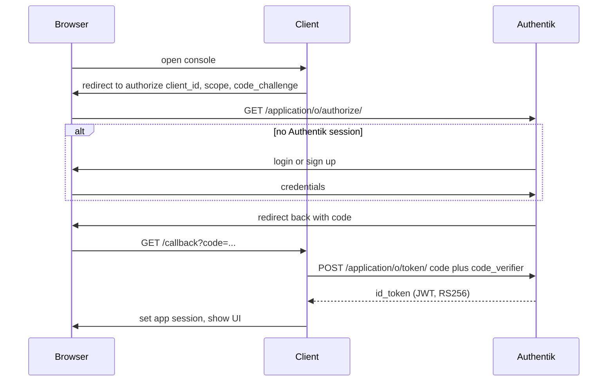
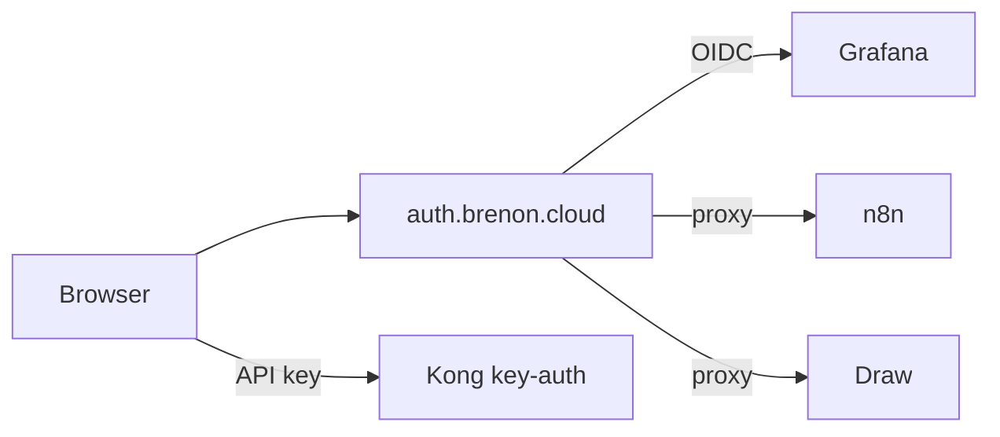

# One login for the lab

We already had Authentik at [auth.brenon.cloud](https://auth.brenon.cloud). It was an identity provider with almost nothing plugged in. Grafana had a password. Portainer had a password. n8n had a password. MinIO had a root user. Draw was wide open.

That is a home lab. It is not a cloud.

A cloud, even a small one, has a front door. You prove who you are once. Then you see the products you paid for, or the consoles you are allowed to operate. AWS calls that the access portal. Google calls it the account picker. We wanted the same shape on `*.brenon.cloud`.

This post is what we actually shipped, why OIDC is the protocol underneath, where we cheated, and why this is the prerequisite for renting capacity (a Hermes instance, a private Draw, a dedicated n8n) to real customers later. That last part is not live. The identity plane is.

---

## SSO is not a password manager

Single sign-on means one identity provider (IdP) owns the login. Applications do not store your password. They ask the IdP: is this person signed in, and may they use me?

The useful properties:

- You type a password (or a passkey, or a magic link) **once**, at `auth.brenon.cloud`.
- The next app does not show a form. It redirects, the IdP already has a session, and you bounce back in.
- Revoking access is one group membership, not hunting leftover accounts in five UIs.
- MFA, if we turn it on, lives in one place.

What SSO is not:

- It is not "the same password copied into every app."
- It is not a Kong API key. Machines still use `key-auth` on `api.brenon.cloud`.
- It is not a lock on the marketing site. Blog, products, games, Path to Glory, TibiaPixel play, and the status page stay public.

If we had put oauth2-proxy in front of brenon.cloud itself, the blog would demand a login. That is the wrong cloud. AWS does not make you sign in to read the homepage. They make you sign in to **open the console**.

---

## OIDC, without the brochure

[OpenID Connect](https://openid.net/specs/openid-connect-core-1_0.html) is a thin identity layer on OAuth 2.0. OAuth was built so an app can get **permission** to call an API. OIDC adds: **who is the human**.

The pieces we run:

| Piece | Here |
|-------|------|
| IdP / OpenID Provider | Authentik 2025.8.4 at `auth.brenon.cloud` |
| Client | each app (Grafana, the site, the proxy in front of n8n) |
| Authorization code | short-lived, one-time, comes back on the redirect |
| ID token | a JWT the client can verify. Name, email, subject. |
| Access token | for APIs. We barely use it for consoles. The ID token (or the proxy cookie) is enough. |
| Refresh token | we issue them. Consoles mostly ignore them and live on their own cookie. |

The dance Grafana (and the **Go to console** button) use is authorization code + PKCE:

A few details that actually bit us:

**Issuer is per application.** Discovery is not a global `/.well-known` on the host. It is `https://auth.brenon.cloud/application/o/<slug>/.well-known/openid-configuration`. Grafana, n8n, Draw, and the website each have their own.

**The ID token must be signed with a key in JWKS.** Authentik will happily sign HS256 with the client secret if you leave `signing_key` empty. oauth2-proxy then fails with `failed to verify id token signature`. We point providers at Authentik's internal JWT certificate so discovery advertises RS256 and JWKS is not empty.

**Public vs confidential clients.** The website is a Vue SPA. It cannot keep a client secret. It is a public client with PKCE. Grafana and oauth2-proxy are confidential: they hold a secret on the server.

**The IdP session is not the app session.** After OIDC, Grafana has its own cookie. n8n has `n8n-auth`. Draw has `_oauth2_proxy`. Logging out of one does not instantly kill the others. We did not promise global single logout in this wave.

**Email has to match.** n8n looks up the user by `X-Forwarded-Email`. Authentik sent `brenonaraujo@gmail.com`. The n8n owner was `sudo@brenon.cloud`. The editor kept asking for a password until those lined up. Same class of bug will show up in comments later if we are sloppy.

---

## AWS mapping, on purpose

This is how we talk about the lab internally. It is also how a customer should eventually talk about it.

| AWS | Brenon.Cloud |
|-----|----------------|
| IAM Identity Center / access portal | Authentik library at `/if/user/` |
| AWS account | this Swarm (`brenon.cloud`) |
| Permission set | Authentik group |
| IAM user | Authentik user |
| Access key | Kong `key-auth` consumer |
| Cognito app client | OIDC provider per app |
| ALB + OIDC | oauth2-proxy or native OIDC |
| Organizations SCP | policies on the application |

The **Go to console** control on [brenon.cloud](https://brenon.cloud) is the marketing-site equivalent of AWS's console button. The homepage stays readable. The button starts OIDC (`client_id=brenon-cloud`). After login, the chip is your name. The menu opens the Authentik library (the real console), Draw, and sign out.

Sign up is not a second loud button in the header. It lives on the Authentik identification page, wired to our enrollment flow. One identity, two intents: enter, or create.

---

## What each console actually does

We did not pretend every product speaks OIDC.

| Console | Pattern | Why |
|---------|---------|-----|
| Grafana | Native OIDC, password form off | The app supports it. IdP down means Grafana down. We accepted that. |
| Portainer | OIDC **and** local login | If Authentik is down we still need Swarm. Local login is break-glass. A bypass, on purpose. |
| n8n | oauth2-proxy, then a hook that calls `issueCookie` | Community edition has no OIDC. Proxy authenticates. The hook mints `n8n-auth` so the editor does not show a second form. |
| MinIO console | proxy, then we mint the console session | Current MinIO OSS UI dropped the OpenID button. Env vars were not enough. S3 on `:7000` stays a machine API. |
| Draw | same proxy family | Excalidraw has no login. A service worker cached the board and skipped the IdP until we served a kill-switch at `/service-worker.js`. |

The proxy path is uglier than a native button. It is also how you attach software that will never grow SSO, which is most of the OSS we run.

---

## Groups are the product catalog

Staff groups already exist: `brenon-admins`, `brenon-ops`, `brenon-viewers`, `brenon-builders`. There is a `plan-free` group for product apps. Draw does not require a paid group. Being logged in is enough.

That is the whole authorization model we need for a store:

- Stripe (or any billing) says the customer paid for `price_xxx`.
- A webhook puts them in `plan-hermes` or `plan-oficina`.
- Authentik hides every other tile.
- Offboarding is delete-from-group, not a ticket to hunt passwords.

Billing does not live in Grafana. Grafana only trusts the token.

Comments and likes on the blog are not built. When they are, they will read `profile.email` from this same login. A second accounts table would be a regression.

---

## Why this is how you sell the home cloud

A home cloud without identity can host **your** Grafana. It cannot host **someone else's** Hermes and bill them.

The missing piece was never Docker. We already run Swarm, Kong, a tunnel, GHCR. The missing piece was: who is this human, which instance may they open, and how do we turn that off on Friday when the card fails.

SSO plus groups is that piece.

A plausible next shape, not shipped:

1. Customer hits **Go to console** (or a future **Sign up** that is still Authentik).
2. Checkout maps `price_id` to a group.
3. We provision an isolated instance (Hermes with their config, a private n8n, a Draw room that is not the public board).
4. The portal shows that tile and nothing else.
5. Cancel → group gone → hostname stops answering for them.

Hermes is the obvious first paid workload: it is already how we operate the lab, and it is a product people pay for elsewhere. n8n and a locked Draw are the same pattern. Oficina already is a product; it should eventually consume this IdP instead of growing a parallel login.

None of that is a store yet. Without the IdP it would be five passwords and a spreadsheet. With it, it is an AWS-shaped portal on hardware we already pay for.

---

## References and Useful Links

- **[OpenID Connect Core](https://openid.net/specs/openid-connect-core-1_0.html)**: the protocol.
- **[Authentik](https://goauthentik.io/)**: the IdP we run.
- **[User library](https://auth.brenon.cloud/if/user/)**: the portal after login.
- **[brenon.cloud](https://brenon.cloud)**: Go to console in the nav.
- **[Draw](https://draw.brenon.cloud)**: Excalidraw, SSO required.
- **[oauth2-proxy](https://oauth2-proxy.github.io/oauth2-proxy/)**: front door for apps without native OIDC.
