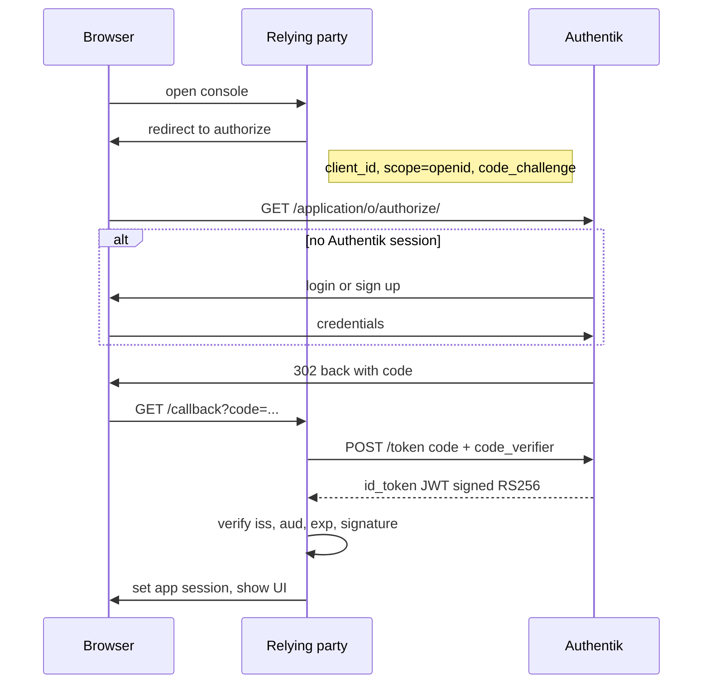
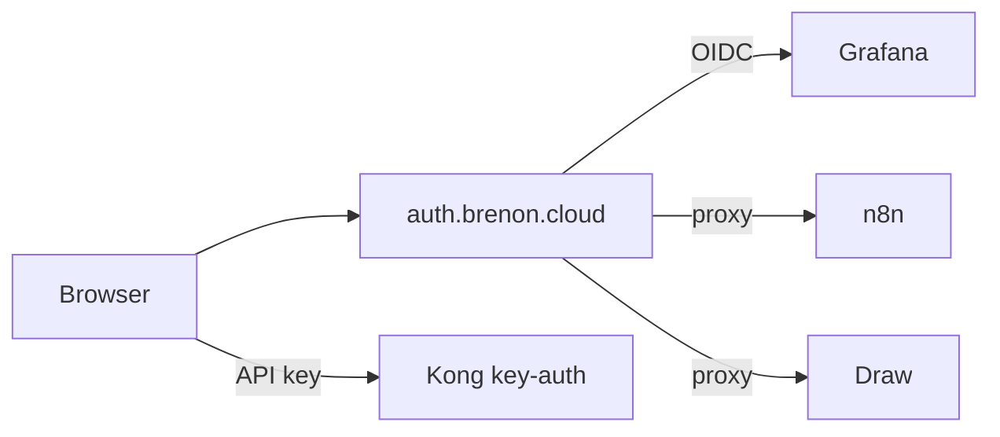

# One door for many services

We did not turn on SSO to look like a vendor. We did it because the lab was getting hard to share.

Every new console meant another password to invent, another admin user to create, another place to remember to delete someone. Grafana, Portainer, n8n, MinIO, Draw — five doors. That is fine when the only user is you. It falls apart the moment you want a collaborator in n8n, a friend on Draw, later a customer on a Hermes instance. You cannot scale access if access is five spreadsheets.

So we made **one door**. You sign in at [auth.brenon.cloud](https://auth.brenon.cloud). Authentik decides who you are and which tiles you may open. The consoles stop owning passwords. Revoke is a group, not a hunt. That is the whole reason.

Authentik was already running there (2025.8.4). It was an IdP with almost nothing plugged in. The work was to make it the **core**: the single access-control point for humans on `*.brenon.cloud`. This post starts there — why, then what Authentik actually is and why it stayed instead of Keycloak or Authelia — and only then walks the protocol and each console.

The marketing site, games, TibiaPixel play, and the status page stay public. A door is for consoles, not for reading the blog.

---

## Identity, before any product name

Every multi-app system has the same three questions:

1. **Authentication** — are you who you say you are?
2. **Session** — do I still believe you five minutes from now, without asking again?
3. **Authorization** — now that I know you, may you open *this* thing?

A password stored inside Grafana only answers (1) for Grafana. It does not answer (2) for n8n. It does not answer (3) for a future paid Hermes. If you copy the same password into five apps you still have five answers to (1), five sessions, and five places to revoke. That is the silo model.

An **identity provider** (IdP) is a service whose only job is those three questions, for every app that agrees to trust it. The app becomes a **client**. The human logs in at the IdP. The client never sees the password.

That split is the whole game. Everything else in this post is how the client and the IdP talk, and how we attached software that does not want to talk.

---

## What SSO is, and what it is not

**Single sign-on** is the property you get when many clients share one IdP session.

You type a password, or a passkey, or finish a magic link, **once**, at the IdP. The next client redirects there, the IdP already has a cookie, and you bounce back already in. Revoking access is a group membership, not a hunt through leftover admin users. MFA, if we turn it on, lives in one place.

SSO is not:

- the same password copied into every app
- a Kong API key (that is how **machines** call `api.brenon.cloud`)
- a lock on the marketing site

AWS does not make you sign in to read aws.amazon.com. They make you sign in to **open the console**. If we had put a proxy in front of brenon.cloud itself, the blog would demand a login. That is the wrong cloud.

Two more distinctions that matter later:

- **SSO is not single logout.** After OIDC, Grafana has its own cookie, n8n has `n8n-auth`, Draw has `_oauth2_proxy`. Signing out of one does not instantly kill the others. We did not promise global SLO in this wave.
- **SSO is not authorization.** Being logged in only proves identity. Which tile you see is a **group** (or a policy) on the application. A free account and an admin account can share the same login screen and still see different worlds.

---

## What OIDC is

[OpenID Connect](https://openid.net/specs/openid-connect-core-1_0.html) is a thin identity layer on **OAuth 2.0**.

OAuth was built so an application can get **permission** to call an API on your behalf. The original story is: a third-party photo printer wants to read your Google Drive. You should not give the printer your Google password. You send the printer to Google, you consent, the printer gets a token that is only good for that API.

That answers *may this app call that API*. It does not, by itself, answer *who is sitting in the browser*. People bolted identity onto OAuth anyway, each in a slightly different way, and the result was a mess of custom `/userinfo` endpoints. OIDC is the agreed extra:

- a standard way to request identity (`scope=openid`)
- a standard **ID token** (a JWT) that says who you are
- a standard discovery document so the client does not hard-code URLs
- a standard UserInfo endpoint if the client wants more claims

The three roles, in the language of the spec:

| Role | Job | Here |
|------|-----|------|
| Resource owner | the human | you, in a browser |
| Relying party (RP) / client | the app that wants to know who you are | Grafana, the site, oauth2-proxy |
| OpenID provider (OP) / IdP | issues tokens after login | Authentik at `auth.brenon.cloud` |

The three artifacts that move:

| Artifact | Lifetime | What it proves |
|----------|----------|----------------|
| Authorization code | seconds, one use | "this browser just finished login for this client" |
| ID token | minutes | "this is the human" — `sub`, `email`, `name`, `iss`, `aud` |
| Access token | minutes | "this client may call that API" |

Consoles mostly eat the ID token (or a cookie the proxy sets after verifying it). Machine APIs on this lab never see those tokens. They use Kong `key-auth`. Mixing the two doors is how you accidentally put a human session in a cron job, or an API key in a browser.

### The dance: authorization code + PKCE

Grafana and the **Go to console** button use the same flow. The website is a public client (a Vue SPA, no place to hide a secret), so it adds **PKCE**: the browser invents a verifier, sends a hash of it (`code_challenge`) on the authorize request, and later proves it still has the verifier when it trades the code for tokens. A stolen code in the redirect URL is useless without that verifier.

A few rules that are easy to skip and expensive to debug:

**Issuer is per application.** Authentik does not publish one global `/.well-known` on the host. Discovery is `https://auth.brenon.cloud/application/o/<slug>/.well-known/openid-configuration`. Grafana, n8n, Draw, and the website each have their own issuer. Point a client at the wrong slug and the `iss` claim will not match.

**The ID token must verify against JWKS.** If you leave Authentik's `signing_key` empty, it will sign HS256 with the client secret. A confidential app that knows the secret can still verify that. oauth2-proxy will not: it fetches JWKS, gets `keys: []`, and dies with `failed to verify id token signature`. We point those providers at Authentik's internal JWT certificate so discovery advertises `RS256` and JWKS is not empty.

**Public versus confidential clients.** The website cannot keep a client secret. It is public + PKCE. Grafana and oauth2-proxy run on the server and hold a secret. Do not put the Grafana secret in the SPA. Do not expect the SPA to use a confidential client.

**The IdP session is not the app session.** After the code exchange, each relying party mints its own cookie. That is why a second form can still appear even after Authentik said yes: the app never learned.

---

## Why Authentik is the core

The protocol is OIDC. The **product** in the middle is Authentik. If Authentik is down, Grafana is down, Draw is down, the **Go to console** button is down. Portainer is the only console that still has a local password, and that is only so we can recover the Swarm that runs Authentik itself.

Authentik is a self-hosted IdP (MIT, Python/Django, Postgres, Redis, a worker). We run it as a Swarm stack at `auth.brenon.cloud`. The pieces that matter for sharing services are not marketing bullets. They are objects we click — and now describe in [brenon-cloud-identity](https://github.com/brenonaraujo/brenon-cloud-identity).

**Application.** The tile. Name, slug, launch URL, which groups see it. The user library at `/if/user/` is just the list of applications you are allowed to open. That library is the reason we can invite more people without mailing five URLs and five passwords.

**Provider.** How the tile talks. Ours are OAuth2/OIDC (`grafana`, `n8n`, `minio`, `draw`, `brenon-cloud`). Authentik also speaks SAML, LDAP, SCIM, and a **proxy** provider. A provider with no application is a dead client — oauth2-proxy said `Failed to resolve application` until we linked them. Discovery can return 200 while authorize still fails.

**Flow and stage.** A flow is an ordered list of stages: identification, password, MFA, write the user, log them in, redirect. Login and **sign up** are two flows. We pointed the identification stage at our enrollment flow so "I do not have an account" is not a second product. The leftover slug is still `bankdefi-enrollment-flow`. The title on screen is Brenon Cloud.

**Group.** The permission set. `brenon-admins`, `brenon-ops`, `brenon-viewers`, `brenon-builders`, `plan-free`. Bindings are deny-by-default. Draw is the exception: any authenticated user, so a new free account can already open a board.

**Policy.** Extra conditions (expression, reputation). We mostly rely on the group binding. The object is there when a plan needs more than a tile.

**Brand.** The chrome of the login page. This is how the door says Brenon Cloud instead of a generic Authentik.

**Source.** Inbound identity: Google, LDAP, another SAML IdP. Not wired. When we want "Sign in with Google" we add a source. We do not replace Authentik.

**Outpost.** Authentik's own edge process for forward-auth, LDAP, RADIUS. We used **oauth2-proxy** in front of n8n, MinIO, and Draw instead, because we needed to skip `/webhook*` and kill Excalidraw's service worker. The outpost is still the native answer if we fold those proxies back in.

**Blueprints and the API.** As-code. The catalog is the source of truth. Apply goes to the LAN listener (`:9005`) because Cloudflare 403s non-browser user agents on the public host.

**Events.** Every login, every failed authorize, every policy deny. When a collaborator cannot open n8n, this is the first log, not five app logs.

What we are not using yet, but is why the box can stay the core for years: WebAuthn/passkeys, invitation links, recovery flows, RAC (remote access), more sources. The point of picking a full IdP is that those are stages and objects, not a migration.

### What we looked at instead

This was not a greenfield bake-off. Authentik was already on the cluster. We still had to decide whether to **keep it as the plane** or rip it out for something thinner or heavier. The job was: one portal, many OIDC clients, a signup flow we can show on brenon.cloud, groups we can hand to Stripe later, ops we can run on a home Swarm.

**Keycloak** is the default enterprise answer. Realms, SAML, LDAP federation, a huge admin surface, a Terraform provider. It would have done OIDC for Grafana. It would not have given us a user-facing **application library** that looks like a console. Flows exist; deep custom is a Java SPI. Memory and JVM ops are real on a small node. We would have traded a box we already run for a heavier IAM we do not staff.

**Authelia** is the homelab favorite when the only problem is "put login in front of this reverse proxy." One Go binary, YAML, excellent forward-auth for Traefik and nginx. Its OIDC provider is enough for a couple of clients. It is not a directory, a flow designer, or a portal. Enrollment as a product and groups as a catalog are the wrong shape. If we only needed to lock Draw, Authelia would have been the smaller tool. We needed to **share many services with many people** from one place.

**Zitadel** is closer to Authentik in ambition: OIDC, a login UI, actions, first-class multi-tenant (instances, orgs, projects). That model is right if the product *is* IAM for other companies. Our tenant is one home cloud. Authentik's application + group is a shallower mental model and it matched the tiles we wanted.

**Kanidm** (Rust) is the right IdP if the pain is POSIX: PAM, nss, Unix users. That is not our pain. **Ory** (Hydra + Kratos + Keto + Oathkeeper) is the right answer if you want to assemble an IdP from parts. We wanted one box. **Dex** is a broker in front of someone else's users. We needed the user store.

Authentik sat in the middle we actually needed: a portal, visual flows, a provider per app, groups, an API, and an outpost if we want it — without a JVM and without assembling four services. That is why it is the core, not a leftover from a previous experiment.

The resemblance to a public cloud is a side effect, not the goal. AWS Identity Center is also "one portal, permission sets, apps." We care about that shape because it lets us invite people. We do not need to win a comparison with us-east-1.

---

## Then we wired the consoles to it

We did not install a new IdP. We described the catalog and applied it. Cloudflare in front of the public host returns 403 to non-browser user agents, so apply talks to the LAN API.

The website stayed public. TibiaPixel play stayed public. The Uptime status page stayed public. Machine routes on `api.brenon.cloud` stayed on Kong keys. Humans and bots are not the same door.

We did not force one integration pattern. The product decides.

### Grafana: native OIDC, form off

Grafana already speaks the protocol. We created an OIDC application (`client_id=grafana`), pointed Grafana at the per-slug issuer, and turned `disable_login_form` on. Opening `grafana.brenon.cloud` now redirects to Authentik. There is no local password left on purpose. If the IdP is down, Grafana is down. That is the cost of a real console.

### Portainer: both doors, on purpose

Portainer also speaks OIDC. We left the local login next to it. Portainer is how we recover Swarm, including Authentik itself. SSO-only here is how you lock yourself out of the lab. The hybrid is a bypass we accepted and documented. If you are designing this at work, write that sentence down before someone "cleans up" the extra button.

### n8n: community edition has no OIDC

n8n's native SSO is an enterprise feature. `/rest/sso/oidc/*` is 404 on what we run. The public hostname therefore hits **oauth2-proxy** first, with `client_id=n8n`. After Authentik, the proxy injects `X-Forwarded-Email`. That is not enough: n8n still renders its own sign-in SPA unless something issues `n8n-auth`.

A small hook (`hooks/n8n-sso.js`) looks up the user by that header and calls the same cookie path the password form would have used. Two bugs hid under "it still asks for a password":

1. The email from Authentik (`brenonaraujo@gmail.com`) was not the n8n owner (`sudo@brenon.cloud`). The hook had nobody to mint a cookie for.
2. The first hook assumed `user.role.slug`. On `:next`, `role` can be missing. The editor threw `Cannot read properties of undefined (reading 'slug')` and fell back to the form.

Webhooks stay skipped (`/webhook*`, `/healthz`). Stripe, later, can land there without walking through a login wall.

### MinIO: the OSS console dropped the button

We set the OpenID env vars. Discovery for `client_id=minio` returned 200. The UI still said `loginStrategy: form`. The image we can actually pull (`minio/minio:latest` on the node) no longer draws an OIDC button. Pinning an older RELEASE from Quay failed: the Docker Hub PAT on the `minio=true` node is expired, and a bad pin took the stack to zero tasks.

The public console hostname now goes through a proxy. After Authentik we mint the console session. S3 on `:7000` is unchanged. It is a machine API. Putting SSO on the S3 port would break every client that speaks the S3 protocol.

### Draw: Excalidraw plus a service worker that lied

Draw is stock Excalidraw. No accounts, no OIDC. We put the same proxy family on `draw.brenon.cloud`. An anonymous request today is a 302 to Authentik with `client_id=draw`. Any logged-in Brenon Cloud user is enough, including free tier. That is a product decision: Draw is the first "has an account" app, not a paid SKU.

Browsers that had visited the old public board still opened the canvas with no login. The PWA service worker was serving the app from cache and never hitting the proxy. We now serve a kill-switch at `/service-worker.js` that uninstalls itself. If a tab still looks open, it is cache. A private window is the honest test.

Authorize on Draw is **any authenticated user**, not a staff group. Binding only `brenon-admins` would have locked a brand-new free account out of the one product they can already use.

### The button on brenon.cloud

[brenon.cloud](https://brenon.cloud) is still a public site. Blog, products, games, Path to Glory: no wall.

The nav has one outline control, **Go to console**, in the same spirit as AWS. It starts OIDC against Authentik with a **public** client (`client_id=brenon-cloud`), PKCE, redirect `https://brenon.cloud/auth/callback`. Sign up is not a second loud button. It lives on the Authentik identification page, wired to our enrollment flow (`bankdefi-enrollment-flow` — the slug is leftover, the title is Brenon Cloud). After enrollment the site continues OIDC so the SPA gets tokens.

Logged in, the chip is your name. The menu opens the Authentik library (the actual console), Draw, and sign out. That session is the same identity Draw and Grafana already trust.

Comments and likes on posts are not built. When they are, they will read `profile.email` from this login. A second accounts table would be a regression.

---

## Groups are how we share

Staff groups already exist: `brenon-admins`, `brenon-ops`, `brenon-viewers`, `brenon-builders`. `plan-free` exists for product apps. Bindings are deny-by-default: if the application is not assigned to one of your groups, it does not show in the library and the provider rejects the token. Draw is the exception we called out above.

This is the single control point. Invite someone to Authentik, put them in a group, they see those tiles. Take the group away, every console that checks the token stops. We do not open a ticket on five products.

1. Checkout says the customer paid `price_xxx`.
2. A webhook (n8n, with `/webhook*` already open) puts them in `plan-hermes` or `plan-oficina`.
3. Authentik shows that tile and hides the rest.
4. Cancel → group gone → hostname stops answering for them.

Billing does not live in Grafana. Grafana only trusts the token. Staff checkout must never add `brenon-admins`. That group is how you open Portainer.

---

## Why this is how you sell the home cloud

A home cloud without identity can host **your** Grafana. It cannot host **someone else's** Hermes and bill them.

The missing piece was never Docker. Swarm, Kong, the tunnel, GHCR already ran. The missing piece was: who is this human, which instance may they open, and how do we turn that off on Friday when the card fails.

A plausible next shape, not shipped:

1. Customer hits **Go to console** (or a future sign-up that is still Authentik).
2. Checkout maps `price_id` to a group.
3. We provision an isolated instance: Hermes with their config, a private n8n, a Draw room that is not the public board.
4. The portal shows that tile.
5. Cancel → group gone → stack gone.

Hermes is the obvious first paid workload. It is already how we operate the lab, and it is a product people pay for elsewhere. n8n and a locked Draw are the same pattern. Oficina is already a product; it should eventually consume this IdP instead of growing a parallel login.

None of that is a store. Without the IdP it would be five passwords and a spreadsheet. With it, it is an AWS-shaped portal on hardware we already pay for.

---

## Pitfalls we actually hit

These are not theoretical.

**Cloudflare 403 on the Authentik API.** Scripts need a browser User-Agent and, better, the LAN listener. The public hostname is for humans.

**API tokens expire and look like "the apply script is broken."** The admin API wants an Intent token, expiry off, the **key** from the modal. We do not paste those into git.

**A provider is not an application.** oauth2-proxy said `Failed to resolve application` because the OIDC provider for n8n had no Application row. Discovery can 200 while authorize 404s. We linked them in Postgres when the API token was dead. The durable fix is `apply.py` from the catalog, not another SQL patch.

**HS256 versus oauth2-proxy.** Empty `signing_key` → empty JWKS → signature error. Grafana did not care (it had the secret). The proxy did. Request ID `b0d8b0ff-…` was the proxy, not Authentik "Oops."

**Proxy success is not app SSO.** Authentik can 302 you in and the product still shows a form. The second factor is the app session. n8n needed a hook. MinIO needed a minted console cookie. Draw needed the service worker dead.

**Email mismatch.** Same human, two strings, second login. Comments will hit this if we are sloppy.

**Image pins can take MinIO to zero tasks.** Roll back to a digest the node already has before you invent a sidecar.

**Do not lock landings.** The temptation, once the proxy works, is to put it everywhere. Then nobody can read the blog.

---

## What is next

The identity plane is the boring layer clouds forget to blog about and cannot ship without. Next, in no particular order and none of it live yet:

- Enrollment that always lands the new user in `plan-free`
- Stripe `price_id` → group, with cancel
- Comments and likes on this blog, same `profile.email`
- One isolated Hermes as the first paid SKU
- Rebrand leftovers (the enrollment slug still says bankdefi; the login screen still has old chrome in places)
- Outpost / forward-auth for admin UIs that will never grow OIDC

The promise is not that a home rack becomes AWS. The promise is that the **objects** match: one human, one portal, groups as permission sets, machines on keys. Once those objects exist, renting a slice of the rack is a provisioning problem, not an identity problem.

---

## References and Useful Links

- **[OpenID Connect Core](https://openid.net/specs/openid-connect-core-1_0.html)**: the protocol, including the authorization-code flow and the ID token.
- **[OAuth 2.0 RFC 6749](https://datatracker.ietf.org/doc/html/rfc6749)**: what OIDC sits on.
- **[PKCE RFC 7636](https://datatracker.ietf.org/doc/html/rfc7636)**: why a public SPA can do this without a client secret.
- **[Authentik](https://goauthentik.io/)**: the IdP, and the core of this setup.
- **[Authentik docs](https://docs.goauthentik.io/)**: applications, providers, flows, outposts.
- **[Keycloak](https://www.keycloak.org/)**: the heavier Java IAM we did not move to.
- **[Authelia](https://www.authelia.com/)**: the forward-auth box that would have been enough to lock one host, not to share many.
- **[Zitadel](https://zitadel.com/)**: multi-tenant IAM, closer in ambition, wrong tenant model for one home cloud.
- **[User library](https://auth.brenon.cloud/if/user/)**: the portal after login.
- **[brenon.cloud](https://brenon.cloud)**: Go to console in the nav.
- **[Draw](https://draw.brenon.cloud)**: Excalidraw, SSO required.
- **[oauth2-proxy](https://oauth2-proxy.github.io/oauth2-proxy/)**: the front door for apps without native OIDC.
- **[Agentic loop engineering](/blog/agentic-loop-engineering)**: the post whose shape this one follows.
