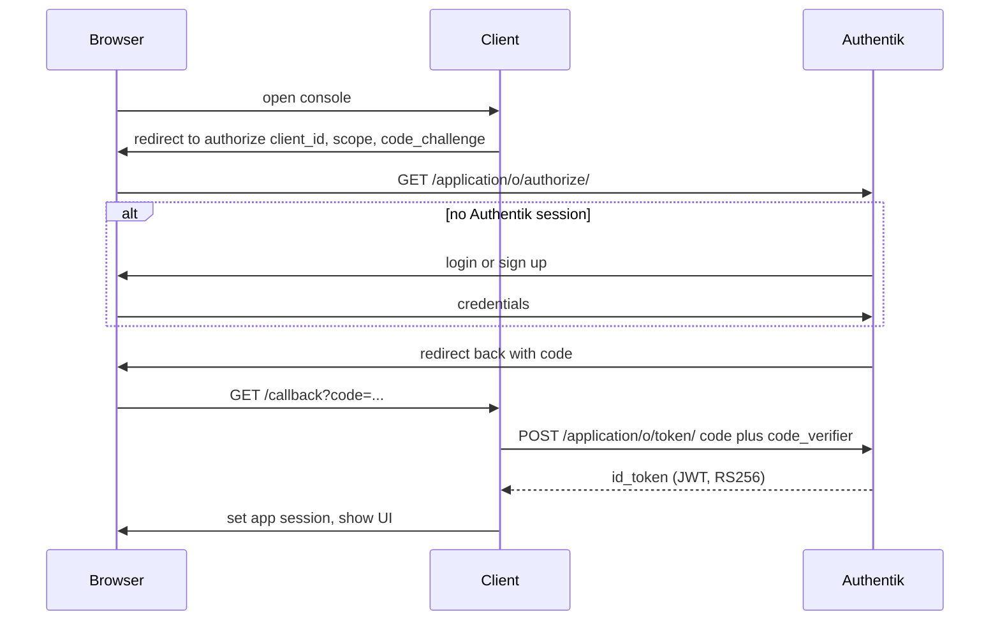
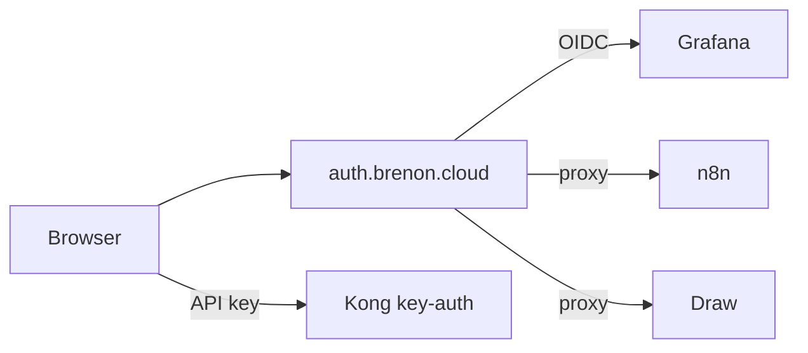

# Um login para o lab

A gente já tinha Authentik em [auth.brenon.cloud](https://auth.brenon.cloud). IdP no ar, quase nada plugado. Grafana com senha. Portainer com senha. n8n com senha. MinIO com root. Draw aberto.

Isso é lab. Não é nuvem.

Nuvem, mesmo pequena, tem porta da frente. Você prova quem é uma vez. Depois vê o produto que pagou, ou o console que pode operar. A AWS chama isso de access portal. A Google, de seletor de conta. A gente queria o mesmo formato em `*.brenon.cloud`.

Este texto é o que subiu de fato, por que OIDC é o protocolo embaixo, onde a gente fez gambiarra consciente, e por que isso é o pré-requisito para alugar capacidade (uma instância de Hermes, um Draw privado, um n8n só seu) para cliente de verdade. Essa última parte não está no ar. O plano de identidade está.

---

## SSO não é gerenciador de senha

Single sign-on quer dizer: um provedor de identidade (IdP) dono do login. O aplicativo não guarda a sua senha. Ele pergunta ao IdP: essa pessoa está autenticada, e pode me usar?

O que isso dá na prática:

- Você digita senha (ou passkey, ou magic link) **uma vez**, em `auth.brenon.cloud`.
- O próximo app não mostra form. Redireciona, o IdP já tem sessão, você volta dentro.
- Tirar acesso é um grupo, não caça a conta leftover em cinco UIs.
- MFA, se a gente ligar, mora num lugar só.

O que SSO não é:

- Não é a mesma senha copiada em todo app.
- Não é chave do Kong. Máquina continua com `key-auth` em `api.brenon.cloud`.
- Não é muro no site. Blog, produtos, jogos, Path to Glory, play do TibiaPixel e status continuam públicos.

Se a gente pusesse oauth2-proxy na frente da brenon.cloud inteira, o blog pediria login. Nuvem errada. A AWS não te manda autenticar para ler a home. Manda autenticar para **abrir o console**.

---

## OIDC, sem folheto

[OpenID Connect](https://openid.net/specs/openid-connect-core-1_0.html) é uma camada fina de identidade em cima de OAuth 2.0. OAuth nasceu para um app obter **permissão** de chamar uma API. OIDC acrescenta: **quem é o humano**.

As peças que a gente roda:

| Peça | Aqui |
|------|------|
| IdP / OpenID Provider | Authentik 2025.8.4 em `auth.brenon.cloud` |
| Client | cada app (Grafana, o site, o proxy na frente do n8n) |
| Authorization code | vive pouco, vale uma vez, volta no redirect |
| ID token | JWT que o client verifica. Nome, e-mail, subject. |
| Access token | para API. Console quase não usa. O ID token (ou o cookie do proxy) chega. |
| Refresh token | a gente emite. Os consoles ignoram e vivem do cookie próprio. |

A dança do Grafana (e do botão **Acessar console**) é authorization code + PKCE:

Detalhes que de fato morderam:

**Issuer é por application.** Discovery não é um `/.well-known` global no host. É `https://auth.brenon.cloud/application/o/<slug>/.well-known/openid-configuration`. Grafana, n8n, Draw e o site têm o seu.

**ID token precisa de chave no JWKS.** O Authentik assina HS256 com o client secret se você deixar `signing_key` vazio. O oauth2-proxy então quebra com `failed to verify id token signature`. Os providers apontam para o certificado JWT interno. Discovery anuncia RS256 e o JWKS não vem vazio.

**Client público vs confidencial.** O site é SPA Vue. Não guarda secret. É client público com PKCE. Grafana e oauth2-proxy são confidencial: o secret fica no servidor.

**Sessão do IdP não é sessão do app.** Depois do OIDC, Grafana tem cookie próprio. n8n tem `n8n-auth`. Draw tem `_oauth2_proxy`. Sair de um não mata os outros na hora. A gente não prometeu single logout global nesta onda.

**E-mail tem que bater.** O n8n busca o usuário por `X-Forwarded-Email`. O Authentik mandava `brenonaraujo@gmail.com`. O dono no n8n era `sudo@brenon.cloud`. O editor pedia senha até isso alinhar. A mesma classe de bug aparece em comentário de blog se a gente for relaxado.

---

## Mapeamento AWS, de propósito

É assim que a gente fala do lab por dentro. É assim que um cliente deveria falar depois.

| AWS | Brenon.Cloud |
|-----|----------------|
| IAM Identity Center / access portal | biblioteca Authentik em `/if/user/` |
| AWS account | este Swarm (`brenon.cloud`) |
| Permission set | grupo Authentik |
| IAM user | usuário Authentik |
| Access key | consumer Kong `key-auth` |
| Cognito app client | provider OIDC por app |
| ALB + OIDC | oauth2-proxy ou OIDC nativo |
| Organizations SCP | policy na application |

O **Acessar console** na [brenon.cloud](https://brenon.cloud) é o equivalente do botão de console da AWS no site de marketing. A home continua legível. O botão dispara OIDC (`client_id=brenon-cloud`). Logado, o chip é o nome. O menu abre a biblioteca (o console de verdade), o Draw e sair.

Criar conta não é segundo botão gritante no header. Mora na tela de identificação do Authentik, ligada no flow de enrollment. Uma identidade, duas intenções: entrar, ou criar.

---

## O que cada console faz de verdade

A gente não fingiu que todo produto fala OIDC.

| Console | Padrão | Por quê |
|---------|---------|-----|
| Grafana | OIDC nativo, form de senha off | O app aguenta. IdP fora, Grafana fora. Aceitamos. |
| Portainer | OIDC **e** login local | Se o Authentik cair, ainda precisa do Swarm. Local é break-glass. Bypass, de propósito. |
| n8n | oauth2-proxy, depois hook com `issueCookie` | Community não tem OIDC. O proxy autentica. O hook emite `n8n-auth` para o editor não mostrar segundo form. |
| MinIO console | proxy, depois a gente abre a sessão | A UI OSS atual tirou o botão OpenID. Env não bastou. S3 na `:7000` continua API de máquina. |
| Draw | a mesma família de proxy | Excalidraw não tem login. Service worker cacheava o quadro e furava o IdP até a gente servir um kill-switch em `/service-worker.js`. |

O caminho do proxy é mais feio que botão nativo. Também é como você cola software que nunca vai ganhar SSO, que é a maior parte do OSS que a gente roda.

---

## Grupo é catálogo de produto

Grupos de staff já existem: `brenon-admins`, `brenon-ops`, `brenon-viewers`, `brenon-builders`. Tem `plan-free` para app de produto. Draw não pede plano pago. Estar logado basta.

Esse é o modelo de autorização que uma loja precisa:

- Stripe (ou qualquer billing) diz que o cliente pagou `price_xxx`.
- Um webhook põe a pessoa em `plan-hermes` ou `plan-oficina`.
- O Authentik esconde os outros tiles.
- Offboarding é tirar do grupo, não ticket para caçar senha.

Cobrança não mora no Grafana. Grafana só confia no token.

Comentário e like no blog ainda não existem. Quando existirem, leem `profile.email` desse login. Segunda tabela de conta seria regressão.

---

## Por que isso é o jeito de vender a home cloud

Home cloud sem identidade hospeda **o seu** Grafana. Não hospeda **o Hermes de outra pessoa** e cobra.

A peça que faltava nunca foi Docker. Swarm, Kong, túnel, GHCR já rodavam. Faltava: quem é esse humano, qual instância ele pode abrir, e como desligar na sexta quando o cartão recusa.

SSO mais grupo é essa peça.

Um formato plausível, não no ar:

1. Cliente clica **Acessar console** (ou um Sign up futuro que ainda é Authentik).
2. O Checkout mapeia `price_id` para grupo.
3. A gente provisiona instância isolada (Hermes com o config deles, n8n privado, Draw que não é o quadro público).
4. O portal mostra aquele tile e mais nada.
5. Cancelou → grupo some → o hostname para de responder para eles.

Hermes é o workload pago óbvio: já é como a gente opera o lab, e já é produto que gente paga em outro lugar. n8n e um Draw fechado são o mesmo padrão. Oficina já é produto; no limite consome este IdP em vez de crescer login paralelo.

Nada disso é loja ainda. Sem o IdP seria cinco senhas e uma planilha. Com ele, é portal no formato AWS em hardware que a gente já paga.

---

## Referências e Links Úteis

- **[OpenID Connect Core](https://openid.net/specs/openid-connect-core-1_0.html)**: o protocolo.
- **[Authentik](https://goauthentik.io/)**: o IdP que a gente roda.
- **[Biblioteca](https://auth.brenon.cloud/if/user/)**: o portal depois do login.
- **[brenon.cloud](https://brenon.cloud)**: Acessar console na nav.
- **[Draw](https://draw.brenon.cloud)**: Excalidraw, SSO obrigatório.
- **[oauth2-proxy](https://oauth2-proxy.github.io/oauth2-proxy/)**: porta da frente para app sem OIDC nativo.
