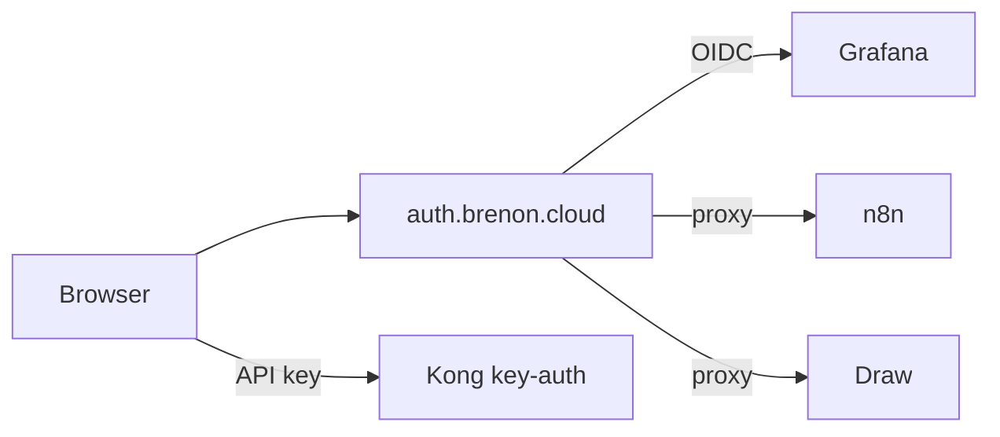

# Um login para o lab

A gente já tinha Authentik em [auth.brenon.cloud](https://auth.brenon.cloud). IdP no ar, quase nada plugado. Cada console com a senha dele. Serve para um lab de fim de semana. Vira bagunça quando `*.brenon.cloud` passa a ser tratado como nuvem pequena.

A meta era chata e suficiente: entrar uma vez e abrir o que você tem direito de ver. Tipo portal da AWS, não uma conta por produto.

---

## O que está no ar

O portal é [auth.brenon.cloud/if/user/](https://auth.brenon.cloud/if/user/). Authentik 2025.8.4. Um cookie de sessão no IdP, depois OIDC (ou um proxy na frente) em cada console.

| Console | Como se entra |
|---------|----------------|
| Grafana | OIDC nativo. Form de senha desligado. |
| Portainer | OIDC e login local. Break-glass do Swarm fica. |
| n8n | A edição community não tem OIDC. oauth2-proxy na frente, um hook pequeno emite o cookie do editor. |
| MinIO console | A UI OSS atual tirou o botão OpenID. Proxy na frente, depois a gente abre a sessão do console. S3 na `:7000` não muda. |
| Draw | Excalidraw atrás do mesmo proxy. O cache do PWA antigo abria o quadro sem passar no IdP. Tivemos que matar o service worker. |

Site, play do TibiaPixel, página de status e landings parecidas continuam públicos. API de máquina em `api.brenon.cloud` continua no Kong com `key-auth`. Humano e bot não usam a mesma porta.

---

## A gente não forçou um padrão só

Grafana fala OIDC, então fala com o Authentik direto. n8n CE e o Excalidraw de estoque não falam. Proxy na frente é mais feio que um botão nativo. Também é o único jeito desses apps entrarem no mesmo login.

Portainer é a exceção que a gente manteve de propósito. Se o Authentik cair, ainda precisa abrir o Swarm. Login local ali é um ônus aceito. Grafana não ganha isso: IdP fora, Grafana fora.

MinIO foi o chato. As env de identity estavam lá. O console ainda mostrava form. A imagem OSS que a gente roda não desenha mais botão OIDC. Então o hostname público passa no Authentik primeiro. Depois a sessão do console é criada para você.

---

## O botão na brenon.cloud

[brenon.cloud](https://brenon.cloud) continua site público. Blog, produtos, jogos, Path to Glory: sem muro de login.

Na nav tem um controle só, contorno fino, **Acessar console**, no espírito da AWS. Ele dispara OIDC no Authentik (`client_id=brenon-cloud`). Criar conta fica na tela do IdP, não num segundo botão gritante no header.

Logado, o chip é o nome. O menu abre a biblioteca do Authentik (o console de verdade), o Draw e sair. Essa sessão é a mesma que Draw e Grafana já confiam.

Comentário e like no blog ainda não existem. Quando existirem, usam essa conta, não outra.

---

## Grupos, planos depois

Grupos de staff já existem: admins, ops, viewers, builders. Tem grupo de free tier para app de produto. Draw não pede plano pago. Estar logado basta.

Stripe pode mapear `price_id` para grupo mais tarde. Quem pode abrir qual tile continua sendo o IdP. Cobrança não mora no Grafana.

---

## Referências e Links Úteis

- **[Authentik](https://goauthentik.io/)**: o IdP que a gente roda.
- **[Biblioteca](https://auth.brenon.cloud/if/user/)**: o portal depois do login.
- **[brenon.cloud](https://brenon.cloud)**: Acessar console na nav.
- **[Draw](https://draw.brenon.cloud)**: Excalidraw, SSO obrigatório.
- **[oauth2-proxy](https://oauth2-proxy.github.io/oauth2-proxy/)**: a porta da frente para app sem OIDC nativo.
