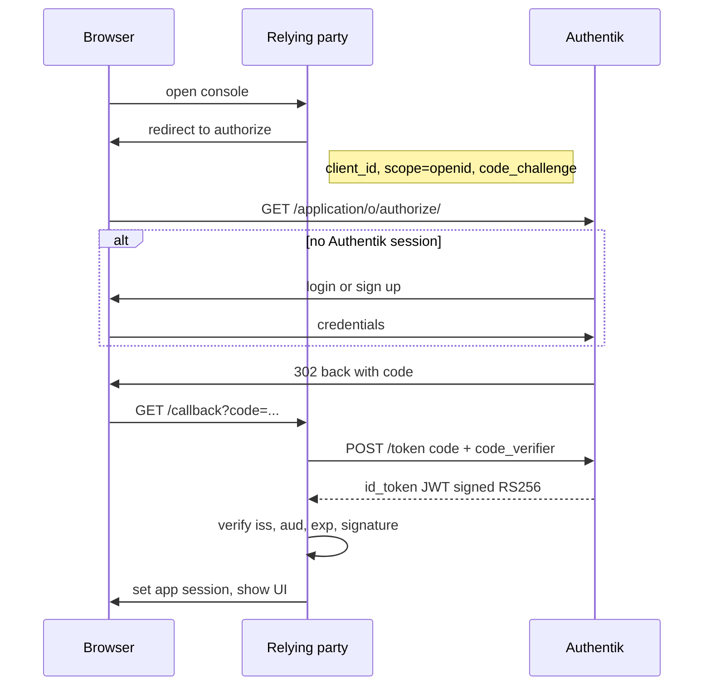
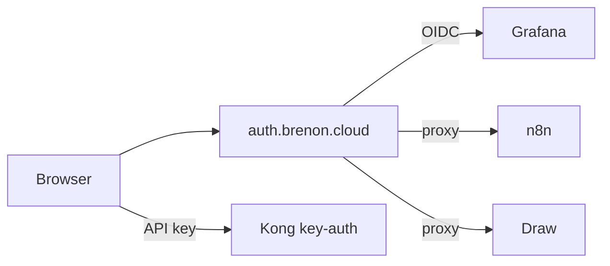

# SSO numa home cloud

Nuvem não é um monte de container com hostname público. Nuvem tem um plano de identidade: um lugar que responde *quem é essa pessoa* e *o que ela pode abrir*. A AWS faz isso com IAM Identity Center. A Google, com o seletor de conta. A Azure, com Entra ID. A gente já rodava Swarm, Kong, túnel e uma dúzia de hosts `*.brenon.cloud`. O que não tinha era esse plano.

O Authentik já estava no ar em [auth.brenon.cloud](https://auth.brenon.cloud). Versão 2025.8.4, saudável, quase nada plugado. Grafana com senha. Portainer com senha. n8n com senha. MinIO com root. Draw aberto. Isso é lab. Não é nuvem.

Este texto segue o mesmo formato do [post de loop engineering](/blog/agentic-loop-engineering): começa na ideia, nomeia o protocolo, depois caminha no que subiu de fato e onde quebrou. A loja que vende uma instância de Hermes para um estranho não está no ar. O plano de identidade é o pré-requisito, e essa parte está.

---

## Identidade, antes de qualquer nome de produto

Todo sistema com mais de um app tem as mesmas três perguntas:

1. **Autenticação** — você é quem diz que é?
2. **Sessão** — eu ainda acredito em você daqui a cinco minutos, sem perguntar de novo?
3. **Autorização** — agora que eu sei quem é, você pode abrir *esta* coisa?

Uma senha guardada dentro do Grafana só responde (1) para o Grafana. Não responde (2) para o n8n. Não responde (3) para um Hermes pago no futuro. Se você copia a mesma senha em cinco apps, ainda tem cinco respostas para (1), cinco sessões e cinco lugares para revogar. Esse é o modelo de silo.

Um **provedor de identidade** (IdP) é um serviço cujo único trabalho é essas três perguntas, para todo app que topa confiar nele. O app vira **client**. O humano entra no IdP. O client nunca vê a senha.

Essa divisão é o jogo inteiro. O resto deste post é como o client e o IdP conversam, e como a gente colou software que não quer conversar.

---

## O que SSO é, e o que não é

**Single sign-on** é a propriedade que você ganha quando vários clients compartilham uma sessão de IdP.

Você digita senha, ou passkey, ou termina um magic link, **uma vez**, no IdP. O próximo client redireciona para lá, o IdP já tem cookie, e você volta já dentro. Tirar acesso é um grupo, não uma caça a admin leftover. MFA, se a gente ligar, mora num lugar só.

SSO não é:

- a mesma senha copiada em todo app
- uma chave do Kong (isso é como **máquina** chama `api.brenon.cloud`)
- um muro no site de marketing

A AWS não te manda autenticar para ler aws.amazon.com. Manda autenticar para **abrir o console**. Se a gente pusesse um proxy na frente da brenon.cloud inteira, o blog pediria login. Nuvem errada.

Mais duas distinções que importam depois:

- **SSO não é single logout.** Depois do OIDC, Grafana tem cookie próprio, n8n tem `n8n-auth`, Draw tem `_oauth2_proxy`. Sair de um não mata os outros na hora. A gente não prometeu SLO global nesta onda.
- **SSO não é autorização.** Estar logado só prova identidade. Qual tile você vê é **grupo** (ou policy) na application. Conta free e conta admin podem dividir a mesma tela de login e mesmo assim ver mundos diferentes.

---

## O que OIDC é

[OpenID Connect](https://openid.net/specs/openid-connect-core-1_0.html) é uma camada fina de identidade em cima de **OAuth 2.0**.

OAuth nasceu para um aplicativo obter **permissão** de chamar uma API no seu nome. A história original: uma gráfica quer ler seu Google Drive. Você não deve entregar a senha do Google para a gráfica. Você manda a gráfica para o Google, consente, a gráfica ganha um token que só vale para aquela API.

Isso responde *este app pode chamar aquela API*. Sozinho, não responde *quem está sentado no browser*. O povo empalhou identidade em cima de OAuth de um jeito diferente cada um, e o resultado foi uma bagunça de `/userinfo` caseiro. OIDC é o extra combinado:

- um jeito padrão de pedir identidade (`scope=openid`)
- um **ID token** padrão (JWT) que diz quem você é
- um documento de discovery padrão para o client não hardcodar URL
- um endpoint UserInfo padrão se o client quiser mais claim

Os três papéis, na língua da spec:

| Papel | Trabalho | Aqui |
|-------|----------|------|
| Resource owner | o humano | você, no browser |
| Relying party (RP) / client | o app que quer saber quem você é | Grafana, o site, oauth2-proxy |
| OpenID provider (OP) / IdP | emite token depois do login | Authentik em `auth.brenon.cloud` |

Os três artefatos que se movem:

| Artefato | Vida | O que prova |
|----------|------|-------------|
| Authorization code | segundos, uma vez | "este browser acabou de logar neste client" |
| ID token | minutos | "este é o humano" — `sub`, `email`, `name`, `iss`, `aud` |
| Access token | minutos | "este client pode chamar aquela API" |

Console quase sempre come o ID token (ou um cookie que o proxy seta depois de verificar). API de máquina neste lab nunca vê esses tokens. Usa Kong `key-auth`. Misturar as duas portas é como você coloca sessão de humano num cron, ou API key no browser.

### A dança: authorization code + PKCE

O Grafana e o botão **Acessar console** usam o mesmo fluxo. O site é client público (SPA Vue, sem lugar para esconder secret), então entra **PKCE**: o browser inventa um verifier, manda o hash (`code_challenge`) no authorize, e depois prova que ainda tem o verifier na troca do code por tokens. Code roubado na URL de redirect não serve sem o verifier.

Algumas regras fáceis de pular e caras de debugar:

**Issuer é por application.** O Authentik não publica um `/.well-known` global no host. Discovery é `https://auth.brenon.cloud/application/o/<slug>/.well-known/openid-configuration`. Grafana, n8n, Draw e o site têm o seu. Apontar o client para o slug errado faz o claim `iss` não bater.

**ID token precisa verificar no JWKS.** Se você deixa `signing_key` vazio no Authentik, ele assina HS256 com o client secret. App confidencial que conhece o secret ainda verifica. oauth2-proxy não: busca JWKS, recebe `keys: []` e morre com `failed to verify id token signature`. A gente aponta esses providers para o certificado JWT interno. Discovery anuncia `RS256` e o JWKS não vem vazio.

**Client público versus confidencial.** O site não guarda secret. É público + PKCE. Grafana e oauth2-proxy rodam no servidor e seguram secret. Não coloque o secret do Grafana na SPA. Não espere que a SPA use client confidencial.

**Sessão do IdP não é sessão do app.** Depois da troca do code, cada relying party emite o cookie dela. Por isso um segundo form ainda aparece mesmo depois do Authentik dizer sim: o app não ficou sabendo.

---

## Como isso tem o mesmo formato de uma nuvem de verdade

Quando você tem IdP, portal e grupo, não está mais descrevendo truque de homelab. Está descrevendo os mesmos objetos que AWS, GCP e Azure vendem, com outros nomes.

| Nuvem | Objeto | Brenon.Cloud |
|-------|--------|--------------|
| AWS IAM Identity Center | access portal | biblioteca Authentik em `/if/user/` |
| AWS | account | este Swarm |
| AWS | permission set | grupo Authentik |
| AWS | IAM user | usuário Authentik |
| AWS | access key | consumer Kong `key-auth` |
| AWS Cognito / GCP IAP / Azure App Registration | app client | provider OIDC por slug |
| AWS ALB + OIDC | forward auth | oauth2-proxy na frente de app burro |
| AWS Organizations SCP | guardrail | policy na application |

O mapeamento que importa não é a tabela. É a **separação de dever**:

- Billing (Stripe, depois) não te loga. Ele escreve um grupo.
- O IdP não provisiona Docker. Ele responde quem você é e quais tiles pode ver.
- O orquestrador que um dia sobe uma instância de Hermes para um cliente lê o grupo, não o cartão.

Sem essa divisão, vender capacidade é planilha de senha. Com ela, vender capacidade é "põe em `plan-hermes` e sobe um stack."

---

## Aí a gente fez de verdade

O Authentik já era um stack no Swarm. A gente não instalou outro IdP. Tratamos o que existia como o plano, descrevemos o catálogo no [brenon-cloud-identity](https://github.com/brenonaraujo/brenon-cloud-identity) e aplicamos na API da LAN (`192.168.1.101:9005`) porque o Cloudflare na frente do host público devolve 403 para user-agent que não é browser.

O site ficou público. O play do TibiaPixel ficou público. A página de status do Uptime ficou pública. Rota de máquina em `api.brenon.cloud` ficou no Kong com chave. Humano e bot não usam a mesma porta.

A gente não forçou um padrão de integração. O produto decide.

### Grafana: OIDC nativo, form off

O Grafana já fala o protocolo. Criamos uma application OIDC (`client_id=grafana`), apontamos o Grafana para o issuer do slug e ligamos `disable_login_form`. Abrir `grafana.brenon.cloud` agora redireciona para o Authentik. Não sobrou senha local de propósito. IdP fora, Grafana fora. Esse é o custo de um console de verdade.

### Portainer: as duas portas, de propósito

O Portainer também fala OIDC. A gente deixou o login local do lado. Portainer é como a gente recupera o Swarm, inclusive o próprio Authentik. SSO-only aqui é o jeito de se trancar fora do lab. O híbrido é um bypass que aceitamos e documentamos. Se você for desenhar isso no trabalho, escreve essa frase antes de alguém "limpar" o botão extra.

### n8n: a community não tem OIDC

SSO nativo do n8n é feature enterprise. `/rest/sso/oidc/*` é 404 no que a gente roda. O hostname público então bate primeiro no **oauth2-proxy**, com `client_id=n8n`. Depois do Authentik, o proxy injeta `X-Forwarded-Email`. Isso não basta: o n8n ainda renderiza a SPA de sign-in dele a menos que alguém emita `n8n-auth`.

Um hook pequeno (`hooks/n8n-sso.js`) busca o usuário por esse header e chama o mesmo caminho de cookie que o form de senha usaria. Dois bugs moravam embaixo de "ainda pede senha":

1. O e-mail do Authentik (`brenonaraujo@gmail.com`) não era o dono no n8n (`sudo@brenon.cloud`). O hook não tinha para quem mintar cookie.
2. O primeiro hook assumia `user.role.slug`. No `:next`, `role` pode faltar. O editor estourava `Cannot read properties of undefined (reading 'slug')` e caía no form.

Webhook continua pulado (`/webhook*`, `/healthz`). Stripe, depois, pode cair ali sem passar por muro de login.

### MinIO: a UI OSS tirou o botão

A gente setou as env de OpenID. Discovery do `client_id=minio` voltava 200. A UI ainda dizia `loginStrategy: form`. A imagem que o nó consegue puxar (`minio/minio:latest`) não desenha mais botão OIDC. Pinar um RELEASE antigo no Quay falhou: o PAT do Docker Hub no nó `minio=true` está expirado, e um pin ruim zerou as tasks do stack.

O hostname público do console agora passa por um proxy. Depois do Authentik a gente abre a sessão do console. S3 na `:7000` não muda. É API de máquina. Colocar SSO na porta S3 quebra todo client que fala o protocolo S3.

### Draw: Excalidraw mais um service worker mentiroso

Draw é Excalidraw de estoque. Sem conta, sem OIDC. Colocamos a mesma família de proxy em `draw.brenon.cloud`. Pedido anônimo hoje é 302 para o Authentik com `client_id=draw`. Qualquer usuário logado na Brenon Cloud basta, inclusive free. Decisão de produto: Draw é o primeiro app "tem conta", não um SKU pago.

Browser que já tinha visitado o quadro público antigo ainda abria o canvas sem login. O service worker do PWA servia o app do cache e não batia no proxy. Agora a gente serve um kill-switch em `/service-worker.js` que se desinstala. Se a aba ainda parece aberta, é cache. Janela anônima é o teste honesto.

Authorize no Draw é **qualquer usuário autenticado**, não grupo de staff. Binding só em `brenon-admins` trancaria uma conta free nova fora do único produto que ela já pode usar.

### O botão na brenon.cloud

[brenon.cloud](https://brenon.cloud) continua site público. Blog, produtos, jogos, Path to Glory: sem muro.

Na nav tem um controle só, contorno fino, **Acessar console**, no espírito da AWS. Ele dispara OIDC no Authentik com client **público** (`client_id=brenon-cloud`), PKCE, redirect `https://brenon.cloud/auth/callback`. Criar conta não é segundo botão gritante. Mora na tela de identificação do Authentik, ligada no flow de enrollment (`bankdefi-enrollment-flow` — o slug é leftover, o título é Brenon Cloud). Depois do enrollment o site continua o OIDC para a SPA ganhar token.

Logado, o chip é o nome. O menu abre a biblioteca do Authentik (o console de verdade), o Draw e sair. Essa sessão é a mesma identidade que Draw e Grafana já confiam.

Comentário e like no blog ainda não existem. Quando existirem, leem `profile.email` desse login. Segunda tabela de conta seria regressão.

---

## Grupo é o catálogo

Grupos de staff já existem: `brenon-admins`, `brenon-ops`, `brenon-viewers`, `brenon-builders`. `plan-free` existe para app de produto. Binding é deny-by-default: se a application não está no seu grupo, ela não aparece na biblioteca e o provider recusa o token. Draw é a exceção que a gente falou acima.

Isso já é autorização suficiente para vender depois:

1. O Checkout diz que o cliente pagou `price_xxx`.
2. Um webhook (n8n, com `/webhook*` já aberto) põe a pessoa em `plan-hermes` ou `plan-oficina`.
3. O Authentik mostra aquele tile e esconde o resto.
4. Cancelou → grupo some → o hostname para de responder para eles.

Cobrança não mora no Grafana. Grafana só confia no token. Checkout de staff nunca pode adicionar `brenon-admins`. Esse grupo é como se abre o Portainer.

---

## Por que isso é o jeito de vender a home cloud

Home cloud sem identidade hospeda **o seu** Grafana. Não hospeda **o Hermes de outra pessoa** e cobra.

A peça que faltava nunca foi Docker. Swarm, Kong, túnel, GHCR já rodavam. Faltava: quem é esse humano, qual instância ele pode abrir, e como desligar na sexta quando o cartão recusa.

Um formato plausível, não no ar:

1. Cliente clica **Acessar console** (ou um sign-up futuro que ainda é Authentik).
2. O Checkout mapeia `price_id` para grupo.
3. A gente provisiona instância isolada: Hermes com o config deles, n8n privado, Draw que não é o quadro público.
4. O portal mostra aquele tile.
5. Cancelou → grupo some → stack some.

Hermes é o workload pago óbvio. Já é como a gente opera o lab, e já é produto que gente paga em outro lugar. n8n e um Draw fechado são o mesmo padrão. Oficina já é produto; no limite consome este IdP em vez de crescer login paralelo.

Nada disso é loja. Sem o IdP seria cinco senhas e uma planilha. Com ele, é portal no formato AWS em hardware que a gente já paga.

---

## Armadilhas que a gente de fato levou

Isso não é teoria.

**Cloudflare 403 na API do Authentik.** Script precisa de User-Agent de browser e, melhor, do listener na LAN. Hostname público é para humano.

**Token de API expira e parece que "o apply quebrou."** A API admin quer Intent token, expiry off, a **key** do modal. A gente não cola isso no git.

**Provider não é application.** O oauth2-proxy disse `Failed to resolve application` porque o provider OIDC do n8n não tinha linha de Application. Discovery pode dar 200 e o authorize 404. Ligamos no Postgres quando o token da API estava morto. O conserto durável é o `apply.py` do catálogo, não outro patch SQL.

**HS256 versus oauth2-proxy.** `signing_key` vazio → JWKS vazio → erro de assinatura. O Grafana não ligou (tinha o secret). O proxy ligou. O Request ID `b0d8b0ff-…` era o proxy, não o "Oops" do Authentik.

**Sucesso no proxy não é SSO do app.** O Authentik pode te 302ar para dentro e o produto ainda mostra form. O segundo fator é a sessão do app. n8n precisou de hook. MinIO precisou de cookie de console. Draw precisou do service worker morto.

**E-mail que não bate.** O mesmo humano, duas strings, segundo login. Comentário no blog vai levar isso se a gente for relaxado.

**Pin de imagem pode zerar o MinIO.** Volta para um digest que o nó já tem antes de inventar sidecar.

**Não tranca landing.** A tentação, quando o proxy funciona, é pôr em tudo. Aí ninguém lê o blog.

---

## O que vem depois

O plano de identidade é a camada chata que nuvem esquece de blogar e não consegue shippar sem. Depois, sem ordem e nada disso no ar ainda:

- Enrollment que sempre joga usuário novo em `plan-free`
- Stripe `price_id` → grupo, com cancelamento
- Comentário e like neste blog, mesmo `profile.email`
- Um Hermes isolado como primeiro SKU pago
- Leftover de rebrand (o slug do enrollment ainda diz bankdefi; a tela de login ainda tem chrome velho em alguns cantos)
- Outpost / forward-auth para admin UI que nunca vai ganhar OIDC

A promessa não é que um rack em casa vira AWS. A promessa é que os **objetos** batem: um humano, um portal, grupo como permission set, máquina na chave. Quando esses objetos existem, alugar uma fatia do rack é problema de provisionamento, não de identidade.

---

## Referências e Links Úteis

- **[OpenID Connect Core](https://openid.net/specs/openid-connect-core-1_0.html)**: o protocolo, inclusive o fluxo de authorization code e o ID token.
- **[OAuth 2.0 RFC 6749](https://datatracker.ietf.org/doc/html/rfc6749)**: em cima do que o OIDC senta.
- **[PKCE RFC 7636](https://datatracker.ietf.org/doc/html/rfc7636)**: por que uma SPA pública consegue isso sem client secret.
- **[Authentik](https://goauthentik.io/)**: o IdP que a gente roda.
- **[Biblioteca](https://auth.brenon.cloud/if/user/)**: o portal depois do login.
- **[brenon.cloud](https://brenon.cloud)**: Acessar console na nav.
- **[Draw](https://draw.brenon.cloud)**: Excalidraw, SSO obrigatório.
- **[oauth2-proxy](https://oauth2-proxy.github.io/oauth2-proxy/)**: a porta da frente para app sem OIDC nativo.
- **[Agentic loop engineering](/blog/agentic-loop-engineering)**: o post cujo formato este segue.
