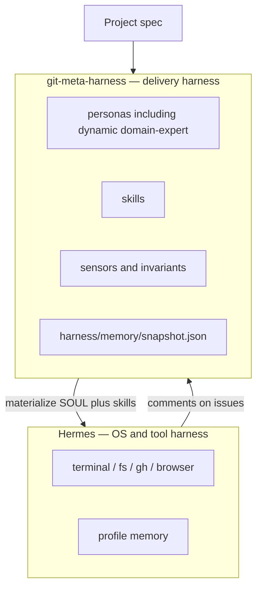
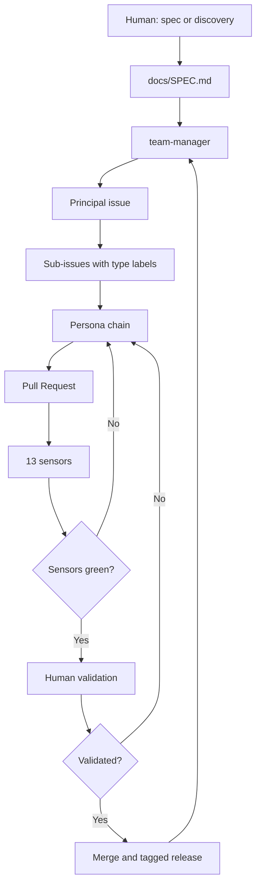
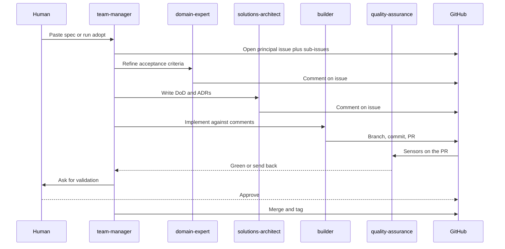

# git-meta-harness — From Loop Engineering to a Team That Ships

In [Agentic Loop Engineering](/blog/agentic-loop-engineering) we argued that the unit of work is no longer a prompt. It is a loop: plan, execute, verify, learn, deploy, repeat. That article was a field report from Hermes, Kanban, and GitHub. It answered *how agents should work*. It did not answer the next question: *how do you instantiate that loop on the next project without reinventing the team?*

Every new repo still asked the same tax. Pick a stack. Write personas. Wire CI. Invent labels. Explain to the agent, again, that the domain expert does not write code and that a green test suite is not a release. The loop was real. The factory that produces the loop was not.

So we built **git-meta-harness** — a framework that materializes a multi-agent delivery team from a functional spec, using GitHub Issues, PRs, and Actions as the native substrate. We called it *meta* because the unit it delivers is not one configured agent. It is an orchestrated team, with process, gates, and an audit trail. Some of those profiles are **created from the project itself** — a `domain-expert-clinicsy` is not a generic PM with the name swapped. It is instantiated from the spec, the stack, and the language of that product.

Then we went looking for whether anyone else had named the same idea. They had. In March 2026, Stanford IRIS (with MIT and KRAFTON) published **Meta-Harness: End-to-End Optimization of Model Harnesses** ([arXiv:2603.28052](https://arxiv.org/abs/2603.28052)). Same word. Different layer. Their paper searches over the *code that wraps a model*. Our framework governs the *team that ships software*. Under both sits **Hermes Agent**, which is already a harness for talking to the operating system — terminal, filesystem, `gh`, browsers. git-meta-harness does not reimplement that. It emits the project-specific agents, skills, tools, and memory that Hermes (or another runtime) then runs. This article is how those layers fit — and what happened when we stopped talking about the loop and started dropping it onto real products, including a SaaS already in production: [Clinicsy](https://clinicsy.app).

---

## The gap after loop engineering

Loop engineering, as we use it, has a short thesis: **you do not prompt the agent; you design the system that prompts the agent.** The five techniques we mapped in the previous post — SDD, SPDD, BMAD, harness architecture, and the loop itself — are not competing religions. They are layers. Specs reduce ambiguity. Plans make the path visible. Personas split roles. The harness is the orchestration. The loop is what makes the system improve.

What still broke in practice was reuse.

A harness that lives in one chat is a one-off. A harness that lives in one Hermes profile is a personal setup. The moment you start a second product — or, harder, drop agents onto a codebase that already has customers — you pay the setup tax again. Stack drift. Role collapse ("one agent does everything"). No sensors. No routing. No audit trail of *why* a decision was made.

The missing product was not a better prompt. It was **the harness of harnesses**: a versioned contract that, given a spec, produces a team + a project + a pipeline, and then keeps producing the next change the same way.

That is `git-meta-harness`. Public repo: [github.com/brenonaraujo/git-meta-harness](https://github.com/brenonaraujo/git-meta-harness). Current line is **v1.15.0**, MIT, with a `gmh` CLI.

---

## Two meanings of "meta-harness"

The name collision is the interesting part, not an accident to paper over. Both projects are reacting to the same 2026 fact: **model weights are no longer the scarce resource. The wrapper around the model is.**

### Stanford IRIS: a harness that searches over harnesses

Lee, Nair, Zhang, Lee, Khattab, and Finn define a harness as *the code that determines what information to store, retrieve, and present to the model*. Harnesses are still designed largely by hand. Text optimizers help, but they compress feedback too aggressively — memoryless scores, short templates, summaries that throw away the trace you needed to debug the last failure.

Their **Meta-Harness** is an outer loop that searches over harness *code*. A coding-agent proposer inspects the source, scores, and execution traces of prior candidates through a filesystem (`grep`, `cat`), then writes a new harness. It does not ingest the whole history as one prompt. In their hardest setting the proposer reads a median of 82 files per iteration and looks at more than 20 prior candidates. A single evaluation can leave on the order of 10 million tokens of diagnostics.

Results they report:

- Online text classification: **+7.7 points** over Agentic Context Engineering (ACE), with **4× fewer** context tokens (11.4K vs 50.8K).
- Retrieval-augmented math: a single discovered harness improves accuracy on **200 IMO-level problems by 4.7 points** on average across five held-out models.
- Agentic coding: discovered harnesses beat strong hand-engineered baselines on **TerminalBench-2**.

Reference code: [stanford-iris-lab/meta-harness](https://github.com/stanford-iris-lab/meta-harness). The paper is explicit that Meta-Harness is itself a harness in the broad sense — it decides what the proposer is allowed to see.

### git-meta-harness: a harness that materializes a delivery team

Our definition is operational, not experimental. A harness here is the configuration of one agent: model, skills, context, tools, system prompt. A **meta-harness** is the configuration of the factory: which roles exist, which sensors gate which transitions, which labels route which issues, which invariants cannot be violated, which human approvals are mandatory.

The input is a **functional spec** — what the system does for users, not which language to pick. The output, after one materialization, is:

- a roster of personas with explicit allowed / forbidden / exit evidence
- **at least one domain-expert created from that project's context** (`domain-expert-<slug>`), never a generic `domain-expert`
- GitHub issues with `type/*` routing
- one PR per issue, gated by sensors
- ADRs for decisions
- durable **memory of the generated harness** (`harness/memory/snapshot.json`)
- a process for the *next* change, including improving personas and skills from the issue trail

The user does not design the loop. The user pastes the spec (or asks for spec discovery on an existing repo) and validates.

These are not two implementations of the same system. They occupy different layers of the same stack.

| Layer | Stanford Meta-Harness | git-meta-harness |
|---|---|---|
| **What is being improved** | The model's wrapper (memory, retrieval, prompts, tool logic) | The delivery organization (roles, gates, audit, CI) |
| **Search space** | Candidate harness programs, scored on a task distribution | A versioned contract in `harness/`, instantiated per project |
| **Feedback channel** | Filesystem of code + scores + traces | GitHub issues, PR checks, ADRs, sensor logs |
| **Stop condition** | Fixed search budget, then test-set eval on the Pareto front | Sensors green **and** a human validates |
| **Portability** | Task-specific discovered harness | Runtime-agnostic (`AGENTS.md`) across Hermes, Claude Code, Copilot, Codex, OpenCode, Devin, Cursor |
| **Failure mode if used alone** | A better wrapper around a chaotic delivery process | A well-governed team whose *model* harness is still hand-tuned |

We did not derive our framework from the paper. We built it from the Hermes profile loop, published it, and then found the paper while looking for who else had used the name. The overlap is the thesis, not the code.

---

## Comparison at a glance

Same table shape as the loop-engineering post, one row further.

| Technique | Spec first | Agent model | What it produces | Verification |
|---|---|---|---|---|
| **SDD** | Spec → code | Single agent | Code | Tests |
| **SPDD** | Spec → plan → code | Single agent + visible plan | Code + plan | Plan review + tests |
| **Loop engineering** | Plan → execute → verify → learn | Orchestrator + workers | Working software that improves | Unit + E2E + CI |
| **Stanford Meta-Harness** | Task + outer search | Coding-agent proposer | A better *model* harness | Benchmark scores + traces |
| **git-meta-harness** | Functional spec → team | 8 personas, smart routing | Team + project + pipeline + ADRs | 13 sensors + 28 invariants + human gate |

SDD makes the spec the contract. SPDD makes the plan visible. Loop engineering makes verification the bottleneck that is worth engineering. Stanford Meta-Harness automates improvement of the model's wrapper. git-meta-harness makes the *software factory* the thing you check in.

---

## Building git-meta-harness

We did not design this top-down. It was distilled from an 8-week exploration of Hermes profiles, documented in the repo's [ORIGIN](https://github.com/brenonaraujo/git-meta-harness/blob/main/docs/ORIGIN.md). The pattern that survived contact with real work was boring and strict: **one model, one role**. A reasoning model as `team-manager`. A specialized `domain-expert-<x>`. An architect who writes Definition of Done, not code. Builders who only build. QA who only falsifies. DevOps who owns the pipeline.

### The team

Eight personas. `team-manager` is always present. The `type/*` label on the issue picks the path. Personas inside a path run **in sequence**, not as a swarm.

- `type/feature` — domain-expert → solutions-architect → builder → QA
- `type/technical` — architect → builder → QA (no domain-expert)
- `type/infra` — architect → devops-engineer → QA
- `type/bug` — architect → builder → QA

A later sensor exists because we cheated this table in the wild. **Sensor 13 (`feature-flow`)** blocks a `type/feature` from moving to in-progress unless refinement and DoD actually happened. The team-manager is not allowed to skip the people whose job is to think.

### The verifiers

Loop engineering said the verifier is the bottleneck. We took that literally. v1.14 ships **13 sensors** (00–13): lint, vuln, unit, contract, image scan, smoke, load, 12-factor, i18n, verify-after-build, decomposition safety, scope discipline, frontend polish, feature-flow.

Most of them **block the merge**. Load blocks the release. Image scan blocks the deploy. Scope is a warning. That mix is deliberate: a loop that never stops is as useless as a loop that stops on the wrong thing.

On top of sensors, `AGENTS.md` carries **28 invariants** — non-negotiable contracts. Examples that actually change behavior:

- only the `team-manager` creates branches and moves the principal issue
- `domain-expert` is always specialized (`domain-expert-<x>`), never generic
- no PR with locally red CI
- human validation before an issue closes

The stop condition is testable: **all required sensors green, and a human has validated.** Both sides are machine-checkable or GitHub-enforceable (branch protection). That is the bar loop engineering asked for.

### GitHub as substrate

We did not invent a board product. Issues are memory. Labels are routing. PRs are the artifact. Actions are the sensors that cannot be argued with. Releases are the end of the loop. Adapters project the same contract onto Hermes profiles, Claude Code agents, Copilot agents, Codex, OpenCode, Devin, Cursor. The canonical files stay in `harness/`. Runtime files are projections.

### The CLI, including brownfield

Greenfield is the easy demo: paste a spec, `gmh install`, let the team-manager open issue #1.

v1.14 added the path we actually needed:

- `gmh adopt` — in-progress projects: detect the stack, adapt, do not pretend every repo is Go + Nuxt
- `gmh new --spec` — create the project and the TODO from a spec
- `gmh doctor --json` — health score 0–100, four dimensions
- `gmh metrics` — Prometheus dashboard + Slack alerts

`adopt` is the honest feature. Most software worth running is not greenfield.

### Dynamic domain-expert, from the project, not from a template name

Invariant 12 says there is never a generic `domain-expert`. That used to be a markdown rule and a stub CLI. v1.15 makes it an operation:

```bash
gmh personas create --domain clinicsy --from-spec docs/SPEC.md
gmh personas create --domain "Home Care" --context "WhatsApp, LGPD, multi-tenant clinic SaaS"
```

The slug becomes `domain-expert-home-care`. The file is copied from the canonical template, placeholders filled, and a **Project context** section appended from the spec or the `--context` blob. Clinicsy does not get a banking persona with the title changed. It gets a specialist whose first job is the language of that clinic.

`gmh personas list` / `remove` exist. Overwrite is refused. `domain-expert-adopter` (the adopt-time adapter) cannot be deleted by accident.

### Two harnesses, stacked

This is the part we under-said in the first draft.

**Hermes is already a harness** — for the machine. Tools, permissions, skills, memory, profiles, `gh`, the filesystem, the browser. We do not rebuild that inside git-meta-harness. We *use* it.

**git-meta-harness is the delivery harness.** Its result is context: which personas exist for *this* repo, which skills they load, which sensors gate a PR, which GitHub labels route work. `gmh agents sync` projects that context onto Hermes profiles (`SOUL.md`) and skills. The team-manager then runs *on Hermes*, with OS tools, against that project-specific context.



### Memory of what was generated, and an evolve loop over it

A materialized harness that lives only in a chat is the original problem again. v1.15 writes **`harness/memory/snapshot.json`**: schema, framework version, runtime (`hermes` when `~/.hermes` is there), the persona files, the skills, the Hermes profiles. That is the memory of the *generated* harness — not Hermes's user memory, the delivery snapshot.

Then we took the paper at its word. Stanford Meta-Harness keeps a filesystem of candidate *model* harnesses plus traces, and a proposer that reads them with `grep`/`cat`. We keep a filesystem of **issue and comment traces** and a proposer prompt for the Hermes team-manager:

```bash
gmh memory write
gmh evolve --from-dir ./comments --apply
```

`--apply` writes `harness/memory/traces/<utc>/{comments.json,proposal.md,PROMPT.md}`. It does **not** overwrite persona markdown. The team-manager, running on Hermes, reads the prompt, uses `gh` and the filesystem, and a human still validates before a persona or skill file changes. Personas and skills improve **on demand**, from the history the project already has — the same comments that sensor 13 already requires builders to read.

That is the governance-side analog of the paper. We did not vendor their Python proposer. We reused the idea: richer access to prior experience, stored as files, not compressed into a one-shot prompt.

---

## How this is loop engineering, instantiated

The mapping is one-to-one with the building blocks we already used in the previous post.

| Loop engineering | git-meta-harness |
|---|---|
| Automations | GitHub Actions (push, PR, cron) |
| Worktrees / parallel work | `feature/<id>-<slug>` per issue |
| Skills | `harness/skills/*.md`, materialized per persona |
| Connectors | GitHub + the agent runtime of the day |
| Sub-agents | 8 personas, smart routing |
| Memory outside the chat | Issues, ADRs, `versions.md`, invariants, **`harness/memory/`** |

The loop as a flowchart:



And the same loop as a sequence, so the hand-offs are visible:



Stanford Meta-Harness is the same shape one layer down: proposer inspects traces, writes a new wrapper, evaluates, repeats. Their filesystem of candidates is our GitHub history. Their Pareto front is our sensor report plus the human "validated". Different objects in the loop. Same discipline.

---

## Case studies: a greenfield, and a SaaS that already had customers

A framework that only works on empty repos is a tutorial. We used this one both ways.

### mandai-v2 — greenfield, now public

**[mandai-v2](https://github.com/brenonaraujo/mandai-v2)** is public. It is the validation case named in the git-meta-harness README — the first full greenfield run of the factory, on Hermes Agent.

The product is community group buying (compra coletiva por líder de praça), in the Meituan Select / Duoduo Maicai shape. SPEC v0.2: WhatsApp-first, Pix-first, mobile number as identity, multi-tenant by workspace (bairro digital), one account with three roles (Morador, Líder, Fornecedor) plus Admin. Stack matches the harness default: Go + Gin + GORM + PostgreSQL, Nuxt 4 + Nuxt UI + Pinia, i18n structure in place with a PT-BR-content waiver (ADR-0001).

The repo carries the materialized harness: `harness/bootstrap.md`, `harness/AGENTS.md`, personas (including `examples/domain-expert-mandai.md`), sensors, issue templates, CI. The documented issue flow is `triage → refined → ready → in-progress → in-review → qa → done`.

Counted on the public repo (2026-08-26): **80 issues**, all closed; **33 pull requests**; the MVP epic is [#97](https://github.com/brenonaraujo/mandai-v2/issues/97). That is the opposite of a toy scaffold. Spec in, team-manager routes, personas ship behind sensors, human validates.

Greenfield is where `gmh install` + seed look magical. The team-manager creates issue #1. You do not configure the factory. You validate. Then the factory keeps running for the next 79 issues.

### Clinicsy — adopt on a productive SaaS

The harder test is a product that already runs.

**[Clinicsy](https://clinicsy.app)** is a live multi-tenant SaaS for home care, consultórios, and clinics. The public site states the job in one line: get off spreadsheets. The feature list on the live landing is not a roadmap — it is what tenants already use:

- intelligent scheduling with Google Maps travel time, plus a public booking link
- WhatsApp reminders and confirmations
- clinical evolution by audio, text, and images, with AI
- customizable anamnesis
- patient dossier with clinical and financial history
- products, services, and session packages; revenue from the agenda
- expenses, CSV import, reports
- multi-user permissions, per-clinic branding, LGPD isolation by clinic

Stack on the ground: **Next.js 15 + React 19 + TypeScript**, Firebase (Auth, Firestore, Storage), Stripe for trial and subscription. First tenant: **VittaLuz**, now one clinic inside the platform. Public trial is 14 days; listed plans sit in the R$29.90–R$50.00 range.

This is not the harness default stack (Go + Gin + PostgreSQL / Nuxt). That is the point of `gmh adopt`. You do not get to pretend the repo is empty. You detect what is there, run `gmh personas create --domain clinicsy --context "home care, consultório, LGPD, WhatsApp, Stripe"`, and keep the invariants that still apply: tenant isolation, no secrets in git, tests with schema changes, human validation before merge. The specialist is **created from this product**, not copied from mandai.

Clinicsy already had an agent culture before the meta-harness repo existed — Copilot custom agents in `.github/agents/` (orchestrator, implementer, reviewer, devops, browser tester), plus an `AGENTS.md` that is loaded on every session: tenant-scoped queries, auth gate, idempotent Stripe webhook, plan enforcement. Activating git-meta-harness here is not "generate a toy app". It is overlaying a team-manager, routing, and gates on a codebase with production traffic and a paying tenant.

That is the claim we wanted to be able to make: the loop is not only for greenfield demos. It runs on a SaaS that already has to stay up.

---

## Pitfalls and lessons

### 1. Same name, different object

The first confusion to kill in your own head: Stanford Meta-Harness will not open your GitHub issues. git-meta-harness will not discover a better context manager for IMO problems. If you merge the two in conversation, you will try to "optimize personas" with a benchmark that does not exist, or "govern" a research proposer with branch protection. Complementary layers. Do not collapse them.

### 2. One agent, all roles, still loses

We already knew this from the loop post. It got worse at 100+ files. The meta-harness exists because role collapse is the default of every coding agent left alone. Specialization is an invariant, not a suggestion. Sensor 13 exists because we skipped it.

### 3. Greenfield templates on a brownfield stack

`adopt` is slower than `install` on purpose. Forcing Go + Nuxt sensors onto a Next.js + Firestore app produces red CI that means nothing. Detect the stack. Keep the *discipline* (TDD, 12-factor where it applies, human gate). Swap the *commands*. A 12-factor audit that looks for `DATABASE_URL` and misses Firestore security rules is theater.

### 4. The verifier is still the product

A beautiful persona matrix with no blocking sensors is SPDD with extra markdown. If QA cannot fail the PR, you have a writing club. Load tests that never block a release are a blog post.

### 5. Human validation is not a failure of autonomy

The more the loop runs unattended, the more the merge gate matters. Architecture, auth, secrets, public API breaks, anything that touches patient data on Clinicsy — the orchestrator flags for a human. The paper's proposer never sees the test set; our team-manager never closes an issue because CI was green. Same instinct.

### 6. Spec discovery is a feature, not a prelude you skip

Existing repos without a spec are the common case. The harness documents a five-phase discovery path (reconnaissance → excavation → interpretation → generation → review) with confidence markers: confirmed, inferred, gap. Feature work does not start on a 🔴. Clinicsy had docs and `AGENTS.md`; many repos have neither. Do not let the team-manager invent the product.

---

## What is next

The models are good enough. The interesting work is still orchestration — and the join between the two meta-harnesses is no longer only a sketch.

- **Evolve is shipped on the governance side.** `gmh evolve` writes traces and a Hermes prompt from issue comments. What is *not* shipped is calling Stanford's Python proposer over our persona files. Next: harvest comments live via `gh`, still with a human gate before any persona overwrite.
- **More `adopt`, fewer greenfield victory laps.** Clinicsy is the template: live SaaS, non-default stack, production constraints, a domain-expert instantiated from that context.
- **Keep the runtime list honest.** Adapters are projections. If a runtime does not support a capability, we document the gap instead of leaving inert files.

The promise is the same as in the loop-engineering post, with two extra sentences. Agents handle the mechanical work so engineers can keep the architecture, the product, and the human context. Extra sentence one: **the factory that assigns that work should itself be a checked-in artifact**, not a chat you had in July. Extra sentence two: **that factory sits on Hermes for tools, remembers what it generated, and can improve its own personas from the issue trail.**

We built that factory. A lab at Stanford, independently, built a factory that improves the model's wrapper. Both are called meta-harness. Both belong in the same diagram. Only one of them is what we run on [Clinicsy](https://clinicsy.app) on a Tuesday.

---

## References and Useful Links

- **[git-meta-harness](https://github.com/brenonaraujo/git-meta-harness)**: The framework. v1.15.0, MIT, `gmh` CLI.
- **[v1.15.0 PR](https://github.com/brenonaraujo/git-meta-harness/pull/1)**: Dynamic domain-expert, harness memory, evolve loop.
- **[EVOLVE.md](https://github.com/brenonaraujo/git-meta-harness/blob/feat/v1.15.0-persona-evolve/docs/EVOLVE.md)**: Hermes as OS/tool harness, snapshot memory, issue-trace evolve.
- **[CONCEPT.md](https://github.com/brenonaraujo/git-meta-harness/blob/main/docs/CONCEPT.md)**: What it is, what it is not, why "meta".
- **[LOOP.md](https://github.com/brenonaraujo/git-meta-harness/blob/main/docs/LOOP.md)**: Explicit mapping onto loop engineering.
- **[ORIGIN.md](https://github.com/brenonaraujo/git-meta-harness/blob/main/docs/ORIGIN.md)**: How it came out of Hermes profiles.
- **[COMPARISON.md](https://github.com/brenonaraujo/git-meta-harness/blob/main/docs/COMPARISON.md)**: Single-agent vs SDD vs SPDD vs meta-harness.
- **[ECOSYSTEM.md](https://github.com/brenonaraujo/git-meta-harness/blob/main/docs/ECOSYSTEM.md)**: Stanford IRIS, SuperagenticAI, Towards AI, and this repo on one map.
- **[Meta-Harness: End-to-End Optimization of Model Harnesses](https://arxiv.org/abs/2603.28052)**: Lee, Nair, Zhang, Lee, Khattab, Finn. arXiv:2603.28052, 30 Mar 2026.
- **[stanford-iris-lab/meta-harness](https://github.com/stanford-iris-lab/meta-harness)**: Reference code for the paper.
- **[Agentic Loop Engineering](/blog/agentic-loop-engineering)**: The previous field report this post continues.
- **[Clinicsy](https://clinicsy.app)**: Live SaaS — home care, consultório, and clinic management. The brownfield case.
- **[mandai-v2](https://github.com/brenonaraujo/mandai-v2)**: Public greenfield validation — 80 issues, 33 PRs, SPEC v0.2, materialized `harness/`.
- **[Hermes Agent](https://hermes-agent.nousresearch.com/docs/)**: The runtime the validation case ran on.
- **[brenon.cloud](https://brenon.cloud)**: Where this article is published.
