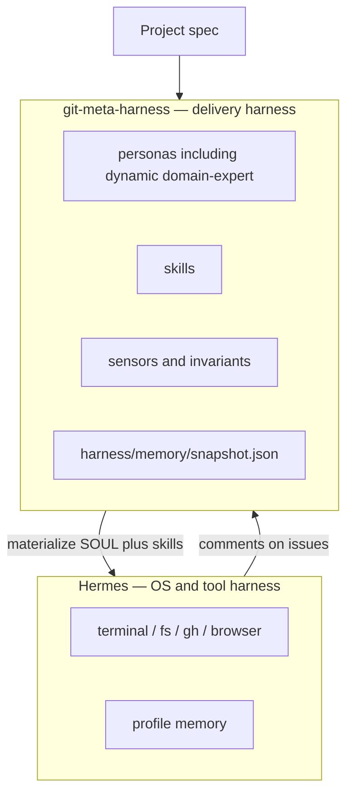
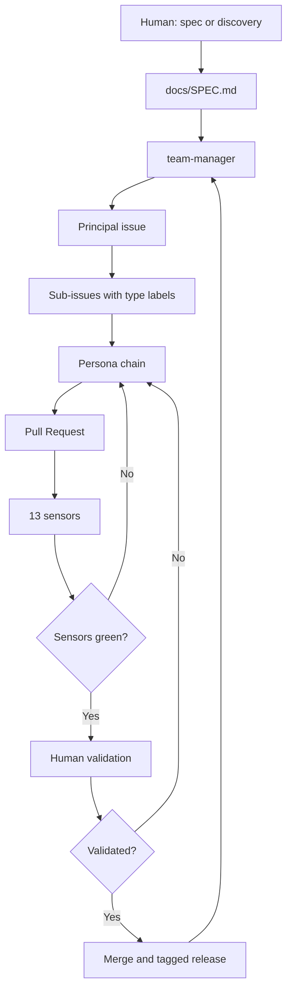
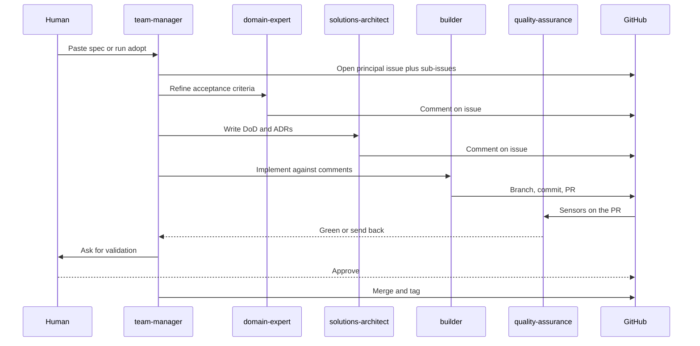

# git-meta-harness — Do Loop Engineering a um Time que Entrega

No [Loop Engineering Agentico](/blog/agentic-loop-engineering) a tese era que a unidade de trabalho já não é um prompt. É um loop: planejar, executar, verificar, aprender, publicar, repetir. Aquele artigo foi um relato de campo com Hermes, Kanban e GitHub. Respondia *como agentes devem trabalhar*. Não respondia a pergunta seguinte: *como instanciar esse loop no próximo projeto sem reinventar o time?*

Todo repositório novo cobrava o mesmo imposto. Escolher stack. Escrever personas. Ligar CI. Inventar labels. Explicar de novo para o agente que o especialista de domínio não escreve código e que suíte verde não é release. O loop era real. A fábrica que produz o loop não era.

Então construímos o **git-meta-harness** — um framework que materializa um time multiagente de entrega a partir de uma spec funcional, usando Issues, PRs e Actions do GitHub como substrato nativo. Chamamos de *meta* porque a unidade que ele entrega não é um agente configurado. É um time orquestrado, com processo, gates e rastro de auditoria. Alguns desses profiles são **criados a partir do próprio projeto** — um `domain-expert-clinicsy` não é um PM genérico com o nome trocado. Ele é instanciado da spec, da stack e da língua daquele produto.

Depois fomos pesquisar se alguém tinha batizado a mesma ideia. Tinha. Em março de 2026, o Stanford IRIS (com MIT e KRAFTON) publicou **Meta-Harness: End-to-End Optimization of Model Harnesses** ([arXiv:2603.28052](https://arxiv.org/abs/2603.28052)). Mesma palavra. Camada diferente. O paper busca sobre o *código que envolve o modelo*. O nosso framework governa o *time que entrega software*. Por baixo dos dois está o **Hermes Agent**, que já é um harness para falar com o sistema operacional — terminal, filesystem, `gh`, browsers. O git-meta-harness não reimplementa isso. Ele emite os agentes, skills, tools e memória específicos daquele projeto, que o Hermes (ou outro runtime) então executa. Este artigo é como essas camadas se encaixam — e o que aconteceu quando paramos de falar do loop e passamos a jogá-lo em produto real, inclusive um SaaS já em produção: a [Clinicsy](https://clinicsy.app).

---

## A lacuna depois do loop engineering

Loop engineering, do jeito que a gente usa, cabe numa frase: **você não dá prompt para o agente; você desenha o sistema que dá prompt para o agente.** As cinco técnicas do post anterior — SDD, SPDD, BMAD, arquitetura de harness e o próprio loop — não são religiões concorrentes. São camadas. Spec reduz ambiguidade. Plano torna o caminho visível. Personas separam papéis. O harness é a orquestração. O loop é o que faz o sistema melhorar.

O que ainda quebrava na prática era reuso.

Um harness que mora num chat é um one-off. Um harness que mora num perfil do Hermes é setup pessoal. No segundo produto — ou, pior, quando você joga agentes numa base que já tem cliente — você paga o imposto de novo. Drift de stack. Colapso de papel ("um agente faz tudo"). Sem sensores. Sem roteamento. Sem rastro de *por que* uma decisão foi tomada.

O produto que faltava não era um prompt melhor. Era **o harness dos harnesses**: um contrato versionado que, dada uma spec, produz time + projeto + pipeline, e depois continua produzindo a próxima mudança do mesmo jeito.

Isso é o `git-meta-harness`. Repo público: [github.com/brenonaraujo/git-meta-harness](https://github.com/brenonaraujo/git-meta-harness). Linha atual **v1.15.0**, MIT, com a CLI `gmh`.

---

## Dois sentidos de "meta-harness"

A colisão de nome é a parte interessante, não um acidente para esconder. Os dois projetos reagem ao mesmo fato de 2026: **os pesos do modelo já não são o recurso escasso. O envelope em volta do modelo é.**

### Stanford IRIS: um harness que busca sobre harnesses

Lee, Nair, Zhang, Lee, Khattab e Finn definem harness como *o código que decide o que guardar, recuperar e apresentar ao modelo*. Harnesses ainda são desenhados na mão. Otimizadores de texto ajudam, mas comprimem o feedback demais — scores sem memória, templates curtos, resumos que jogam fora o rastro que você precisava para debugar a última falha.

O **Meta-Harness** deles é um loop externo que busca sobre *código* de harness. Um proposer que é coding agent inspeciona fonte, scores e traces dos candidatos anteriores via filesystem (`grep`, `cat`) e escreve um harness novo. Ele não engole a história inteira como um único prompt. No setting mais pesado, o proposer lê uma mediana de 82 arquivos por iteração e olha mais de 20 candidatos anteriores. Uma única avaliação pode deixar da ordem de 10 milhões de tokens de diagnóstico.

Resultados que eles reportam:

- Classificação de texto online: **+7,7 pontos** sobre Agentic Context Engineering (ACE), com **4× menos** tokens de contexto (11,4K vs 50,8K).
- Matemática com retrieval: um único harness descoberto sobe a acurácia em **200 problemas nível IMO em 4,7 pontos**, na média, em cinco modelos held-out.
- Coding agentico: harnesses descobertos batem baselines fortes feitos à mão no **TerminalBench-2**.

Código de referência: [stanford-iris-lab/meta-harness](https://github.com/stanford-iris-lab/meta-harness). O paper é explícito: o Meta-Harness também é um harness no sentido amplo — ele decide o que o proposer pode ver.

### git-meta-harness: um harness que materializa um time de entrega

A nossa definição é operacional, não experimental. Harness aqui é a configuração de um agente: modelo, skills, contexto, tools, system prompt. **Meta-harness** é a configuração da fábrica: quais papéis existem, quais sensores gatilham quais transições, quais labels roteiam quais issues, quais invariantes não se violam, quais aprovações humanas são obrigatórias.

A entrada é uma **spec funcional** — o que o sistema faz para as pessoas, não qual linguagem escolher. A saída, depois de uma materialização, é:

- um roster de personas com permitido / proibido / evidência de saída
- **pelo menos um domain-expert criado do contexto daquele projeto** (`domain-expert-<slug>`), nunca um `domain-expert` genérico
- issues no GitHub com roteamento `type/*`
- um PR por issue, gated por sensores
- ADRs para decisões
- **memória durável do harness gerado** (`harness/memory/snapshot.json`)
- um processo para a *próxima* mudança, inclusive melhorar personas e skills a partir do rastro das issues

O usuário não desenha o loop. Cola a spec (ou pede discovery de spec num repo que já existe) e valida.

Não são duas implementações do mesmo sistema. Ocupam camadas diferentes da mesma pilha.

| Camada | Meta-Harness Stanford | git-meta-harness |
|---|---|---|
| **O que está sendo melhorado** | O envelope do modelo (memória, retrieval, prompts, tools) | A organização de entrega (papéis, gates, auditoria, CI) |
| **Espaço de busca** | Programas-candidatos, score numa distribuição de tarefas | Um contrato versionado em `harness/`, instanciado por projeto |
| **Canal de feedback** | Filesystem de código + scores + traces | Issues, checks de PR, ADRs, logs de sensor |
| **Condição de parada** | Orçamento de busca, depois eval no conjunto de teste | Sensores verdes **e** um humano valida |
| **Portabilidade** | Harness descoberto para a tarefa | Runtime-agnostic (`AGENTS.md`) em Hermes, Claude Code, Copilot, Codex, OpenCode, Devin, Cursor |
| **Falha se usado sozinho** | Um envelope melhor em volta de um processo caótico | Um time bem governado cujo harness de *modelo* ainda é tunado na mão |

A gente não derivou o framework do paper. Construímos a partir do loop de perfis do Hermes, publicamos, e depois achamos o paper procurando quem mais tinha usado o nome. A sobreposição é a tese, não o código.

---

## Comparação de relance

Mesmo formato de tabela do post de loop engineering, uma linha a mais.

| Técnica | Spec primeiro | Modelo de agente | O que produz | Verificação |
|---|---|---|---|---|
| **SDD** | Spec → código | Um agente | Código | Testes |
| **SPDD** | Spec → plano → código | Um agente + plano visível | Código + plano | Review do plano + testes |
| **Loop engineering** | Planejar → executar → verificar → aprender | Orquestrador + workers | Software que melhora | Unit + E2E + CI |
| **Meta-Harness Stanford** | Tarefa + busca externa | Proposer coding agent | Um harness de *modelo* melhor | Scores de benchmark + traces |
| **git-meta-harness** | Spec funcional → time | 8 personas, roteamento | Time + projeto + pipeline + ADRs | 13 sensores + 28 invariantes + gate humano |

SDD faz da spec o contrato. SPDD torna o plano visível. Loop engineering faz da verificação o gargalo que vale a pena engenheirar. O Meta-Harness Stanford automatiza a melhoria do envelope do modelo. O git-meta-harness faz da *fábrica de software* a coisa que você commita.

---

## Construindo o git-meta-harness

Isso não foi desenhado de cima para baixo. Foi destilado de umas oito semanas de exploração com perfis do Hermes, documentado no [ORIGIN](https://github.com/brenonaraujo/git-meta-harness/blob/main/docs/ORIGIN.md) do repo. O padrão que sobreviveu ao contato com trabalho real era chato e rígido: **um modelo, um papel**. Modelo de raciocínio como `team-manager`. Um `domain-expert-<x>` especializado. Arquiteto que escreve Definition of Done, não código. Builder que só constrói. QA que só falsifica. DevOps dono do pipeline.

### O time

Oito personas. `team-manager` está sempre presente. O label `type/*` da issue escolhe o caminho. Personas dentro de um caminho rodam **em sequência**, não como enxame.

- `type/feature` — domain-expert → solutions-architect → builder → QA
- `type/technical` — architect → builder → QA (sem domain-expert)
- `type/infra` — architect → devops-engineer → QA
- `type/bug` — architect → builder → QA

Um sensor posterior existe porque a gente furava essa tabela no mundo real. O **sensor 13 (`feature-flow`)** bloqueia `type/feature` de ir para in-progress se refinement e DoD não aconteceram de verdade. O team-manager não pode pular quem tem o trabalho de pensar.

### Os verificadores

O loop engineering disse que o verifier é o gargalo. Levamos ao pé da letra. A v1.14 traz **13 sensores** (00–13): lint, vuln, unit, contrato, scan de imagem, smoke, load, 12-factor, i18n, verify-after-build, segurança de decomposição, disciplina de escopo, polish de frontend, feature-flow.

A maior parte **bloqueia o merge**. Load bloqueia o release. Scan de imagem bloqueia o deploy. Escopo é warning. Essa mistura é de propósito: um loop que nunca para é tão inútil quanto um loop que para no lugar errado.

Em cima dos sensores, o `AGENTS.md` carrega **28 invariantes** — contratos inegociáveis. Exemplos que mudam comportamento de verdade:

- só o `team-manager` cria branch e move a issue principal
- `domain-expert` é sempre especializado (`domain-expert-<x>`), nunca genérico
- nenhum PR com CI local vermelha
- validação humana antes de fechar issue

A condição de parada é testável: **sensores obrigatórios verdes, e um humano validou.** Os dois lados são checáveis por máquina ou pelo GitHub (branch protection). É a barra que o loop engineering pedia.

### GitHub como substrato

A gente não inventou um produto de board. Issue é memória. Label é roteamento. PR é o artefato. Actions são os sensores com os quais não se discute. Release é o fim do loop. Adapters projetam o mesmo contrato em perfis Hermes, agents do Claude Code, Copilot, Codex, OpenCode, Devin, Cursor. Os arquivos canônicos ficam em `harness/`. Arquivos de runtime são projeção.

### A CLI, inclusive brownfield

Greenfield é o demo fácil: cola a spec, `gmh install`, deixa o team-manager abrir a issue #1.

A v1.14 adicionou o caminho que a gente de fato precisava:

- `gmh adopt` — projeto em andamento: detecta a stack, adapta, não finge que todo repo é Go + Nuxt
- `gmh new --spec` — cria o projeto e o TODO a partir da spec
- `gmh doctor --json` — health score 0–100, quatro dimensões
- `gmh metrics` — dashboard Prometheus + alertas no Slack

`adopt` é a feature honesta. A maior parte do software que vale a pena rodar não é greenfield.

### Domain-expert dinâmico, do projeto, não do nome do template

A invariante 12 diz que nunca existe um `domain-expert` genérico. Isso era regra em markdown e CLI stub. A v1.15 transforma em operação:

```bash
gmh personas create --domain clinicsy --from-spec docs/SPEC.md
gmh personas create --domain "Home Care" --context "WhatsApp, LGPD, multi-tenant clinic SaaS"
```

O slug vira `domain-expert-home-care`. O arquivo sai do template canônico, placeholders preenchidos, e uma seção **Project context** entra a partir da spec ou do `--context`. A Clinicsy não ganha uma persona de banking com o título trocado. Ganha um especialista cujo primeiro trabalho é a língua daquela clínica.

Existem `gmh personas list` / `remove`. Overwrite é recusado. `domain-expert-adopter` (o adapter do adopt) não se apaga por acidente.

### Dois harnesses, empilhados

Isso é o que o primeiro rascunho subdisse.

**O Hermes já é um harness** — da máquina. Tools, permissões, skills, memória, profiles, `gh`, filesystem, browser. A gente não reconstrói isso dentro do git-meta-harness. A gente *usa*.

**O git-meta-harness é o harness de entrega.** O resultado dele é contexto: quais personas existem *neste* repo, quais skills elas carregam, quais sensores gatilham um PR, quais labels do GitHub roteiam o trabalho. `gmh agents sync` projeta esse contexto em profiles do Hermes (`SOUL.md`) e skills. O team-manager então roda *no Hermes*, com tools de SO, contra o contexto daquele projeto.



### Memória do que foi gerado, e um loop de evolve em cima

Harness materializado que só vive no chat é o problema original de novo. A v1.15 grava **`harness/memory/snapshot.json`**: schema, versão do framework, runtime (`hermes` quando existe `~/.hermes`), os arquivos de persona, as skills, os profiles do Hermes. Essa é a memória do harness *gerado* — não a memória de usuário do Hermes, o snapshot de entrega.

Aí levamos o paper ao pé da letra. O Meta-Harness Stanford guarda um filesystem de harnesses de *modelo* candidatos mais traces, e um proposer que lê com `grep`/`cat`. A gente guarda um filesystem de **traces de issue e comentário** e um prompt de proposer para o team-manager no Hermes:

```bash
gmh memory write
gmh evolve --from-dir ./comments --apply
```

`--apply` escreve `harness/memory/traces/<utc>/{comments.json,proposal.md,PROMPT.md}`. **Não** sobrescreve markdown de persona. O team-manager, rodando no Hermes, lê o prompt, usa `gh` e o filesystem, e um humano ainda valida antes de mudar persona ou skill. Personas e skills melhoram **sob demanda**, a partir do histórico que o projeto já tem — os mesmos comentários que o sensor 13 já exige que o builder leia.

Esse é o análogo, no lado da governança, do paper. Não vendemos o proposer Python deles. Reusamos a ideia: acesso mais rico à experiência anterior, guardado em arquivos, não comprimido num prompt único.

---

## Como isso é loop engineering, instanciado

O mapeamento é um-para-um com os blocos que já usamos no post anterior.

| Loop engineering | git-meta-harness |
|---|---|
| Automações | GitHub Actions (push, PR, cron) |
| Worktrees / trabalho em paralelo | `feature/<id>-<slug>` por issue |
| Skills | `harness/skills/*.md`, materializadas por persona |
| Conectores | GitHub + o runtime de agente do dia |
| Subagentes | 8 personas, roteamento |
| Memória fora do chat | Issues, ADRs, `versions.md`, invariantes, **`harness/memory/`** |

O loop como flowchart:



E o mesmo loop em sequência, para os hand-offs aparecerem:



O Meta-Harness Stanford é o mesmo desenho uma camada abaixo: o proposer inspeciona traces, escreve um envelope novo, avalia, repete. O filesystem de candidatos deles é o nosso histórico no GitHub. A frente de Pareto deles é o nosso relatório de sensores mais o "validado" humano. Objetos diferentes no loop. Mesma disciplina.

---

## Estudos de caso: um greenfield, e um SaaS que já tinha cliente

Framework que só funciona em repo vazio é tutorial. A gente usou os dois jeitos.

### mandai-v2 — greenfield, agora público

O **[mandai-v2](https://github.com/brenonaraujo/mandai-v2)** está público. É o caso de validação nomeado no README do git-meta-harness — o primeiro greenfield completo da fábrica, no Hermes Agent.

O produto é compra coletiva por líder de praça, no formato Meituan Select / Duoduo Maicai. SPEC v0.2: WhatsApp-first, Pix-first, celular como identidade, multi-tenant por workspace (bairro digital), uma conta com três papéis (Morador, Líder, Fornecedor) mais Admin. A stack casa com o default do harness: Go + Gin + GORM + PostgreSQL, Nuxt 4 + Nuxt UI + Pinia, estrutura de i18n no lugar com waiver de conteúdo PT-BR (ADR-0001).

O repo carrega o harness materializado: `harness/bootstrap.md`, `harness/AGENTS.md`, personas (incluindo `examples/domain-expert-mandai.md`), sensores, templates de issue, CI. O fluxo documentado é `triage → refined → ready → in-progress → in-review → qa → done`.

Contado no repo público (2026-08-26): **80 issues**, todas fechadas; **33 pull requests**; o épico do MVP é a [#97](https://github.com/brenonaraujo/mandai-v2/issues/97). O contrário de um scaffold de brinquedo. Spec entra, team-manager roteia, personas entregam atrás de sensores, humano valida.

Greenfield é onde `gmh install` + seed parecem mágica. O team-manager cria a issue #1. Você não configura a fábrica. Você valida. Depois a fábrica continua pelas outras 79 issues.

### Clinicsy — adopt num SaaS produtivo

O teste difícil é produto que já roda.

A **[Clinicsy](https://clinicsy.app)** é um SaaS multi-tenant ao vivo para home care, consultório e clínica. O site público resume o trabalho numa linha: sair da planilha. A lista de features na landing não é roadmap — é o que o tenant já usa:

- agendamento inteligente com deslocamento no Google Maps, mais link público de marcação
- WhatsApp para lembretes e confirmações
- evolução clínica por áudio, texto e imagens, com IA
- anamnese personalizável
- dossiê do paciente com histórico clínico e financeiro
- produtos, serviços e pacotes de sessões; receita a partir da agenda
- despesas, importação CSV, relatórios
- permissões multi-usuário, marca por clínica, isolamento LGPD por clínica

Stack no chão: **Next.js 15 + React 19 + TypeScript**, Firebase (Auth, Firestore, Storage), Stripe para trial e assinatura. Primeiro tenant: **VittaLuz**, hoje uma clínica dentro da plataforma. Trial público de 14 dias; planos listados na faixa R$ 29,90–R$ 50,00.

Isso não é a stack default do harness (Go + Gin + PostgreSQL / Nuxt). É exatamente o ponto do `gmh adopt`. Você não finge que o repo está vazio. Detecta o que tem, roda `gmh personas create --domain clinicsy --context "home care, consultório, LGPD, WhatsApp, Stripe"`, e mantém as invariantes que ainda valem: isolamento de tenant, nenhum segredo no git, teste junto de mudança de schema, validação humana antes do merge. O especialista é **criado deste produto**, não copiado do mandai.

A Clinicsy já tinha cultura de agente antes do repo do meta-harness existir — custom agents do Copilot em `.github/agents/` (orchestrator, implementer, reviewer, devops, browser tester), mais um `AGENTS.md` carregado em toda sessão: query escopada por tenant, gate de auth, webhook Stripe idempotente, enforcement de plano. Ativar o git-meta-harness aqui não é "gerar um app de brinquedo". É sobrepor team-manager, roteamento e gates numa base com tráfego de produção e tenant pagando.

Essa é a afirmação que a gente queria poder fazer: o loop não é só para demo greenfield. Ele roda num SaaS que precisa continuar no ar.

---

## Pitfalls e o que aprendemos

### 1. Mesmo nome, objeto diferente

A primeira confusão a matar na própria cabeça: o Meta-Harness Stanford não abre as suas issues. O git-meta-harness não descobre um context manager melhor para problema de IMO. Se você mistura os dois na conversa, tenta "otimizar personas" com um benchmark que não existe, ou "governar" um proposer de pesquisa com branch protection. Camadas complementares. Não colapse.

### 2. Um agente, todos os papéis, ainda perde

A gente já sabia disso no post do loop. Ficou pior depois de 100+ arquivos. O meta-harness existe porque colapso de papel é o default de qualquer coding agent largado sozinho. Especialização é invariante, não sugestão. O sensor 13 existe porque a gente pulou.

### 3. Template greenfield em stack brownfield

`adopt` é mais lento que `install` de propósito. Forçar sensores de Go + Nuxt num app Next.js + Firestore produz CI vermelha que não significa nada. Detecta a stack. Mantém a *disciplina* (TDD, 12-factor onde cabe, gate humano). Troca os *comandos*. Auditoria 12-factor que procura `DATABASE_URL` e ignora `firestore.rules` é teatro.

### 4. O verifier continua sendo o produto

Matriz linda de personas sem sensor que bloqueia é SPDD com markdown extra. Se o QA não consegue reprovar o PR, você tem um clube de escrita. Load test que nunca bloqueia release é post de blog.

### 5. Validação humana não é falha de autonomia

Quanto mais o loop roda sozinho, mais o gate de merge importa. Arquitetura, auth, segredo, quebra de API pública, qualquer coisa que toque dado de paciente na Clinicsy — o orquestrador escala para humano. O proposer do paper nunca vê o conjunto de teste; o nosso team-manager nunca fecha issue porque a CI ficou verde. Mesmo instinto.

### 6. Spec discovery é feature, não prelúdio que se pula

Repo existente sem spec é o caso comum. O harness documenta um discovery em cinco fases (reconhecimento → escavação → interpretação → geração → review) com marcadores de confiança: confirmado, inferido, lacuna. Trabalho de feature não começa em 🔴. A Clinicsy já tinha docs e `AGENTS.md`; muita gente não tem nenhum dos dois. Não deixe o team-manager inventar o produto.

---

## O que vem depois

Os modelos já são bons o suficiente. O trabalho interessante continua sendo orquestração — e a junta entre os dois meta-harnesses já não é só esboço.

- **Evolve no lado da governança já foi shipped.** `gmh evolve` grava traces e um prompt Hermes a partir de comentários de issue. O que *não* foi shipped é chamar o proposer Python do Stanford em cima dos nossos arquivos de persona. Próximo: colher comentários ao vivo via `gh`, ainda com gate humano antes de sobrescrever persona.
- **Mais `adopt`, menos volta olímpica em greenfield.** A Clinicsy é o molde: SaaS ao vivo, stack fora do default, restrição de produção, domain-expert instanciado daquele contexto.
- **Lista de runtime honesta.** Adapter é projeção. Se o runtime não tem a capacidade, documenta o buraco em vez de deixar arquivo inerte.

A promessa é a mesma do post de loop engineering, com duas frases a mais. Agentes fazem o trabalho mecânico para o engenheiro ficar com arquitetura, produto e contexto humano. Frase um: **a fábrica que distribui esse trabalho deve ser ela mesma um artefato no git**, não um chat de julho. Frase dois: **essa fábrica senta no Hermes para tools, lembra o que gerou, e pode melhorar as próprias personas a partir do rastro das issues.**

A gente construiu essa fábrica. Um lab em Stanford, independente, construiu uma fábrica que melhora o envelope do modelo. As duas se chamam meta-harness. As duas cabem no mesmo diagrama. Só uma delas é o que a gente roda na [Clinicsy](https://clinicsy.app) numa terça.

---

## Referências e Links Úteis

- **[git-meta-harness](https://github.com/brenonaraujo/git-meta-harness)**: O framework. v1.15.0, MIT, CLI `gmh`.
- **[PR v1.15.0](https://github.com/brenonaraujo/git-meta-harness/pull/1)**: Domain-expert dinâmico, memória do harness, loop de evolve.
- **[EVOLVE.md](https://github.com/brenonaraujo/git-meta-harness/blob/feat/v1.15.0-persona-evolve/docs/EVOLVE.md)**: Hermes como harness de SO/tools, snapshot de memória, evolve por traces de issue.
- **[CONCEPT.md](https://github.com/brenonaraujo/git-meta-harness/blob/main/docs/CONCEPT.md)**: O que é, o que não é, por que "meta".
- **[LOOP.md](https://github.com/brenonaraujo/git-meta-harness/blob/main/docs/LOOP.md)**: Mapeamento explícito para loop engineering.
- **[ORIGIN.md](https://github.com/brenonaraujo/git-meta-harness/blob/main/docs/ORIGIN.md)**: Como saiu dos perfis do Hermes.
- **[COMPARISON.md](https://github.com/brenonaraujo/git-meta-harness/blob/main/docs/COMPARISON.md)**: Agente único vs SDD vs SPDD vs meta-harness.
- **[ECOSYSTEM.md](https://github.com/brenonaraujo/git-meta-harness/blob/main/docs/ECOSYSTEM.md)**: Stanford IRIS, SuperagenticAI, Towards AI e este repo no mesmo mapa.
- **[Meta-Harness: End-to-End Optimization of Model Harnesses](https://arxiv.org/abs/2603.28052)**: Lee, Nair, Zhang, Lee, Khattab, Finn. arXiv:2603.28052, 30 mar 2026.
- **[stanford-iris-lab/meta-harness](https://github.com/stanford-iris-lab/meta-harness)**: Código de referência do paper.
- **[Loop Engineering Agentico](/blog/agentic-loop-engineering)**: O relato de campo que este post continua.
- **[Clinicsy](https://clinicsy.app)**: SaaS ao vivo — gestão para home care, consultório e clínica. O caso brownfield.
- **[mandai-v2](https://github.com/brenonaraujo/mandai-v2)**: Validação greenfield pública — 80 issues, 33 PRs, SPEC v0.2, `harness/` materializado.
- **[Hermes Agent](https://hermes-agent.nousresearch.com/docs/)**: O runtime do caso de validação.
- **[brenon.cloud](https://brenon.cloud)**: Onde este artigo é publicado.
