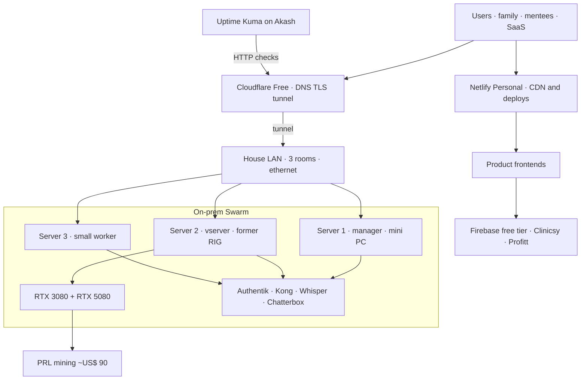

# How much does it cost to build and operate your own cloud with custom services?

Brenon.Cloud is not a hyperscaler invoice. It is a cluster in my house that stays on 24/7, a bit of cheap public cloud in front of it, and a catalog I actually use: study, family, mentoring, and products with real customers.

The title is the post. What does it cost to keep this running? Is it a lab, a provider, or both?

---

## Hardware I already had

I did not buy a rack for this. I reused a mini PC and the old crypto mining RIG. The RIG is now the vserver box: the machine with the two NVIDIA cards, [vserver.brenon.cloud](https://vserver.brenon.cloud).

The Swarm manager is the mini PC. Mitsushiba, Intel inside, in the network cabinet, sitting next to a five-port switch. Four links lit. I run the cable myself. The nodes are not on Wi-Fi. They are on copper ethernet, each machine in a different room of the house.

The vserver is the other extreme. Open Superframe case, Aorus cooler, RGB memory, XPG PSU. An MSI RTX inside the chassis. A Colorful RTX hanging off the side on a riser, because both cards do not fit cleanly in that case. If you have ever built a mining box, you already know this layout: one card outside, too many cables, a desk doing the job of a bench.

Today that is a 3-node Docker Swarm:

| Node | Role | CPU | RAM | What it is |
| --- | --- | --- | --- | --- |
| Server 1 | manager | 4 | 16.7 GB | Mitsushiba mini PC |
| Server 2 | worker | 12 | 67.4 GB | RIG / vserver, RTX 3080 + RTX 5080 |
| Server 3 | worker | 2 | 8.1 GB | small worker, another mini PC |

Snapshot of the cluster (Portainer, not a live API): **3 nodes, 18 CPU, 92.2 GB RAM, 2 GPUs, 23 stacks, 38 services, 120 containers**.

Three rooms is not a datacenter. It is heat, noise, and power spread across the house. If one box has a bad day, Swarm still tries to schedule on what is left. The WAN is still one home ISP. Real resilience, the kind that survives my street going dark, is Cloudflare, Netlify, and Akash. Inside the house it is copper between rooms and a manager that does not sit on top of the GPUs.

---

## The GPUs pay the electricity

Without the vserver, keeping the rest of the cluster on costs **less than US$ 1/month** in energy. Two mini PCs and a switch.

When I turn the vserver on with both GPUs at 100% around the clock, the energy line jumps. **~US$ 80/month** is easy to hit. That is the number that used to make shutting it down look like the smart call.

I do not shut it down. The same cards mine on the PRL network (I will write about PRL in another post). In recent months that mining has paid **~US$ 90/month**. Net of energy, the hungry machine is **~US$ 10 in profit** for staying on 24/7.

I am not mining as a personality. I am paying the electricity of a capable box so it can keep serving everything else with some headroom: Swarm workloads, [vserver](https://vserver.brenon.cloud) itself, and a local model when I need one. The RIG stopped being a hobby in the corner and became the fat node of the cloud.

---

## Models and software that are not a demo

Under the same roof I run speech models as real APIs, not a notebook on my lap.

[ai.brenon.cloud](https://ai.brenon.cloud) is live: Whisper STT (`brnn/whisper-stt`) and Chatterbox TTS (`brnn/chatterbox-tts`). The catalog is public at `/api/v1/models`. How that landed on the Swarm is in [STT and TTS on our cluster](/blog/audio-apis-on-our-cluster).

And this is not only a lab. [Clinicsy](https://clinicsy.app) is a live SaaS for home care, consultório, and clinic: scheduling, WhatsApp, AI clinical notes, finance. It already brings in **~US$ 100/month** from real work, not a fictional tenant. [Profitt](https://profitt.app) is in the same family of products. Mentoring runs at [mentoria.devdojo.academy](https://mentoria.devdojo.academy). Family uses the same identity and the same hosts.

The cloud is the study environment. It is also the provider those products stand on. They do not all live in the same place: Clinicsy and Profitt sit on Firebase and Netlify. STT, TTS, Authentik, Kong, Oficina, and vserver sit on the Swarm, behind the tunnel. I do not pretend Clinicsy runs on the RIG.

---

## Cheap cloud in front, not instead

On-prem compute looks like the expensive part until you look at the bill. The trick is not to host everything at home. The trick is to keep in the house only what belongs there, and keep off the house anything that must not die with it.

**Cloudflare** is DNS, TLS, and the tunnel into `*.brenon.cloud`. I pulled the last 30 days on the `brenon.cloud` zone (Cloudflare GraphQL, 27 August 2026): **~419k requests, ~2.5 GB**. The zone is on the **Free Website** plan. At this traffic, **Cloudflare costs US$ 0**. Clinicsy, the garage domain, and the clinic domain sit on the same Free plan.

**Netlify** is the CDN and the deploy path for frontends. I pay the basic **Personal** plan, **US$ 9/month**, so I can keep many projects there. More than 15 frontends live on that plane: [clinicsy.app](https://clinicsy.app), this site, and the rest of the catalog. Netlify is not the API. It is the edge for the SPAs.

**Akash** holds what must not die with the house: [Uptime Kuma](https://uptime.brenon.cloud), on an isolated container, **cents of a dollar, under US$ 1/month**. If the Swarm, the tunnel, or the lab power goes away, the monitor is still somewhere else. That deploy is in [Uptime Kuma on Akash](/blog/uptime-kuma-on-akash).

The house does compute and state. Cloudflare terminates the public names. Netlify ships frontends. Akash watches from outside. That is enough decoupling, enough resilience, and enough scale for my traffic, at a price that still fits in the month.

---

## This is not for everyone

It is also not a sermon against AWS.

Most people should not run a three-node Swarm at home and argue with a tunnel at 2 a.m. Most products should pay a vendor and sleep.

But if you build systems for a living, doing this **once** is a different kind of course. You feel DNS, TLS, identity, scheduling, disks, power, and the invoice in the same week. You reuse open-source pieces until they become a platform. You learn why a free tier is a product decision, and why a monitor cannot live on the cluster it watches.

I did not invent a new cloud. I combined things that already existed until the cost-benefit stopped looking like a hobby.

---

## The monthly line items

Figures below are operating cost in **US$ / month**, as of late August 2026. Hardware is already mine (mini PC + RIG). Capex is not in this table.

| Line | Cost | Note |
| --- | --- | --- |
| Cloudflare | **0** | Free Website. ~419k req / ~2.5 GB in 30 days on `brenon.cloud` |
| Netlify Personal | **9** | CDN + deploys, 15+ frontends |
| Uptime Kuma on Akash | **< 1** | cents, isolated from the Swarm |
| GitHub | **10** | I use it constantly, so I pay |
| Firebase (Clinicsy + Profitt) | **0** | free tier, Firestore and friends, still inside quota |
| Energy without vserver | **< 1** | mini PCs + switch |
| Energy with vserver, 2 GPUs 100% 24/7 | **~80** | the real power bill |
| Mining on PRL | **~90 credit** | pays the GPUs; PRL post later |
| AI models (MiniMax + Grok, etc.) | **~150** | the luxury of evolving the catalog with agents, [the token post](/blog/agentic-ops-token-mix) |
| Clinicsy revenue | **~100 credit** | real MRR, real clinics |

Read it in three layers, not one blob:

1. **The cloud itself** (Cloudflare + Netlify + Akash + GitHub + Firebase + energy without GPUs) is **~US$ 20/month**, and energy is pocket change.
2. **Turn the vserver on** and energy becomes **~US$ 80**, currently more than covered by **~US$ 90** of mining. **~US$ 10 left over** for leaving the capable machine up.
3. **The expensive line is not the cluster.** It is the **~US$ 150** I spend to keep building with models. That bill is a choice. The cluster does not require it.

Net of mining, keeping the whole platform on, without counting AI and without counting Clinicsy, lands around **~US$ 10/month**.

---

## How it is actually wired

The switch next to the Mitsushiba is where three rooms become a cluster. A frontend can live on Netlify and still talk to Firebase, or to an API that enters the house through Cloudflare. The Swarm does not have to own every byte. That is the point of the cheap edge.

---

## The two lines I almost forgot

**Firebase.** Clinicsy and Profitt still run on the free tier: Firestore and the rest of that console. I use it a lot. It has not become a line item yet. When it does, it goes on this table.

**GitHub.** I live there: repos, Actions, packages, the loop that ships this site. **US$ 10/month**. Not infrastructure in the Swarm sense. Still part of operating a cloud you actually build on.

---

## What it returns

I share this platform with family. I use it in mentoring. I use it to study. And I use it to run software that already has monthly revenue: Clinicsy at **~US$ 100/month**, used by real home-care and clinic operations.

So the balance is not "a lab that costs US$ 20". It is a lab that is also a small provider.

- **To operate the cloud:** ~US$ 20 in paid SaaS, energy under a dollar without the GPU box, or ~US$ 80 with both GPUs, currently paid by mining, with ~US$ 10 left over.
- **To keep evolving it at my pace:** + ~US$ 150 in models. I already wrote that receipt.
- **Coming back in:** ~US$ 100 from Clinicsy, plus whatever the GPUs over-pay in mining, plus the non-invoice returns (study, family, mentoring, [OficinaCloud](https://oficina.brenon.cloud), [TibiaPixel](https://tibiapixel.brenon.cloud), identity at [auth.brenon.cloud](https://auth.brenon.cloud)).

Count AI as optional and Clinicsy as the first real customer of the setup, and the cloud is not a vanity bill. It is cheap to keep online, and it already has a product paying a large slice of the lights.

That is the honest answer to the title: **your own cloud with custom services, in this shape, costs about twenty dollars a month to keep online, about eighty in electricity if you insist on two GPUs at 100%, and about a hundred and fifty more if you want the same building speed I have been using. Mining currently covers the GPUs. Clinicsy currently covers most of the rest.**

---

## References and Useful Links

- **[20B tokens at ~US$ 150/month](/blog/agentic-ops-token-mix)**: the AI line I did not rehash here.
- **[STT and TTS on our cluster](/blog/audio-apis-on-our-cluster)**: Whisper + Chatterbox on the Swarm.
- **[Uptime Kuma on Akash](/blog/uptime-kuma-on-akash)**: why the monitor is not in the house.
- **[Akash Network: the Airbnb of cloud computing](/blog/akash-network-cloud-marketplace)**: the marketplace behind that container.
- **[Console Air on Brenon.Cloud](/blog/console-air-on-brenon-cloud)**: how I deploy to Akash without a credit card.
- **[Authentik SSO on Brenon.Cloud](/blog/authentik-sso-on-brenon-cloud)**: identity for the same hosts.
- **[clinicsy.app](https://clinicsy.app)**: the SaaS that already returns ~US$ 100/month.
- **[ai.brenon.cloud](https://ai.brenon.cloud)**: STT/TTS APIs.
- **[uptime.brenon.cloud](https://uptime.brenon.cloud)**: public monitor.
- **[Netlify pricing](https://www.netlify.com/pricing/)**: Personal plan, US$ 9/month.
- **[Cloudflare](https://www.cloudflare.com/)**: the Free plan I am still on.
