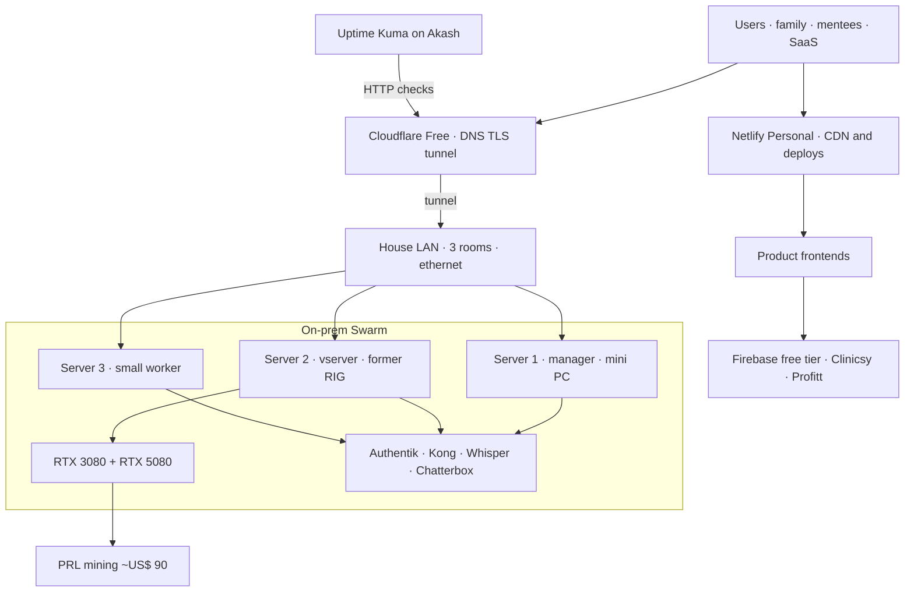

# Quanto custa construir e operar sua própria cloud com serviços customizados?

Brenon.Cloud não é fatura de hyperscaler. É um cluster em casa ligado 24/7, um punhado de cloud barata na frente, e um catálogo que a gente realmente usa: estudo, família, mentoria e produto com cliente de verdade.

A pergunta do título é o post inteiro. Quanto custa manter isso no ar — e isso é lab, é provedor, ou os dois?

---

## Hardware que a gente já tinha

A gente não comprou rack pra isso. Reaproveitamos um mini computador e a antiga RIG de mineração de criptomoedas. A RIG hoje é o hardware do vserver: a máquina das duas NVIDIA, [vserver.brenon.cloud](https://vserver.brenon.cloud).

Hoje isso é um Docker Swarm de 3 nós, ligados por cabo de rede, cada um num cômodo diferente da casa:

| Nó | Papel | CPU | RAM | O que é |
| --- | --- | --- | --- | --- |
| Server 1 | manager | 4 | 16,7 GB | mini PC reaproveitado |
| Server 2 | worker | 12 | 67,4 GB | antiga RIG / vserver |
| Server 3 | worker | 2 | 8,1 GB | worker pequeno |

Snapshot do cluster (Portainer, não é API ao vivo): **3 nós, 18 CPU, 92,2 GB de RAM, 2 GPUs (RTX 3080 + RTX 5080), 23 stacks, 38 serviços, 120 containers**.

Três cômodos não é datacenter. É calor, barulho e tomada espalhados pela casa, e o Swarm ainda consegue agendar se um dos boxes estiver num dia ruim. A WAN continua sendo um único ISP residencial. Resiliência na borda é Cloudflare, Netlify e Akash. Resiliência dentro de casa é cabo entre os cômodos e um manager que não está sentado em cima das GPUs.

---

## As GPUs pagam a luz

Sem o vserver, manter o resto do cluster ligado custa **menos de US$ 1/mês** de energia. São duas máquinas pequenas.

Liga o vserver com as duas GPUs em 100% o dia inteiro e a linha de energia sobe. **~US$ 80/mês** é fácil de alcançar. Era o número que fazia “desliga isso” parecer racional.

A gente não desliga. As mesmas placas mineram na rede PRL (vamos escrever sobre a PRL noutro post). Nos últimos meses essa mineração tem pago **~US$ 90/mês**. Líquido de energia, a máquina pesada dá **~US$ 10 de lucro** por ficar ligada 24/7.

Esse é o ponto. A gente não minera por identidade. A gente paga a luz de uma máquina capaz pra ela continuar servindo o resto com folga: workloads do Swarm, o próprio [vserver](https://vserver.brenon.cloud), e modelo local quando precisa. A RIG parou de ser hobby encostado e virou o nó gordo da cloud.

---

## Modelo e software que não são demo

No mesmo teto a gente roda modelo de áudio como API de verdade, não notebook no laptop.

[ai.brenon.cloud](https://ai.brenon.cloud) está no ar: Whisper STT (`brnn/whisper-stt`) e Chatterbox TTS (`brnn/chatterbox-tts`). O catálogo é público em `/api/v1/models`. Como isso entrou no Swarm está em [STT e TTS no nosso cluster](/blog/audio-apis-on-our-cluster).

E não é só lab. O [Clinicsy](https://clinicsy.app) é SaaS ao vivo pra home care, consultório e clínica — agenda, WhatsApp, evolução com IA, financeiro. Já entra **~US$ 100/mês** de serviço real, não tenant de ficção. O [Profitt](https://profitt.app) é da mesma família de produto que a gente opera. Mentoria roda em [mentoria.devdojo.academy](https://mentoria.devdojo.academy). A família usa a mesma identidade e os mesmos hosts.

A cloud é o ambiente de estudo. Também é o provedor em cima do qual esses produtos ficam de pé.

---

## Cloud barata na frente, não no lugar

Compute on-prem parece a parte cara até você olhar a fatura. O truque não é “hospedar tudo em casa”. O truque é **desacoplar** o que precisa estar na casa do que não pode.

**Cloudflare** é DNS, TLS e o túnel pra `*.brenon.cloud`. Puxei os últimos 30 dias da zona `brenon.cloud` (GraphQL da Cloudflare, 27 de agosto de 2026): **~419 mil requests, ~2,5 GB**. A zona está no plano **Free Website**. Com esse tráfego, **Cloudflare custa US$ 0**. Clinicsy, o domínio da garage e o da clínica estão no mesmo plano Free.

**Netlify** é a CDN e o caminho de deploy dos frontends de produto. A gente paga o plano básico **Personal** — **US$ 9/mês** — justamente pra caber vários projetos. São mais de 15 frontends nesse plano: [clinicsy.app](https://clinicsy.app), este site, e o resto do catálogo. Netlify não é a API. É a borda das SPAs.

**Akash** segura o que não pode morrer com a casa: o [Uptime Kuma](https://uptime.brenon.cloud), num container isolado, **centavos de dólar, menos de US$ 1/mês**. Se o Swarm, o túnel ou a luz do lab cair, o monitor continua noutro lugar. Esse deploy está em [Uptime Kuma na Akash](/blog/uptime-kuma-on-akash).

Junto: a casa faz compute e estado. Cloudflare termina os nomes públicos. Netlify entrega frontend. Akash observa de fora. Desacoplamento, resiliência e escala o suficiente pro tráfego que a gente tem — por um preço que não é religião de crédito de cloud.

---

## Isso não é pra todo mundo

Tampouco é sermão contra AWS.

A maioria das pessoas não deveria rodar um Swarm de três nós na casa e discutir com túnel às duas da manhã. A maioria dos produtos deveria pagar um vendor e dormir.

Mas se o seu ofício é construir sistema, fazer isso **uma vez** é outro tipo de curso. Você sente DNS, TLS, identidade, agendamento, disco, energia e fatura na mesma semana. Reaproveita peça open-source até virar plataforma. Aprende por que free tier é decisão de produto e por que monitor não pode morrer no cluster que ele observa.

A gente não inventou cloud nova. Combinou o que já existia até o custo-benefício parar de parecer hobby.

---

## As linhas do mês

Os números abaixo são custo de operação em **US$ / mês**, fim de agosto de 2026. O hardware já é nosso (mini PC + RIG). Capex não entra nessa tabela.

| Linha | Custo | Nota |
| --- | --- | --- |
| Cloudflare | **0** | Free Website. ~419 mil req / ~2,5 GB em 30 dias em `brenon.cloud` |
| Netlify Personal | **9** | CDN + deploys, mais de 15 frontends |
| Uptime Kuma na Akash | **< 1** | centavos, isolado do Swarm |
| GitHub | **10** | a gente usa o tempo todo, então paga |
| Firebase (Clinicsy + Profitt) | **0** | free tier — Firestore e o resto, ainda dentro da cota |
| Energia sem o vserver | **< 1** | mini PC + worker pequeno |
| Energia com vserver, 2 GPUs 100% 24/7 | **~80** | a conta de luz de verdade |
| Mineração na PRL | **~90 crédito** | paga as GPUs; post da PRL depois |
| Modelos de IA (MiniMax + Grok, etc.) | **~150** | o luxo de continuar evoluindo o catálogo com agente — [o post dos tokens](/blog/agentic-ops-token-mix) |
| Receita do Clinicsy | **~100 crédito** | MRR real, clínica real |

Lê em três camadas, não num bolo só:

1. **A cloud em si** (Cloudflare + Netlify + Akash + GitHub + Firebase + energia sem GPU) dá **~US$ 20/mês**, e energia é troco.
2. **Liga o vserver** e a energia vira **~US$ 80**, hoje mais do que coberta por **~US$ 90** de mineração — sobra **~US$ 10** por deixar a máquina capaz ligada.
3. **A linha cara não é o cluster.** É o **~US$ 150** que a gente gasta pra continuar construindo com modelo. Essa fatura é escolha. O cluster não exige.

Líquido da mineração, manter a plataforma inteira no ar — sem contar IA, sem contar Clinicsy — cai na casa de **~US$ 10/mês**.

---

## Como isso está de fato ligado

Frontend pode viver no Netlify e ainda falar com Firebase ou com API que entra na casa pelo Cloudflare. O Swarm não precisa ser dono de cada byte. Esse é o ponto da borda barata.

---

## As duas linhas que a gente quase esquece

**Firebase.** Clinicsy e Profitt ainda rodam no free tier — Firestore e o resto daquele console. A gente usa bastante. Ainda não virou linha de fatura. Quando virar, entra nessa tabela.

**GitHub.** A gente vive lá: repo, Actions, package, o loop que publica este site. **US$ 10/mês**. Não é infra no sentido de Swarm. Continua sendo parte de operar uma cloud em cima da qual você realmente constrói.

---

## O que isso devolve

A gente divide essa plataforma com a família. Usa nas mentorias. Usa pra estudar. E usa pra rodar software que já tem receita mensal: Clinicsy a **~US$ 100/mês**, usado por operação real de home care e clínica.

Então o balanço não é “um lab que custa US$ 20”. É um lab que também é um provedor pequeno.

- **Pra operar a cloud:** ~US$ 20 de SaaS pago, energia abaixo de um dólar sem a caixa de GPU, ou ~US$ 80 com as duas GPUs — hoje pagas pela mineração, com ~US$ 10 de sobra.
- **Pra continuar evoluindo no nosso ritmo:** + ~US$ 150 de modelo. Esse recibo a gente já escreveu.
- **Entrando:** ~US$ 100 do Clinicsy, mais o que as GPUs pagam a mais na mineração, mais o que não vira fatura (estudo, família, mentoria, [OficinaCloud](https://oficina.brenon.cloud), [TibiaPixel](https://tibiapixel.brenon.cloud), identidade em [auth.brenon.cloud](https://auth.brenon.cloud)).

Conta a IA como opcional e o Clinicsy como o primeiro cliente de verdade do arranjo, e a cloud não é conta de vaidade. É uma fábrica barata com um produto que já paga um pedaço grande da luz.

Essa é a resposta honesta do título: **sua própria cloud com serviços customizados, neste formato, custa uns vinte dólares por mês pra ficar no ar, uns oitenta de energia se você insiste em duas GPUs a 100%, e mais uns cento e cinquenta se quiser a mesma velocidade de construção que a gente tem usado. A mineração hoje cobre as GPUs. O Clinicsy hoje cobre a maior parte do resto.**

---

## Referências e Links Úteis

- **[20B de tokens a ~US$ 150/mês](/blog/agentic-ops-token-mix)**: a linha de IA que a gente não reabriu aqui.
- **[STT e TTS no nosso cluster](/blog/audio-apis-on-our-cluster)**: Whisper + Chatterbox no Swarm.
- **[Uptime Kuma na Akash](/blog/uptime-kuma-on-akash)**: por que o monitor não mora na casa.
- **[Akash Network: o Airbnb da computação em nuvem](/blog/akash-network-cloud-marketplace)**: o marketplace atrás desse container.
- **[Console Air na Brenon.Cloud](/blog/console-air-on-brenon-cloud)**: como a gente sobe na Akash sem cartão.
- **[SSO com Authentik na Brenon.Cloud](/blog/authentik-sso-on-brenon-cloud)**: identidade dos mesmos hosts.
- **[clinicsy.app](https://clinicsy.app)**: o SaaS que já devolve ~US$ 100/mês.
- **[ai.brenon.cloud](https://ai.brenon.cloud)**: APIs de STT/TTS.
- **[uptime.brenon.cloud](https://uptime.brenon.cloud)**: monitor público.
- **[Preço da Netlify](https://www.netlify.com/pricing/)**: plano Personal, US$ 9/mês.
- **[Cloudflare](https://www.cloudflare.com/)**: o plano Free em que a gente ainda está.
