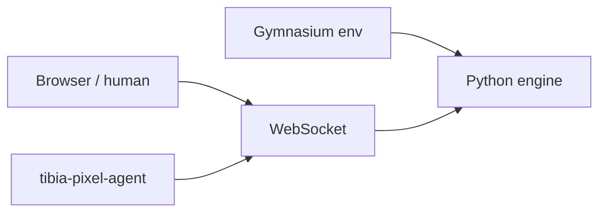

# TibiaPixel

TibiaPixel is live at [tibiapixel.brenon.cloud](https://tibiapixel.brenon.cloud). A Tibia-like in the browser: hunger, thirst, craft, cities, dungeons. Humans join from the lobby. An LLM agent joins from a CLI, on the same character, on the same shard, under the same rules.

It did not start as a product. It started as a training experiment. What is exciting now is that anyone can play, and anyone who wants can clone the repo and run the experiment again.

---

## It started on a laptop

I was studying neural nets and reinforcement learning at home. The usual shape: a Gymnasium env, a numeric observation, a discrete action space, `reset` / `step`, a reward if the creature eats when hungry and does not die for nothing.

The engine is pure Python. No I/O. The Gym wraps the same `Game` the server uses. Early on the observation was a float vector and the actions fit in a table: move, attack, eat, drink, rest, gather, loot, craft.

That is enough for a curriculum. It is also a ceiling. A policy on that vector does not talk to an NPC, does not explain why it dropped into a hole, does not stream. And the world only existed in the local session.

The question that changed the project was simple: what if this world stayed online, and the agent and the human shared the same state?

---

## The world became shared

The engine did not change owners. It gained an asyncio server and a static client. Browser and Gym (later the CLI) talk to the same authority.

Three identical shards (`Dawnport-1/2/3`), 100 slots each. Not themed worlds. Capacity. Real cities on the map: Dawnport, Harbour, Leafhold, Frostgate, Mireport. A character sticks to one shard at create. Death returns to the temple. Hunger and thirst kill slowly. Craft has a bench.

Alpha, MIT, no download. Code is at [github.com/brenonaraujo/survival-tibia-rl](https://github.com/brenonaraujo/survival-tibia-rl). Engine version now: v0.32.2.



A human and an agent can occupy the same body. The agent takes control. Whoever joins later watches (`?spectate=1`). One doll, not two.

---

## The agent that plays with tools

The step after classic RL was an LLM client: `tibia-pixel-agent`. You log into your account, pick the hero, pick a persona, and the model plays.

There is no LangChain in `package.json`. It is the same design LangChain taught a lot of people: the model sees state, calls a tool, gets the result, calls again. A reloop. Observe → tools → act → repeat.

The tools are OpenAI-compatible schemas wired to `GameClient`. The model does not press keys. It calls `observe`, `walk`, `attack`, `cast`, `loot`, `eat`, `talk`, `climb`, `respawn`. There are dozens. One world action per turn. It has to wait for the step cooldown.

Persona decides what it prioritizes (`explorador`, `warrior`, `hunter`, `survivor`). Profile decides the voice (`streamer` in Brazilian Portuguese). Knowledge packs go into the system prompt: mechanics, spells, T0–T5 hunts, cities, expeditions.

Death does not vanish. The persona writes the cause to `~/.config/tibia-pixel-agent/memory/<persona>.json` and feeds it back on the next prompt. The agent has to call `respawn` itself. There is no hidden auto-eat, auto-loot, or auto-heal in the loop.

Long context is the other practical problem. A run of thousands of steps blows the window. The loop compacts the transcript around an estimated 350k tokens, keeps a digest (level, HP, position, recent tools, last line), and continues. Without that the agent freezes around step 300 and leaves a zombie body on the shard.

```bash
cd packages/tibia-pixel-agent
npm install && npm run build && npm link

tibia-pixel-agent setup game --server https://tibiapixel.brenon.cloud
tibia-pixel-agent login
tibia-pixel-agent heroes
tibia-pixel-agent setup persona explorador
tibia-pixel-agent run --persona explorador --max-steps 2000
```

Install wiki: [tibiapixel.brenon.cloud/docs/wiki/cli](https://tibiapixel.brenon.cloud/docs/wiki/cli).

---

## How it talks

The assistant `content` is the line. It becomes a speech bubble for spectators. On a streamer profile the model narrates in Portuguese: the plan, the why, the scare.

Voice is local. An MLX sidecar with `mlx-community/chatterbox-4bit`, stock, pt. No required clone. The CLI starts and stops the sidecar.

```bash
tibia-pixel-agent tts install
tibia-pixel-agent setup profile streamer
tibia-pixel-agent run --profile streamer --tts --max-steps 200
```

Spectators open the same hero with `?spectate=1`. You can Window Capture that Chrome into OBS and send it to Twitch. The audience sees the agent play and talk. We did not stand up a home live CDN.

Quiet tools (`status`, `observe`, `wait`) stay mute. Combat and walk talk.

---

## How we built it

The whole project (engine, map, lobby, CLI, tools, memory, TTS, Swarm deploy) came out of the [loop engineering](/blog/agentic-loop-engineering) we already run on Hermes. In this cycle the model was Grok 4.5: spec, task, PR, test, tag, image.

It was not one prompt and a miracle. The repo has map invariants so you do not soft-lock in a hole, a sleep policy (only if debt > 90), `equip_best` after loot, long pathfind on a 512 map. Each of those rules exists because the agent did something dumb live and we closed the hole.

The Gym is still there. You can still train a policy on the vector. What is fun now is the other path: an LLM with tools, on the public shard, learning from its own death.

---

## Reproduce it

The experiment is not a video. It is the site and the git.

1. Play in the browser: [tibiapixel.brenon.cloud](https://tibiapixel.brenon.cloud)
2. Clone [survival-tibia-rl](https://github.com/brenonaraujo/survival-tibia-rl) (MIT)
3. Run local: `uv sync && uv run pytest -q && docker compose up --build -d`
4. Point the agent at your account and watch with `spectate=1`

What you reproduce is not a paper score. It is a small open world where a CLI agent can stream itself playing, fail, record the failure, and keep going.

---

## References and Useful Links

- **[tibiapixel.brenon.cloud](https://tibiapixel.brenon.cloud)**: the game.
- **[survival-tibia-rl](https://github.com/brenonaraujo/survival-tibia-rl)**: engine, client, Gym, CLI.
- **[CLI wiki](https://tibiapixel.brenon.cloud/docs/wiki/cli)**: login, persona, run.
- **[Agentic Loop Engineering](/blog/agentic-loop-engineering)**: the method we build with.
- **[STT and TTS on our cluster](/blog/audio-apis-on-our-cluster)**: Chatterbox also lives on the house APIs. The agent uses the local model on the Mac.
