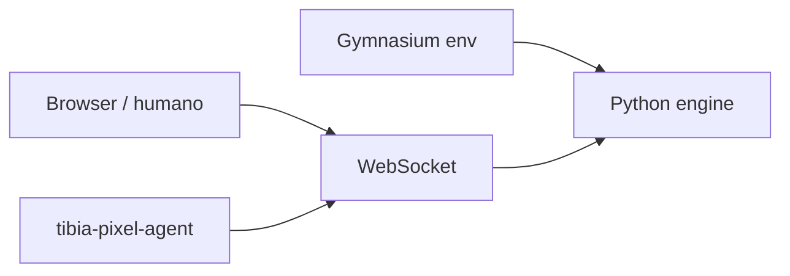

# TibiaPixel

TibiaPixel está no ar em [tibiapixel.brenon.cloud](https://tibiapixel.brenon.cloud). É um Tibia-like no browser: fome, sede, craft, cidades, dungeons. Humanos entram pelo lobby. Um agente LLM entra pela CLI, no mesmo personagem, no mesmo shard, com as mesmas regras.

Não nasceu como produto. Nasceu como experimento de treino. O que empolga agora é que qualquer um pode jogar e, se quiser, clonar o repo e repetir o experimento.

---

## Começou no notebook

Eu estava estudando redes neurais e reinforcement learning em casa. O desenho clássico: um ambiente Gymnasium, observação numérica, ação discreta, `reset` / `step`, recompensa se o bicho come quando está com fome e não morre à toa.

O engine é Python puro. Sem I/O. O Gym envolve o mesmo `Game` que o servidor usa. No começo a obs era um vetor float e as ações cabiam numa tabela: mover, atacar, comer, beber, descansar, coletar, loot, craft.

Isso funciona pra curriculum. Também é um teto. Uma política treinada no vetor não conversa com NPC, não explica por que desceu o buraco, não streama. E o mundo existia só na sessão local.

A pergunta que mudou o projeto foi simples: e se esse mundo ficasse online, e o agente e o humano usassem o mesmo estado?

---

## O mundo ficou compartilhado

O engine não mudou de dono. Ganhou um servidor asyncio e um cliente estático. Browser e Gym (depois a CLI) falam com o mesmo autoritativo.

Três shards iguais (`Dawnport-1/2/3`), 100 vagas cada. Não são mundos temáticos. São capacidade. Cidades de verdade no mapa: Dawnport, Harbour, Leafhold, Frostgate, Mireport. Personagem gruda num shard na criação. Morte volta no templo. Fome e sede matam devagar. Craft tem bancada.

Alpha, MIT, sem download. O código está em [github.com/brenonaraujo/survival-tibia-rl](https://github.com/brenonaraujo/survival-tibia-rl). Versão atual do engine: v0.32.2.



Humano e agente podem ocupar o mesmo corpo. O agente assume o controle. Quem entra depois assiste (`?spectate=1`). Uma bonequinha, não duas.

---

## O agente que joga com tools

O pulo depois do RL clássico foi um cliente LLM: `tibia-pixel-agent`. Você loga na sua conta, escolhe o herói, escolhe uma persona, e o modelo joga.

Não é LangChain no `package.json`. É o mesmo desenho que o LangChain ensinou pra muita gente: o modelo vê o estado, chama uma tool, recebe o resultado, chama de novo. Reloop. Observe → tools → age → repete.

As tools são schemas OpenAI-compatible ligados no `GameClient`. O modelo não aperta tecla. Ele chama `observe`, `walk`, `attack`, `cast`, `loot`, `eat`, `talk`, `climb`, `respawn`. Tem dezena delas. Uma ação de mundo por turno. Tem que esperar o cooldown do passo.

Persona decide o que ele prioriza (`explorador`, `warrior`, `hunter`, `survivor`). Profile decide a voz (`streamer` em pt-BR). Knowledge packs entram no system prompt: mecânica, magia, caça T0–T5, cidade, expedição.

Morte não some no void. A persona grava a causa em `~/.config/tibia-pixel-agent/memory/<persona>.json` e devolve isso no próximo prompt. O agente precisa chamar `respawn` sozinho. Não tem auto-eat, auto-loot, auto-cura escondida no loop.

Contexto longo é o outro problema prático. Run de milhares de steps estoura janela. O loop compacta o transcript quando passa de ~350k tokens estimados, deixa um digest (nível, HP, posição, tools recentes, última fala) e continua. Sem isso o agente trava por volta do passo 300 e deixa um corpo zumbi no shard.

```bash
cd packages/tibia-pixel-agent
npm install && npm run build && npm link

tibia-pixel-agent setup game --server https://tibiapixel.brenon.cloud
tibia-pixel-agent login
tibia-pixel-agent heroes
tibia-pixel-agent setup persona explorador
tibia-pixel-agent run --persona explorador --max-steps 2000
```

Wiki de instalação: [tibiapixel.brenon.cloud/docs/wiki/cli](https://tibiapixel.brenon.cloud/docs/wiki/cli).

---

## Como ele fala

O `content` do assistente é a fala. Vira balão no jogo pra quem assiste. Se o profile é streamer, o modelo narra em português: o plano, o porquê, o susto.

A voz sai local. Sidecar MLX com `mlx-community/chatterbox-4bit`, stock, pt. Sem clone obrigatório. O CLI sobe e derruba o sidecar.

```bash
tibia-pixel-agent tts install
tibia-pixel-agent setup profile streamer
tibia-pixel-agent run --profile streamer --tts --max-steps 200
```

Quem assiste abre o mesmo herói com `?spectate=1`. Dá pra jogar a janela no OBS e mandar pra Twitch. O público vê o agente jogando e falando. A gente não montou CDN de live em casa. Window Capture de um Chrome já logado chega.

Tools quietas (`status`, `observe`, `wait`) não enchem a boca. Combate e walk falam.

---

## Como a gente construiu

O projeto inteiro (engine, mapa, lobby, CLI, tools, memória, TTS, deploy no Swarm) saiu no [loop engineering](/blog/agentic-loop-engineering) que a gente já usa no Hermes. Neste ciclo o modelo foi Grok 4.5: spec, tarefa, PR, teste, tag, imagem.

Não foi um prompt e um milagre. O repo tem invariantes de mapa pra não trancar em buraco, policy de sono (só dorme com dívida > 90), `equip_best` depois de loot, pathfind longo no mapa 512. Cada uma dessas regras existiu porque o agente fez merda ao vivo e a gente fechou o buraco.

O Gym continua lá. Dá pra treinar política no vetor. O que está divertido agora é o outro caminho: um LLM com tools, no shard público, aprendendo da própria morte.

---

## Reproduz

O experimento não é um vídeo. É o site e o git.

1. Joga no browser: [tibiapixel.brenon.cloud](https://tibiapixel.brenon.cloud)
2. Clona [survival-tibia-rl](https://github.com/brenonaraujo/survival-tibia-rl) (MIT)
3. Sobe local: `uv sync && uv run pytest -q && docker compose up --build -d`
4. Liga o agente na sua conta e assiste com `spectate=1`

O que você reproduz não é um score de paper. É um mundo pequeno, aberto, onde um agente de CLI consegue streamar a si mesmo jogando, errar, gravar o erro e continuar.

---

## Referências e Links Úteis

- **[tibiapixel.brenon.cloud](https://tibiapixel.brenon.cloud)**: o jogo.
- **[survival-tibia-rl](https://github.com/brenonaraujo/survival-tibia-rl)**: engine, cliente, Gym, CLI.
- **[Wiki do CLI](https://tibiapixel.brenon.cloud/docs/wiki/cli)**: login, persona, run.
- **[Loop Engineering Agentico](/blog/agentic-loop-engineering)**: o método com que a gente constrói.
- **[STT e TTS no nosso cluster](/blog/audio-apis-on-our-cluster)**: Chatterbox também vive nas APIs da casa. O agente usa o modelo local no Mac.
