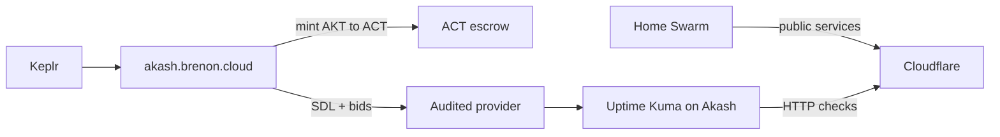

# Uptime Kuma on Akash

Uptime Kuma watches whether services are up. If it lives on the same Swarm it observes, the day the cluster dies the monitor dies with it. You go blind exactly when you need to know what happened.

So we took Kuma off the home lab. It now runs on the [Akash Network](https://akash.network) as its own container, deployed through our Console Air at [akash.brenon.cloud](https://akash.brenon.cloud). Crypto wallet, no signup, no credit card.

The instance is at [uptime.brenon.cloud](https://uptime.brenon.cloud).

---

## Why the monitor doesn't sit on the cluster

A status page and its checks cannot live on the same infra they watch. If the Swarm, Kong, or the lab power goes down, a Kuma on that same box disappears with it. Anyone opening the status page sees the same hole as the product.

Akash solves that without renting a whole VPS for one container. It is a compute marketplace: you describe the image, accept a bid, and the container comes up on someone else's provider. Independent from the lab.

The home cluster still serves product. Kuma just watches from outside, and pings everything we publish.

---

## The SDL

On Akash a deployment is a YAML file called SDL, Stack Definition Language. It reads like a `docker-compose`: image, port, CPU, memory, disk, and the max price you will pay. In Console Air you build that in the editor or paste the YAML.

The first lease was too short on RAM. Kuma 2.5 nightly dies, and SQLite vanishes on restart if the disk is ephemeral. The floor that actually holds the dashboard, monitors, and history is **0.5 CPU + 256 MB + a persistent volume mounted at `/app/data`**. Below that the pod crashes or comes back at `/setup-database`.

The volume has to land on `/app/data`. The official image uses `WORKDIR /app` and writes `./data/` (`db-config.json`, `kuma.db`). If the persistent disk is at `/mnt/data`, Kuma writes on the container's ephemeral disk. Restart → `db-config.json is not found` → setup wizard again.

The SDL that needs to stay live:

```yaml
version: "2.0"
services:
  service-1:
    image: louislam/uptime-kuma:nightly2
    env:
      - DATA_DIR=/app/data
    expose:
      - port: 3001
        as: 80
        to:
          - global: true
    params:
      storage:
        data:
          mount: /app/data
          readOnly: false
profiles:
  compute:
    service-1:
      resources:
        cpu:
          units: 0.5
        memory:
          size: 256Mb
        storage:
          - size: 1Gi
          - name: data
            size: 1Gi
            attributes:
              persistent: true
              class: beta3
  placement:
    dcloud:
      pricing:
        service-1:
          denom: uact
          amount: 100000
deployment:
  service-1:
    dcloud:
      profile: service-1
      count: 1
```

Image `nightly2`, port 3001, `beta3` disk **at `/app/data`**, `DATA_DIR=/app/data`. Wrong path and every restart wipes tags, monitors, and the status page.

The wallet, SDL, and lease path is in [Console Air on Brenon.Cloud](/blog/console-air-on-brenon-cloud).

---

## AKT becomes ACT inside the app

No email, no card. You connect Keplr at [akash.brenon.cloud](https://akash.brenon.cloud). AKT lands in the wallet (exchange, another Cosmos wallet, whatever). Deployments are paid in ACT.

ACT is Akash's compute token, pegged to the dollar. On the Console Air Mint & Burn screen you burn AKT and receive ACT at the oracle rate. The other way works too: leftover ACT turns back into AKT. ACT does not expire and you can redeem it.

The screen has US$ 25, 50, and 100 presets, and a mint floor (10 ACT today). You sign the transaction in the wallet. The app never holds your keys.

With ACT in the wallet, the SDL can go up and the deployment escrow gets funded.

---

## Audited provider and availability

After the SDL, providers bid. The Console Air table shows, per bid, whether the provider is audited and its 7-day uptime. You can filter to audited only. An unaudited provider shows a warning: the experience may be worse.

Audited is not a marketing badge. A network auditor signs the provider's attributes (region, host, persistent disk, GPU). Console Air reads that and marks `Audited`. You can also require an auditor in the SDL itself, under `signedBy`.

The first provider was too tight. We redeployed: another provider, audited, **99.99%** on 7-day uptime, with the 256 MB Kuma actually needs.

We did not grab the cheapest bid blind. We grabbed the one the network had already measured and signed, and that can run the process.

---

## How it sits



The home cluster serves product. Kuma watches from outside. 0.5 CPU and 256 MB on an audited provider with 99.99% on the 7-day history. The public status page is [uptime.brenon.cloud/status/services](https://uptime.brenon.cloud/status/services).

---

## References and Useful Links

- **[uptime.brenon.cloud](https://uptime.brenon.cloud)**: the Uptime Kuma instance.
- **[akash.brenon.cloud](https://akash.brenon.cloud)**: Console Air, SDL, AKT/ACT mint, and bids.
- **[Console Air on Brenon.Cloud](/blog/console-air-on-brenon-cloud)**: why we publish that client and how it works.
- **[Akash Network: the Airbnb of cloud compute](/blog/akash-network-cloud-marketplace)**: the auction, SDL, and the marketplace.
- **[Akash Network](https://akash.network)**: the network the container runs on.
