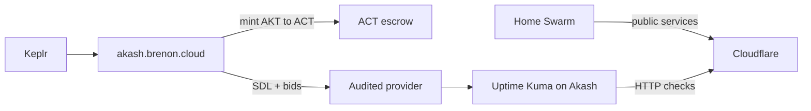

# Uptime Kuma on Akash

Uptime Kuma watches whether services are up. If it lives on the same Swarm it observes, the day the cluster dies the monitor dies with it. You go blind exactly when you need to know what happened.

So we took Kuma off the home lab. It now runs on the [Akash Network](https://akash.network) as its own container, deployed through our Console Air at [akash.brenon.cloud](https://akash.brenon.cloud). Crypto wallet, no signup, no credit card.

The instance is at [uptime.brenon.cloud](https://uptime.brenon.cloud).

---

## Why the monitor doesn't sit on the cluster

A status page and its checks cannot live on the same infra they watch. If the Swarm, Kong, or the lab power goes down, a Kuma on that same box disappears with it. Anyone opening the status page sees the same hole as the product.

Akash solves that without renting a whole VPS for one container. It is a compute marketplace: you describe the image, accept a bid, and the container comes up on someone else's provider. Independent from the lab.

The home cluster still serves product. Kuma just watches from outside, and pings everything we publish.

---

## The SDL

On Akash a deployment is a YAML file called SDL, Stack Definition Language. It reads like a `docker-compose`: image, port, CPU, memory, disk, and the max price you will pay. In Console Air you build that in the editor or paste the YAML.

Kuma fits in a small SDL. Official image, port 3001, a bit of CPU and memory, persistent disk so monitor history survives a restart.

```yaml
version: "2.0"

services:
  kuma:
    image: louislam/uptime-kuma:1
    expose:
      - port: 3001
        as: 80
        to:
          - global: true

profiles:
  compute:
    kuma:
      resources:
        cpu:
          units: 0.5
        memory:
          size: 512Mi
        storage:
          - size: 2Gi
  placement:
    dcloud:
      pricing:
        kuma:
          denom: uact
          amount: 1000

deployment:
  kuma:
    dcloud:
      profile: kuma
      count: 1
```

That tells the network: this image, this port, these resources, paid in ACT. Providers that can host it send a bid. You pick one and the lease closes on-chain.

The wallet, SDL, and lease path is in [Console Air on Brenon.Cloud](/blog/console-air-on-brenon-cloud).

---

## AKT becomes ACT inside the app

No email, no card. You connect Keplr at [akash.brenon.cloud](https://akash.brenon.cloud). AKT lands in the wallet (exchange, another Cosmos wallet, whatever). Deployments are paid in ACT.

ACT is Akash's compute token, pegged to the dollar. On the Console Air Mint & Burn screen you burn AKT and receive ACT at the oracle rate. The other way works too: leftover ACT turns back into AKT. ACT does not expire and you can redeem it.

The screen has US$ 25, 50, and 100 presets, and a mint floor (10 ACT today). You sign the transaction in the wallet. The app never holds your keys.

With ACT in the wallet, the SDL can go up and the deployment escrow gets funded.

---

## Audited provider and availability

After the SDL, providers bid. The Console Air table shows, per bid, whether the provider is audited and its 7-day uptime. You can filter to audited only. An unaudited provider shows a warning: the experience may be worse.

Audited is not a marketing badge. A network auditor signs the provider's attributes (region, host, persistent disk, GPU). Console Air reads that and marks `Audited`. You can also require an auditor in the SDL itself, under `signedBy`.

We filtered to audited providers and looked at 7-day uptime. We took an audited provider with 99.98% availability, at the bid that comes to US$ 0.57 a month for this container.

We did not grab the cheapest bid blind. We grabbed the cheap one the network had already measured and signed.

---

## How it sits



The home cluster serves product. Kuma watches from outside. US$ 0.57 a month for a container that keeps checking what we publish. Not a monitoring plan. A small slice of a machine, audited, with 99.98% on the 7-day history.

---

## References and Useful Links

- **[uptime.brenon.cloud](https://uptime.brenon.cloud)**: the Uptime Kuma instance.
- **[akash.brenon.cloud](https://akash.brenon.cloud)**: Console Air, SDL, AKT/ACT mint, and bids.
- **[Console Air on Brenon.Cloud](/blog/console-air-on-brenon-cloud)**: why we publish that client and how it works.
- **[Akash Network: the Airbnb of cloud compute](/blog/akash-network-cloud-marketplace)**: the auction, SDL, and the marketplace.
- **[Akash Network](https://akash.network)**: the network the container runs on.
