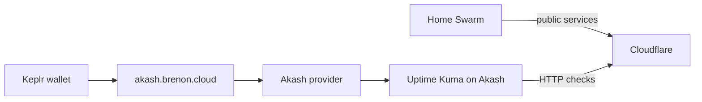

# Uptime Kuma on Akash

Uptime Kuma watches whether services are up. If it lives on the same Swarm it observes, the day the cluster dies the monitor dies with it. You go blind exactly when you need to know what happened.

So we took Kuma off the home lab. It now runs on the [Akash Network](https://akash.network) as its own container, deployed through our Console Air at [akash.brenon.cloud](https://akash.brenon.cloud). Crypto wallet, no signup, no credit card. The lease for that container is US$ 0.57 a month.

The instance is at [uptime.brenon.cloud](https://uptime.brenon.cloud).

---

## Why the monitor doesn't sit on the cluster

A status page and its checks cannot live on the same infra they watch. If the Swarm, Kong, or the lab power goes down, a Kuma on that same box disappears with it. Anyone opening the status page sees the same hole as the product.

Akash solves that without renting a whole VPS for one container. It is a compute marketplace: you describe the image, accept a bid, and the container comes up on someone else's provider. Independent from the lab.

The home cluster still serves product. Kuma just watches from outside, and pings everything we publish.

---

## How we shipped it

Not through Akash's managed console. Through the Console Air instance we publish at [akash.brenon.cloud](https://akash.brenon.cloud).

You connect a wallet (Keplr), swap AKT for ACT, paste the Kuma SDL, and accept a bid. No email, no password, no KYC. Identity is the wallet address. The deployment is a container. Payment goes to on-chain escrow.

The full path is in [Console Air on Brenon.Cloud](/blog/console-air-on-brenon-cloud).

---

## What it costs

US$ 0.57 a month for a container that keeps checking the services we put online. This is not a monitoring plan. It is a small slice of a machine rented on the marketplace, all the time, off-site.

Cheap enough that there is no excuse left to keep the monitor on the same cluster.

---

## References and Useful Links

- **[uptime.brenon.cloud](https://uptime.brenon.cloud)**: the Uptime Kuma instance.
- **[akash.brenon.cloud](https://akash.brenon.cloud)**: Console Air, wallet deploy, no signup.
- **[Console Air on Brenon.Cloud](/blog/console-air-on-brenon-cloud)**: why we publish that client and how it works.
- **[Akash Network](https://akash.network)**: the marketplace the container runs on.
