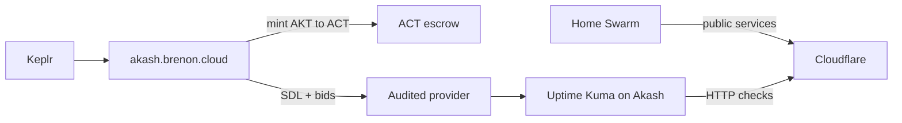

# Uptime Kuma na Akash

Uptime Kuma olha se os serviços estão no ar. Se ele mora no mesmo Swarm que ele observa, o dia que o cluster cai o monitor cai junto. Você fica cego exatamente quando precisa saber o que aconteceu.

Por isso a gente tirou o Kuma de casa. Subiu na [Akash Network](https://akash.network) como um container sozinho, pelo nosso Console Air em [akash.brenon.cloud](https://akash.brenon.cloud). Carteira crypto, sem cadastro, sem cartão.

A instância está em [uptime.brenon.cloud](https://uptime.brenon.cloud).

---

## Por que o monitor não fica no cluster

Status page e monitores não podem viver na mesma infra que eles vigiam. Se o Swarm, o Kong ou a energia do lab caem, o Kuma no mesmo lugar some junto. Quem tenta abrir o status vê o mesmo buraco que o produto.

A Akash resolve isso sem a gente alugar uma VPS só pra um container. É um marketplace de compute: você descreve a imagem, aceita um lance, o container sobe em outro provider. Independente do lab.

O cluster em casa continua servindo produto. O Kuma só assiste de fora, e pinga tudo que a gente publica.

---

## O SDL

Na Akash o deployment é um YAML chamado SDL, Stack Definition Language. Parece um `docker-compose`: imagem, porta, CPU, memória, disco e o preço máximo que você aceita pagar. No Console Air você monta isso no builder ou cola o YAML direto.

O primeiro lease era curto demais de memória. O Kuma 2.5 nightly estoura e o SQLite some no restart se o disco for efêmero. O mínimo que segura o dashboard, os monitores e o histórico é **0,5 CPU + 256 MB + volume persistente**. Abaixo disso o pod cai ou volta pro `/setup-database`.

O SDL que está no ar agora:

```yaml
version: "2.0"
services:
  service-1:
    image: louislam/uptime-kuma:nightly2
    expose:
      - port: 3001
        as: 80
        to:
          - global: true
    params:
      storage:
        data:
          mount: /mnt/data
          readOnly: false
profiles:
  compute:
    service-1:
      resources:
        cpu:
          units: 0.5
        memory:
          size: 256Mb
        storage:
          - size: 1Gi
          - name: data
            size: 1Gi
            attributes:
              persistent: true
              class: beta3
  placement:
    dcloud:
      pricing:
        service-1:
          denom: uact
          amount: 100000
deployment:
  service-1:
    dcloud:
      profile: service-1
      count: 1
```

Imagem `nightly2`, porta 3001, disco `beta3` em `/mnt/data`. Sem esse volume, cada restart apaga tag, monitor e status page.

O caminho de carteira, SDL e lease está no post [Console Air no Brenon.Cloud](/blog/console-air-on-brenon-cloud).

---

## AKT vira ACT dentro da plataforma

Você não cadastra e-mail nem põe cartão. Conecta o Keplr no [akash.brenon.cloud](https://akash.brenon.cloud). AKT entra na carteira (exchange, outra carteira Cosmos, o que for). Deploy se paga em ACT.

ACT é o token de compute da Akash, lastreado em dólar. Na tela Mint & Burn do Console Air você queima AKT e recebe ACT na taxa do oráculo. O contrário também vale: ACT que sobrou vira AKT de novo. ACT não expira e dá pra reembolsar.

A tela tem presets de US$ 25, 50 e 100, e um piso de mint (hoje 10 ACT). A transação você assina na carteira. O app não custodia nada.

Com ACT na carteira, o SDL sobe e o escrow do deployment é abastecido.

---

## Provider auditado e disponibilidade

Depois do SDL, os providers mandam lance. A tabela do Console Air mostra, por lance, se o provider é auditado e o uptime de 7 dias. Dá pra filtrar só os auditados. Provider sem auditoria aparece com aviso: a experiência pode ser pior.

Auditado aqui não é selo de marketing. Um auditor da rede assina atributos do provider (região, host, disco persistente, GPU). O Console Air lê isso e marca `Audited`. Você também pode exigir auditor na própria SDL, no `signedBy`.

O primeiro provider ficou curto. Redeployamos: outro provider, auditado, **99,99%** no uptime de 7 dias, com os 256 MB que o Kuma realmente pede.

Não pegamos o mais barato cego. Pegamos o que a rede já tinha medido e assinado, e que aguenta o processo.

---

## Como isso senta



O cluster em casa serve produto. O Kuma assiste de fora. 0,5 CPU e 256 MB num provider auditado com 99,99% no histórico de 7 dias. A status page pública é [uptime.brenon.cloud/status/services](https://uptime.brenon.cloud/status/services).

---

## Referências e Links Úteis

- **[uptime.brenon.cloud](https://uptime.brenon.cloud)**: a instância do Uptime Kuma.
- **[akash.brenon.cloud](https://akash.brenon.cloud)**: Console Air, SDL, mint AKT/ACT e lances.
- **[Console Air no Brenon.Cloud](/blog/console-air-on-brenon-cloud)**: por que a gente publica esse cliente e como ele funciona.
- **[Akash Network: o Airbnb da computação](/blog/akash-network-cloud-marketplace)**: leilão, SDL e o marketplace.
- **[Akash Network](https://akash.network)**: a rede onde o container roda.
