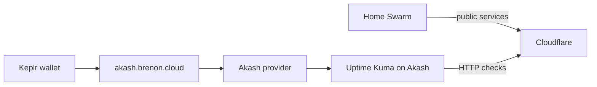

# Uptime Kuma na Akash

Uptime Kuma olha se os serviços estão no ar. Se ele mora no mesmo Swarm que ele observa, o dia que o cluster cai o monitor cai junto. Você fica cego exatamente quando precisa saber o que aconteceu.

Por isso a gente tirou o Kuma de casa. Subiu na [Akash Network](https://akash.network) como um container sozinho, pelo nosso Console Air em [akash.brenon.cloud](https://akash.brenon.cloud). Carteira crypto, sem cadastro, sem cartão. O lease desse container custa US$ 0,57 por mês.

A instância está em [uptime.brenon.cloud](https://uptime.brenon.cloud).

---

## Por que o monitor não fica no cluster

Status page e monitores não podem viver na mesma infra que eles vigiam. Se o Swarm, o Kong ou a energia do lab caem, o Kuma no mesmo lugar some junto. Quem tenta abrir o status vê o mesmo buraco que o produto.

A Akash resolve isso sem a gente alugar uma VPS só pra um container. É um marketplace de compute: você descreve a imagem, aceita um lance, o container sobe em outro provider. Independente do lab.

O cluster em casa continua servindo produto. O Kuma só assiste de fora, e pinga tudo que a gente publica.

---

## Como a gente subiu

Não foi pelo console gerenciado da Akash. Foi pelo Console Air que a gente publica em [akash.brenon.cloud](https://akash.brenon.cloud).

Você conecta a carteira (Keplr), troca AKT por ACT, cola o SDL do Kuma e aceita o lance. Sem e-mail, sem senha, sem KYC. A identidade é o endereço da carteira. O deployment é um container. O pagamento vai pro escrow on-chain.

O caminho inteiro está no post [Console Air no Brenon.Cloud](/blog/console-air-on-brenon-cloud).

---

## O que isso custa

US$ 0,57 por mês para um container que fica checando os serviços que a gente coloca no ar. Não é plano de monitoramento. É um pedaço pequeno de máquina alugado no marketplace, o tempo todo, fora de casa.

É barato o suficiente pra não ter desculpa de deixar o monitor no mesmo cluster.

---

## Referências e Links Úteis

- **[uptime.brenon.cloud](https://uptime.brenon.cloud)**: a instância do Uptime Kuma.
- **[akash.brenon.cloud](https://akash.brenon.cloud)**: Console Air, deploy com carteira e sem cadastro.
- **[Console Air no Brenon.Cloud](/blog/console-air-on-brenon-cloud)**: por que a gente publica esse cliente e como ele funciona.
- **[Akash Network](https://akash.network)**: o marketplace onde o container roda.
